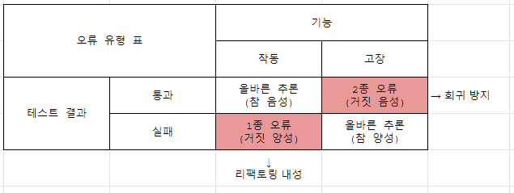

> 1부 요약 : 좋은 단위 테스트 스위트의 특성
> - 개발 주기에 통합돼 있다. 실제로 사용하는 테스트에만 가치가 있다. 그렇지 않으면 작성해도 의미가 X
> - 코드베이스의 가장 중요한 부분만을 대상으로 한다. 모든 실행 코드에 똑같이 신경 쓸 필요가 없다. 애플리케이션의 핵심(도메인 모델)을 다른 것과 구별하는 것이 중요 (ref. 7장)
> - 최소한의 유지비로 최대 가치를 끌어낸다.
    >   - 가치 있는 테스트 (더 나아가, 낮은 가치의 테스트) 식별
>   - 가치 있는 테스트 작성

# 4장_좋은 단위 테스트의 4대 요소

## 4.1 좋은 단위 테스트의 4대 요소 자세히 살펴보기

- 회귀 방지
- 리팩토링 내성
- 빠른 피드백
- 유지 보수성 

### 4.1.1 회귀 방지 
회귀 방지 지표를 극대화하려면 테스트가 가능한 한 많은 코드를 실행하는 것을 목표로 해야 한다.

회귀 : 소프트웨어 버그, 코드를 수정(새 기능을 추가)한 후 기능이 의도한 대로 작동하지 않음   
코드베이스가 커질수록 잠재적인 버그에 더 많이 노출됨 (코드: 자산 X 책임 O)

회귀 방지 지표에 대한 테스트 점수 평가 시 고려사항 
- 테스트 중에 실행되는 코드의 양
- 코드 복잡도 
- 코드의 도메인 유의성 
  - 단순한 코드는 테스트 의미가 없음

### 4.1.2 리팩토링 내성
리팩토링 내성 : 테스트를 '빨간색(실패)'으로 바꾸지 않고 기본 어플리케이션 코드를 리팩토링할 수 있는지에 대한 척도  

거짓 양성 : 리팩토링 결과 테스트가 실패하게 됐지만 사실은 아무것도 고장나지 않은 상황 
- 일반적으로 코드를 리팩토링할 때, 즉 구현을 수정하지만 식별할 수 있는 동작은 유지할 때 발생함 
- 리팩토링 내성 지표에서 거짓 양성은 적게 발생할 수록 좋음
- 거짓 양성이 빈번하면 테스트 스위트에 대한 신뢰가 서서히 떨어지며, 더 이상 믿을 만한 안전망으로 인식하지 않는다 : 신뢰 ▼ 리팩토링 ▼

### 4.1.3 거짓 양성의 원인
- 원인 : **테스트와 테스트 대상 시스템(SUT)의 구현 세부 사항이 많이 결합**할수록 허위 경보가 더 많이 발생함  
- 해결 : SUT 의 구현 세부 사항과 테스트 간의 결합도를 낮춰야 함   
  테스트가 최종 사용자의 관점에서 SUT 를 검증하고 최종 사용자에게 의미 있는 결과만 확인해야 한다

### 4.1.4 구현 세부 사항 대신 최종 결과를 목표로 하기
테스트 대상 코드의 구현 세부사항을 블랙박스 취급하고 식별할 수 있는 동작에만 집중  

## 4.2 "회귀 방지"와 "리팩토링 내성" 간의 본질적인 관계
- 시간이 흐르면서 프로젝트에 영향을 다르게 미치는 경향이 있다
- 프로젝트가 시작된 직후에는 회귀 방지를 훌륭히 갖추는 것이 중요
- 리팩토링 내성은 바로 필요하지 않음 (프로젝트가 진행됨에 따라 중요해짐)

### 4.2.1 테스트 정확도 극대화 

회귀 방지와 리팩토링 내성은 테스트 스위트의 정확도를 극대화하는 것을 목표로 한다.   

정확도 지표 
- 테스트가 버그 있음을 얼마나 잘 나타내는 가 (거짓 음성(회귀 방지 영역) 제외)
- 테스트가 버그 없음을 얼마나 잘 나타내는 가 (거짓 양성(리팩토링 내성 영역) 제외)  

가능한 한 소음(허위 경보)이 적은 강한 신호(버그를 찾을 수 있음)를 생성하면 테스트가 정확해짐  
- 테스트 정확도 = 신호(발견된 버그 수) / 소음(허위 경보 발생 수)

### 4.2.2 거짓 양성과 거짓 음성의 중요성: 역학 관계
- 거짓 양성 : 허위 경보 (리팩토링 내성, 양치기 소년)
- 거짓 음성 : 알려지지 않은 버그 

거짓 양성(허위 경보)은 초기에는 큰 부정적인 영향을 주지 않지만, 프로젝트가 진행될 수록 거짓 음성(알려지지 않은 버그)만큼이나 점점 더 중요해짐 

프로젝트의 규모와 기간이 커질 수록 거짓 음성과 거짓 양성에 대해 똑같이 주의를 기울여야 한다. 

## 4.3 빠른 피드백과 유지 보수성 

빠른 피드백
- 테스트 속도가 빠를수록 테스트 스위트에서 더 많은 테스트를 수행할 수 있고 더 자주 실행할 수 있음

유지 보수성
- 테스트가 얼마나 이해하기 어려운가
  - 테스트 코드의 품질은 제품코드 만큼이나 중요함
  - 테스트를 작성할 때 절차를 생략하지 말고 테스트 코드를 '일급 시민'으로 취급해야한다
- 테스트가 얼마나 실행하기 어려운가
  - 테스트가 프로세스 외부 종속성으로 작동하면 의존성을 상시 운영하는데 식나을 들여야 한다.