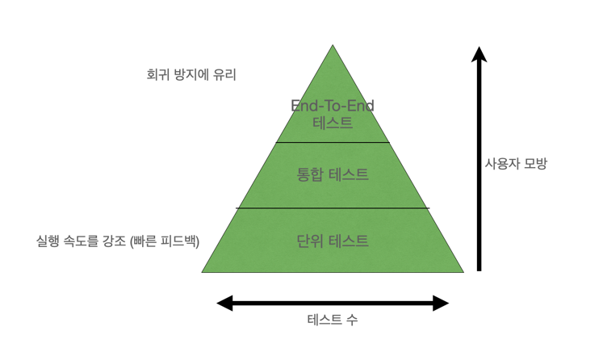

## 4.4 이상적인 테스트를 찾아서 

앞 내용 요약
> ### [ 4.1~4.3 좋은 단위 테스트의 4대 요소 (1)](4week_4.1%7E4.3%20%EC%A2%8B%EC%9D%80%20%EB%8B%A8%EC%9C%84%20%ED%85%8C%EC%8A%A4%ED%8A%B8%EC%9D%98%204%EB%8C%80%20%EC%9A%94%EC%86%8C.md)
> - 회귀 방지
> - 리팩토링 내성
> - 빠른 피드백
> - 유지 보수성
>
> 가치가 있으려면 4가지 범주에서 모두 유효한 점수를 내야한다 1 >= 

### 4.4.1 Q. 이상적인 테스트를 만들 수 있는가? / A. 불가능 

- 이상적인 테스트 : 4가지 특성 모두에서 최대 점수를 받는 테스트
- "회귀 방지", "리팩터링 내성", "빠른 피드백" 은 상호 배타적이기 때문에 셋 중 하나를 희생해야 나머지 둘을 최대로 할 수 있다.
- 극단적 사례 : 그렇다고 두 특성을 최대로 목표하고, 한가지를 희생시키면 결국 가치가 0에 가까워짐 (4.4.2) 
- 결론 : 특성 중 어느 것도 크게 줄지 않는 방식으로 최대한 크게 해야한다.

### 4.4.2 극단적인 사례 1 : End-to-End Test

- End-to-End Test (2장) : 최종 사용자의 관점
  - 모든 시스템 구성 요소 - UI, DB, 외부 어플리케이션  

[ High ]
- 회귀 방지 : 많은 코드를 테스트 
- 리팩토링 내성 : 거짓 양성에 면역 
  - 리팩토링은 (올바르게 했다면) 식별할 수 있는 동작으로 변경하지 않으므로 테스트에 영향을 미치지 않음

[ Low ]
- 빠른 피드백 : 느린 테스트 속도 

### 4.4.3 극단적인 사례 2 : 간단한 테스트

- 작은 단위의 코드베이스 테스트 

[ High ]
- 빠른 피드백 : 빠른 테스트 속도
- 리팩토링 내성 우수 : 거짓 양성이 생길 가능성이 매우 낮음 

[ Low ]
- 회귀 방지 : 기본 코드에 실수할 여지가 많지 않기 때문에 간단한 테스트는 회귀를 나타내지 않음 
- 동어 반복 테스트를 불러와 항상 통과하거나 검증이 무의미하기 때문에 어떤 것도 테스트한다고 할 수 없다.

### 4.4.4 극단적인 사례 : 깨지기 쉬운 테스트

- 깨지기 쉬운 테스트 : 실행이 빠르고 회귀를 잡을 가능성이 높지만 거짓 양성이 많은 테스트 
  - SUT 의 내부 구현 세부사항에 결합
  - [High] 빠른 피드백, 회귀 방지 
  - [Low] 리팩토링 내성

### 4.4.5 이상적인 테스트를 찾아서 : 결론 

- 절대 포기하면 안되는 요소 (최대화) : 리팩토링 내성 / 유지 보수성 
  - 리팩토링 내성은 이진 선택임 (있거나 / 없거나)
  - 그러나 회귀 방지와 빠른 피드백에 대한 지표는 조정이 가능하다
- 리팩토링 내성을 최대로 유지하고 회귀 방지와 빠른 피드백을 슬라이딩 
- 테스트 스위트를 탄탄하게 만들려면 테스트의 불안성(거짓 양성)을 제거하는 것이 최우선 과제다 

#### CAP 정리 (CAP theorem)
- 3가지 특성(리팩토링 내성, 회귀 방지, 빠른 피드백) 간의 상충관계와 유사 
- CAP 정리는 분산 데이터 저장소가 다음 세 가지 보증 모두를 동시에 제공할 수 없음을 나타냄 
  - 일관성 : 모든 읽기가 가장 최근의 쓰기 또는 오류를 수신하는 것을 의미
  - 가용성 : 모든 요청이 (시스템 내 전체 노드 중단은 제외하고) 응답을 수신하는 것을 의미
  - 분할 내성 : 네트워크 분할(네트워크 노드 간 연결 끊김)에도 시스템이 계속 작동함을 의미   
  

  1) 세 가지 중 두 가지를 선택하는 절충안을 선택
  2) 대규모 분산 시스템의 분할 내성도 타협할 수 없다.

- 결론 : 분할 내성 고정 / 일관성과 가용성 간의 절충으로 귀결

---

## 4.5 대중적인 테스트 자동화 개념 살펴보기 
테스트 피라미드와 화이트박스 테스트 vs 블랙박스 테스트 

### 4.5.1 테스트 피라미드 분해 

- 테스트 피라미드 : 테스트 스위트에서 테스트 유형 간의 일정한 비율을 일컫는 개념 
  - 단위 테스트
  - 통합 테스트
  - End-To-End 테스트 : 가장 중요한 기능에 적용할 때와 단위 테스트나 통합 테스트와 동일한 수준으로 보호할 때만 적용
- 어느 계층도 리팩토링 내성이 최대치
- 모든 테스트는 가짓 양성을 가능한 적게 하는 것을 목표로 해야함
- 프로젝트 유형 간의 비율은 피라미드 형태를 유지하는 것이 이상적

- 예외 : 복잡도가 낮은 기본 CRUD 작업만 있는 어플리케이션 
  - 직사각형 모양 : 단위 테스트 = 통합 테스트 && End-To-End X 
- 예외 : 프로젝트 외부 의존성 하나만 연결하는 API 
  - End-to-End 테스트를 더 많이 두는 것이 적합할 수도 있음

### 4.5.2 블랙박스 테스트와 화이트박스 테스트 간의 선택

[ 블랙박스 테스트 ]
- 시스템의 내부 구조를 몰라도 시스템의 기능을 검사할 수 있는 소프트웨어 테스트 방법
- 일반적으로 명세와 요구 사항, 즉 어플리케이션이 무엇을 해야 하는지를 중심으로 구축 (어떻게 해야하는지 X)
- 회귀 방지 : 나쁨
- 리팩토링 내성 : 좋음

[ 화이트박스 테스트 ]
- 블랙박스 테스트와 반대 
- 어플리케이션 내부 작업을 검증하는 테스트 방식 
- 테스트가 요구사항이나 명세가 아닌 소스 코드에서 파생됨 
- 회귀 방지 : 좋음
- 리팩토링 내성 : 나쁨

[ 블랙박스 vs 화이트박스 ]
- 화이트박스 테스트가 더 철저해보이지만 절대 포기할 수 없는 리팩토링 내성이 없기 때문에 좋은 선택이 아님 
- 테스트를 작성할 때는 블랙박스 테스트가 바람직
- 테스트를 분석할 때는 화이트박스 방법을 사용 
- 코드 커버리지 도구를 사용해서 어떤 코드 분기를 실행하지 않았는지 확인한 다음 코드 내부 구조에 대해 전혀 모르는 것처럼 테스트 

