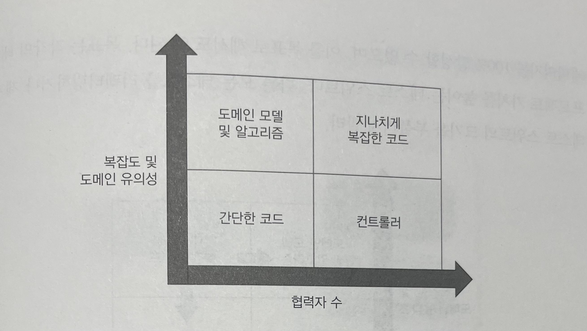
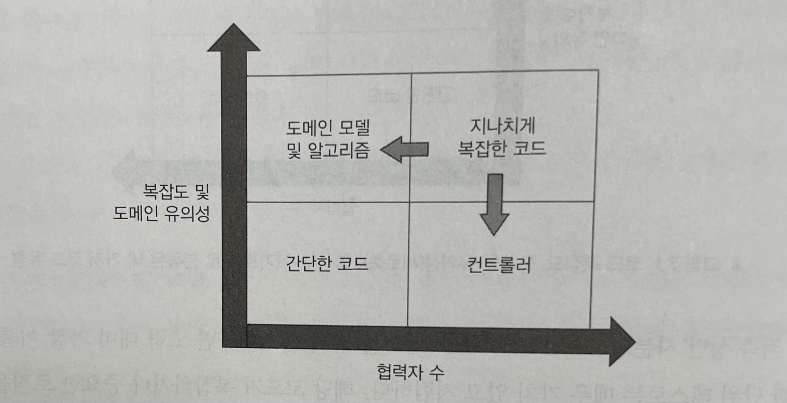
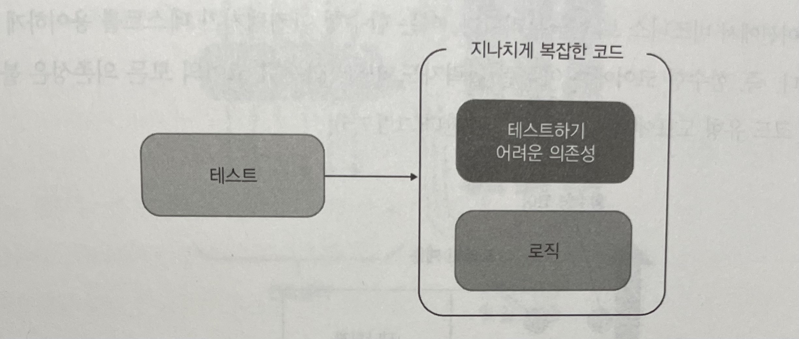
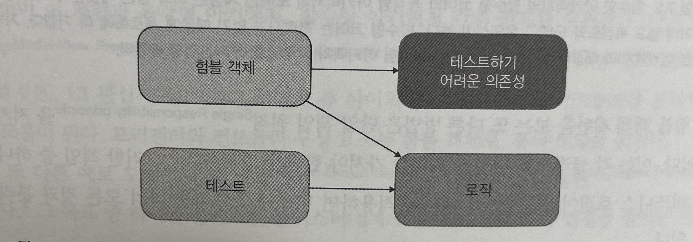
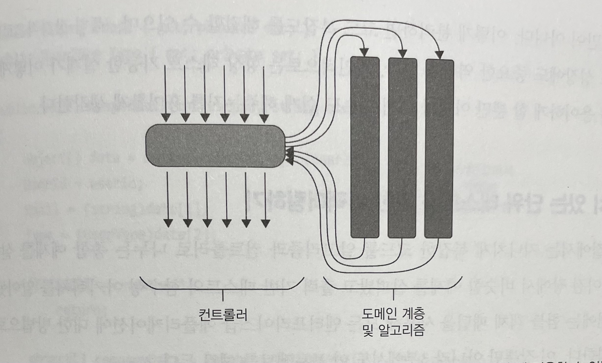
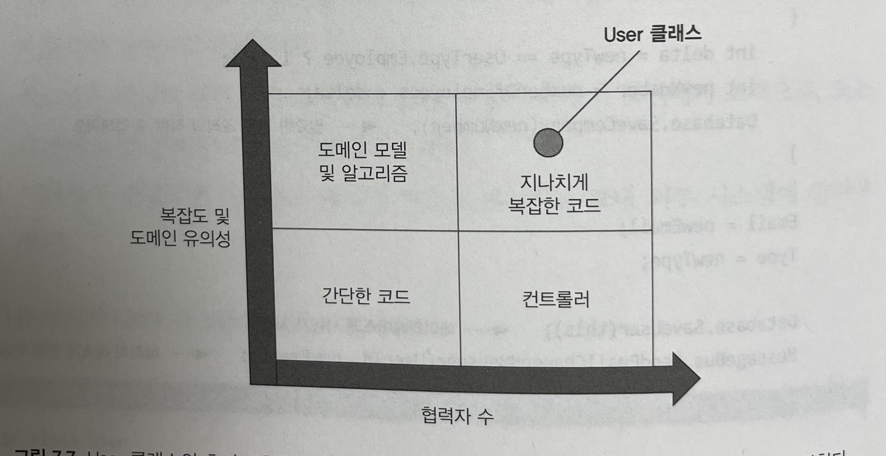
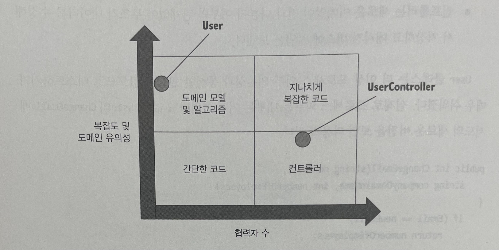
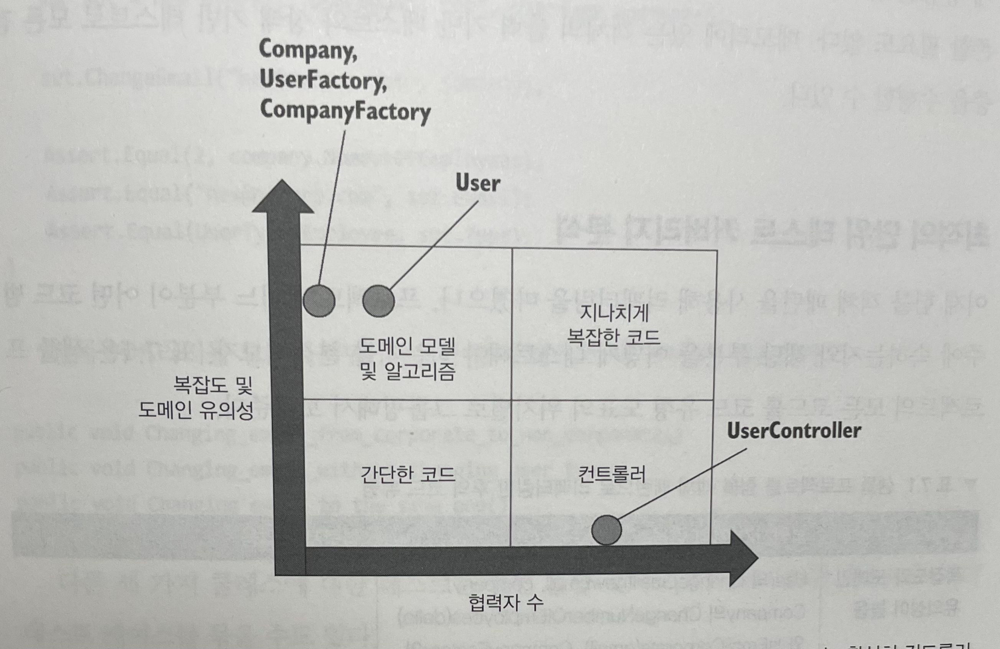

# Unit Testing : 생산성과 품질을 위한 단위 테스트 원칙과 패턴

이 내용은 [단위 테스트 생산성과 품질을 위한 단위 테스트 원칙과 패턴]을 읽으면서 정리한 내용을 포함하고 있습니다.

- 7장 가치 있는 단위 테스트를 위한 리팩터링 : 7.1 ~ 7.2

목차는 다음과 같습니다.

- 7.1 리팩터링할 코드 식별하기 
- 7.2 함수형 아키텍처의 단점 이해하기

## 7장 가치 있는 단위 테스트를 위한 리팩터링

**좋은 단위 테스트 스위트의 속성**

- 개발 주기에 통합
- 코드베이스 중 가장 중요한 부분만을 대상
- 최소한의 유지비로 최대의 가치를 끌어낸다. 이를 달성하기 위해서는 다음을 할 수 있어야 한다.
  - 가치 있는 테스트 식별하기
  - 가치 있는 테스트 작성하기

다음 내용에서는 대다수 소프트웨어 프로젝트에서 가치 있는 테스트를 작성하는 방법과 관련해 실용적인 지침을 알아본다.

### 7.1 리팩터링할 코드 식별하기

기반 코드를 리팩터링하지 않고서는 테슽 스위트를 크게 개선할 수 없다.

- 테스트 코드와 제품 코드는 본질적으로 관련돼 있기 때문이다.

#### 7.1.1 코드의 네 가지 유형

모든 제품 코드는 2차원으로 분류할 수 있다.

- 복잡도 또는 도메인 유의성
  - 복잡도는 코드 내 의사 결정 지점 수로 정의하며 이 숫자가 클수록 복잡도는 더 높아진다.
  - 도메인 유의성은 코드가 프로젝트의 문제 도메인에 대해 얼마나 의미 있는지를 나타낸다.
    - 일반적인 도메인 계층의 모든 코드는 도메인 유의성이 높으나 유틸리티 코드는 연관성이 없다.
  - `복잡한 코드와 도메인 유의성을 갖는 코드가 단위 테스트에서 가장 이롭다.`
- 협력자 수
  - 클래스 또는 메서드가 가진 협력자 수
  - 협력자는 가변 의존성 또는 프로세스 외부 의존성으로 협력자가 많은 코드는 테스트 비용이 많이 든다.
  - 협력자가 많을수록 테스트가 커진다.
  - `프로세스 외부 의존성을 가진 모든 통신은 도메인 계층 외부의 클래스에 위임하는 것이 좋다.`



- 도메인 모델과 알고리즘
  - 문제 도메인과 직접적으로 관련이 없는 복잡한 알고리즘
- 간단한 코드
  - 매개변수가 없는 생성자와 한 줄 속성 등
  - 테스트 코드 필요 없다.
- 컨트롤러
  - Spring에서 Service의 역할
  - 도메인 클래스와 외부 애플리케이션 같은 다른 구성 요소의 작업을 조정
  - 통합 테스트에서 일부 진행 가능하다.
- 지나치게 복잡한 코드
  - 협력자가 많으며 복잡하거나 중요한 코드
  - 예를 들면 덩치가 큰 서비스 코드가 있다.

**도메인 모델과 알고리즘**

해당 영역을 단위 테스트라면 노력 대비 가장 좋다.

- 단위 테스트가 매우 가치 있고 저렴하다.
  - 해당 코드가 복잡하거나 중요한 로직을 수행해서 테스트의 회귀 방지가 향상되기 때문이다.
  - 코드에 협력자가 거의 없어서 테스트 유지비를 낮추기 때문

**지나치게 복잡한 코드**

단위 테스트가 어렵지만 테스트 커버리지 없이 내버려두는 것은 너무 위험하다.

- 많은 사람이 단위 테스트로 어려움을 겪는 주요 원인 중 하나

> 코드가 더 중요해지거나 복잡해질수록 협력자는 더 적어야 한다.

지나치게 복잡한 코드를 알고리즘과 컨트롤러로 나눠서 리팩터링한다.



#### 7.1.2 험블 객체 패턴을 사용해 지나치게 복잡한 코드 분할하기

지나치게 복잡한 코드를 쪼개려면, `험블 객체 패턴` 을 사용해야 한다.

**험블 객체 패턴**

- 제라드 메스자로스가 자신의 저서 xUnit 테스트 패턴 에서 코드 결합과 싸우는 방법 중 하나로 소개
- 현재는 훨씬 더 보편적으로 응용

예를 들어, 코드가 프레임워크 의존성이 결합돼 있기 때문에 테스트가 어렵다는 사실을 깨닫게 되었다. 비동기 또는 멀티스레드 실행, 사용자 인터페이스, 프로세스 외부 의존성과의 통신 등이 있다.



- 어려운 의존성과 결합된 코드는 테스트하기 어렵다.
- 테스트는 해당 의존성도 다뤄야 하기 때문에 유지비가 증가한다.

테스트 대상 코드의 로직을 테스트하려면, 테스트가 가능한 부분을 추출해야 한다. 결과적으로 코드는 테스트 가능한 부분을 둘러싼 얇은 험블 래퍼가 된다.



- 험블 객체 패턴은 지나치게 복잡한 코드에서 로직을 추출해 테스트할 필요가 없도록 간단하게 만든다.
- 추출된 로직은 테스트하기 어려운 의존성에서 분리된 다른 클래스로 이동한다.

육각형 아키텍처는 비즈니스 로직과 외부 의존성과의 통신을 분리한다.
이는 도메인 계층과 애플리케이션 서비스 게층이 각각 담당하는 것이다.

험블 객체 패턴을 보는 또 다른 방법은 단일 책임 원칙(`Single Responsibility Principle`)을 지키는 것이다. 이는 각 클래스가 단일한 책임만 가져야 한다는 원칙이다. 



- 코드의 깊이과 너비는 비즈니스 로직과 오케스트레이션 책임 간의 분리를 고려할 때 적용할 수 있는 유용한 비유
- 컨트롤러는 많은 의존성을 조정하지만, 도메인 클래스는 그 반대

> MVP(Model-View-Presenter), MVC(Model-View-Controller)
> 
> - 두 패턴 모두 비즈니스 로직, UI 관심사(뷰) 그리고 모델과 뷰 사이의 조정을 분리하는 데 도움
> 
> DDD의 Aggregate Pattern
> 
> - 클래스를 클러스터로 묶어서 클래스 간 역할을 줄이는 것

비즈니스 로직과 오케스트레이션을 계속 분리해야 하는 이유

- 테스트 용이성
- 코드 복잡도 해결
- 프로젝트 성장에 중요한 역할

### 7.2 가치 있는 단위 테스트를 위한 리팩터링하기

지나치게 복잡한 코드를 알고리즘과 컨트롤러로 나누는 종합 예제를 살펴본다.

#### 7.2.1 고객 관리 시스템 소개

사용자 등록을 처리하는 고객 관리 시스템이며 모든 사용자가 데이터베이스에 저장된다.
현재 시스템은 사용자 이메일 변경이라는 단 하나의 유스케이스만 지원한다.

- 사용자 이메일이 회사 도메인에 속한 경우 해당 사용자는 직원으로 표시된다. 그렇지 않으면 고객으로 간주한다.
- 시스템은 회사의 직원 수를 추적해야 한다. 사용자 유형이 직원에서 고객으로 또는 그 반대로 변경되면 이 숫자로 변경해야 한다.
- 이메일이 변경되면 시스템은 메시지 버스로 메시지를 보내 외부 시스템에 알려야 한다.

초기 구현 코드는 다음과 같다.

```java
@Getter
@Setter
public class User {

    public int userId;
    public String email;
    public UserType type;
    public UserRepository userRepository;
    public CompanyRepository companyRepository;
    public MessageBus messageBus;

    public void changeEmail(final int userId, final String newEmail) {

        final User findUser = userRepository.findUserById(userId);
        this.email = findUser.email;
        this.type = findUser.type;

        if (this.email.equals(newEmail)) {
            return ;
        }

        final Company company = companyRepository.findCompany();
        final String companyDomainName = company.getName();
        final int numberOfEmployees = company.getNumberOfEmployees();

        final String emailDomain = newEmail.split("@")[1];
        final boolean isEmailCorporate = emailDomain.equals(companyDomainName);
        final UserType newType = isEmailCorporate ? UserType.EMPLOYEE : UserType.CUSTOMER;

        if (type == newType) {
            final int delta = newType == UserType.EMPLOYEE ? 1 : -1;
            final int newNumber = numberOfEmployees + delta;
            companyRepository.update(newNumber);
        }

        this.email = newEmail;
        this.type = newType;

        userRepository.save(this);
        messageBus.sendEmailChangedMessage(this.userId, newEmail);
    }
}
```

- 코드 복잡도는 그리 높지 않다.
- 애플리케이션의 핵심 비즈니스 로직이므로, 이 클래스는 복잡도와 도메인 유의성 측면에서 점수가 높다. 
- 프로세스 외부 협력자가 있으므로 지나치게 복잡한 코드로 분류된다.



- `User` 클래스의 초기 구현은 두 차원에서 모두 점수가 높으므로 지나치게 복잡한 코드에 해당

#### 7.2.2 1단계 : 암시적 의존성을 명시적으로 만들기

**간단한 방법**

데이터베이스와 메시지 버스에 대한 인터페이스를 생성하고, 이 인터페이스를 `User` 에 주입한 후 테스트에서 목으로 처리한다.

**추후 방향**

도메인 모델은 직접적으로든 간접적으로든 프로세스 외부 협력자에게 의존하지 않는 것이 훨씬 더 깔끔하다. 이것이 바로 육각형 아키텍처에서 바라는 바다.

#### 7.2.3 2단계 : 애플리케이션 서비스 계층 도입

도메인 모델이 외부 시스템과 직접 통신하는 문제를 해결하려면 다른 클래스인 험블 서비스로 책임을 옮겨야 한다.

다음은 수정한 버전이다.

```java
public class UserService {

    private final UserRepository userRepository;
    private final CompanyRepository companyRepository;
    private final MessageBus messageBus;

    public UserService(final UserRepository userRepository, final CompanyRepository companyRepository, final MessageBus messageBus) {
        this.userRepository = userRepository;
        this.companyRepository = companyRepository;
        this.messageBus = messageBus;
    }

    public void changeEmail(final int userId, final String newEmail) {

        final User findUser = userRepository.findUserById(userId);
        final String email = findUser.getEmail();
        final UserType type = findUser.getType();
        final User user = new User(userId, email, type);

        final Company company = companyRepository.findCompany();
        final String companyDomainName = company.getName();
        final int numberOfEmployees = company.getNumberOfEmployees();

        final int newNumberOfEmployees = user.changeEmail(newEmail, companyDomainName, numberOfEmployees);

        companyRepository.update(newNumberOfEmployees);
        userRepository.save(user);
        messageBus.sendEmailChangedMessage(userId, newEmail);
    }
}
```

다시 변경한 버전이다.

```java
@Getter
@Setter
public class User {

    private int userId;
    private String email;
    private UserType type;

    public User(final int userId, final String email, final UserType type) {
        this.userId = userId;
        this.email = email;
        this.type = type;
    }

    public int changeEmail(final String newEmail, final String companyDomainName, int numberOfEmployees) {

        if (this.email.equals(newEmail)) {
            return numberOfEmployees;
        }

        final String emailDomain = newEmail.split("@")[1];
        final boolean isEmailCorporate = emailDomain.equals(companyDomainName);
        final UserType newType = isEmailCorporate ? UserType.EMPLOYEE : UserType.CUSTOMER;

        if (type == newType) {
            final int delta = newType == UserType.EMPLOYEE ? 1 : -1;
            final int newNumber = numberOfEmployees + delta;
            numberOfEmployees = newNumber;
        }

        this.email = newEmail;
        this.type = newType;

        return numberOfEmployees;
    }
}
```

Service 사분면에 들어갔지만, 아직 로직이 꽤 복잡하므로 지나치게 복잡한 코드의 경계에 걸쳐 있다.



- 2단계에서는 User가 도메인 모델 사분면으로 들어와서 수직축에 가까이 있게 됐다.
- UserService는 복잡한 로직이 있기 때문에 지나치게 복잡한 코드 사분면의 경계에 걸쳐 있다.

#### 7.2.4 3단계 : 애플리케이션 서비스 복잡도 낮추기

UserService가 컨트롤러 사분면에 확실히 있으려면 재구성 로직을 추출해야 한다.

- ORM 라이브러리를 사용해 데이터베이스를 도메인 모델에 매핑하면, 재구성 로직을 옮기기에 적절한 위치가 될 수 있다.
- 또는 팩토리 패턴 활용

#### 7.2.5 4단계 : 새 Company 클래스 소개

회사 관련 로직과 데이터를 함께 묶는 또 다른 클래스인 Company 생성한다.

```java
@Getter
@Setter
public class Company {

    private String name;
    private int numberOfEmployees;

    public void changeNumberOfEmployees(final int delta) {

        Preconditions.checkArgument(this.numberOfEmployees + delta >= 0);
        this.numberOfEmployees += delta;
    }

    public boolean canEmailCorporate(final String email) {

        final String emailDomain = email.split("@")[1];
        return emailDomain.equals(this.name);
    }
}
```

- `User` 인스턴스는 직원 수를 변경하거나 특정 이메일이 회사 이메일인지 여부를 파악하도록 회사에 말하며, 원시 데이터를 묻지 않고 모든 작업을 자체적으로 수행한다.

서비스 메소드는 다음과 같다.

```java
public class UserService {

    private final UserRepository userRepository;
    private final CompanyRepository companyRepository;
    private final MessageBus messageBus;

    public UserService(final UserRepository userRepository, final CompanyRepository companyRepository, final MessageBus messageBus) {
        this.userRepository = userRepository;
        this.companyRepository = companyRepository;
        this.messageBus = messageBus;
    }

    public void changeEmail(final int userId, final String newEmail) {

        final User user = userRepository.findUserById(userId);

        final Company company = companyRepository.findCompany();

        user.changeEmail(newEmail, company);

        companyRepository.saveCompany(company);
        userRepository.saveUser(user);
        messageBus.sendEmailChangedMessage(userId, newEmail);
    }
}
```

`User` 클래스는 다음과 같다.

```java
@Getter
@Setter
public class User {

    private int userId;
    private String email;
    private UserType type;

    public User(final int userId, final String email, final UserType type) {
        this.userId = userId;
        this.email = email;
        this.type = type;
    }

    public void changeEmail(final String newEmail, final Company company) {

        if (this.email.equals(newEmail)) {
            return ;
        }

        final UserType newType = company.canEmailCorporate(newEmail) ? UserType.EMPLOYEE : UserType.CUSTOMER;

        if (type != newType) {
            final int delta = newType == UserType.EMPLOYEE ? 1 : -1;
            company.changeNumberOfEmployees(delta);
        }

        this.email = newEmail;
        this.type = newType;
    }
}
```

- 잘못둔 책임을 제거하니 `User` 객체가 훨씬 더 깔끔해졌다.
- 회사 데이터를 처리하는 대신 `Company` 인스턴스를 받아 두 가지 중요한 작업을 위임한다.
  - 이메일이 회사 이메일인지 결정하는 것
  - 회사의 직원 수를 변경하는 것

각 클래스의 위치는 다음과 같다.



- `Company` 협력자가 있기 때문에 `User`는 오른쪽으로 이동했다.
- `UserService` 는 확실히 서비스 사분면에 속한다.

도메인 계층에서는 프로세스 외부 의존성과 통신하지 않는다. 애플리케이션 서비스 계층이 해당 통신을 담당한다. 

리팩토리된 소스에서는 비즈니스 로직의 대한 단위 테스트 작성이 쉬워진다.

`User` 객체의 대한 단위 테스트 작성은 다음과 같다.

```java
class UserTest {

    private static final String DOMAIN_NAME = "yopmail.com";

    @Test
    @DisplayName("기존 이메일과 변경하고자 하는 이메일이 같으면 변경되지 않는다.")
    void the_same_email_as_before_is_not_changed() {

        final String email = "test@yopmail.com";
        final User user = new User(1, email, UserType.CUSTOMER);
        final Company company = new Company(DOMAIN_NAME, 1);
        user.changeEmail(email, company);

        assertAll(
                () -> assertThat(user.getEmail()).isEqualTo(email),
                () -> assertThat(user.getType()).isEqualTo(UserType.CUSTOMER)
        );
    }

    @Test
    @DisplayName("고객의 이메일이 회사 도메인에 속하는 메일이면 직원으로 표시된다.")
    void the_customer_email_is_the_same_as_the_company_domain_email_they_are_marked_as_employees() {

        final String email = "test@yopmail.com";
        final String changeEmail = "test-change@yopmail.com";
        final User user = new User(1, email, UserType.CUSTOMER);
        final Company company = new Company(DOMAIN_NAME, 1);
        user.changeEmail(changeEmail, company);

        assertAll(
                () -> assertThat(user.getEmail()).isEqualTo(changeEmail),
                () -> assertThat(user.getType()).isEqualTo(UserType.EMPLOYEE)
        );
    }
}
```

`Company` 객체의 단위 테스트는 다음과 같다.

```java
class CompanyTest {

    private static final String DOMAIN_NAME = "yopmail.com";

    @Test
    @DisplayName("직원수는 마이너스가 될 수 없습니다.")
    void the_number_of_employees_cannot_be_negative() {

        final Company company = new Company(DOMAIN_NAME, 1);

        assertThatThrownBy(() -> company.changeNumberOfEmployees(-2))
                .isInstanceOf(IllegalArgumentException.class)
                .hasMessage("직원수는 마이너스가 될 수 없습니다.");
    }

    @Test
    @DisplayName("회사 도메인과 일치하지 않는다.")
    void not_match_company_domain() {

        final Company company = new Company(DOMAIN_NAME, 1);

        final boolean result = company.canEmailCorporate("test@test.com");

        assertThat(result).isFalse();
    }
}
```