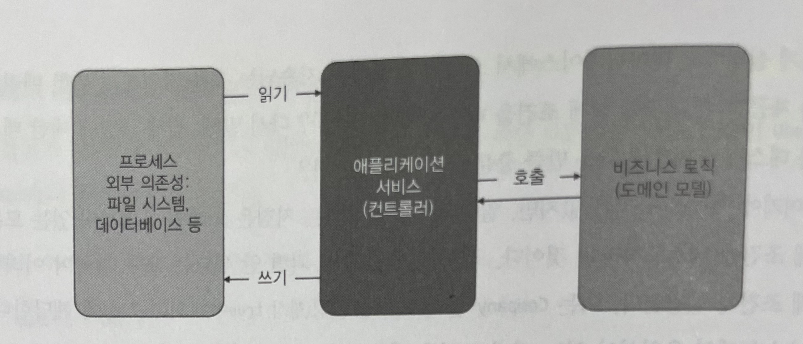
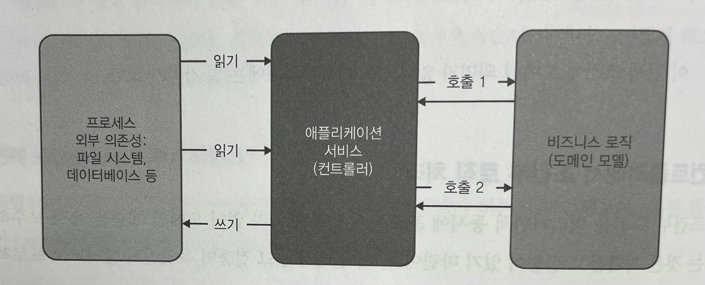
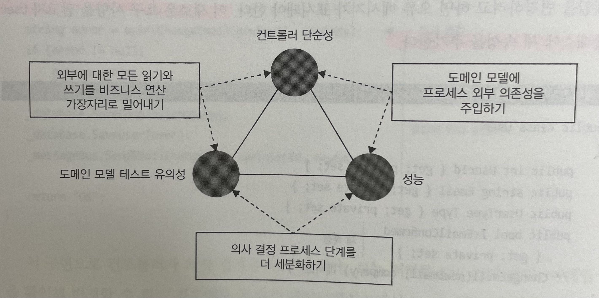
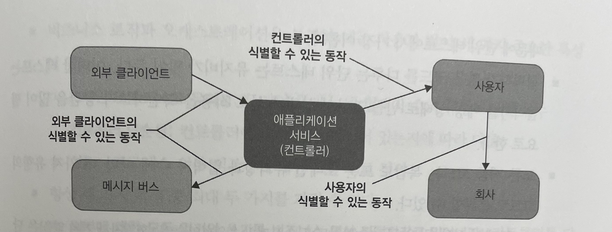

# Unit Testing : 생산성과 품질을 위한 단위 테스트 원칙과 패턴

이 내용은 [단위 테스트 생산성과 품질을 위한 단위 테스트 원칙과 패턴]을 읽으면서 정리한 내용을 포함하고 있습니다.

- 7장 가치 있는 단위 테스트를 위한 리팩터링 : 7.3 ~ 7.5

목차는 다음과 같습니다.

- 7.3 최적의 단위 테스트 커버리지 분석
- 7.4 컨트롤러에서 조건부 로직 처리
- 7.5 결론

## 7장 가치 있는 단위 테스트를 위한 리팩터링

### 7.3 최적의 단위 테스트 커버리지 분석

샘플 프로젝트를 험블 객체 패턴으로 리팩터링한 후의 코드 유형

|   |협력자가 거의 없음|협력자가 많음|
|---|-------------|----------|
|복잡도와 도메인 유의성이 높음|User의 ChangeEmail(newEmail, company), Company의 ChangeNumberOfEmployees(delta)와 IsEmailCorporate(email), CompanyFactory의 Create(data)|    |
|복잡도와 도메인 유의성이 낮음|User와 Company의 생성자|UserController의 ChangeEmail(userId, newMail)|

비즈니스 로직과 오케스트레이션을 완전히 분리하면 코드베이스의 어느 부분을 테스트 단위로 할지 쉽게 결정할 수 있다.

#### 7.3.1 도메인 계층과 유틸리티 코드 테스트하기

코드의 복잡도나 도메인 유의성이 높으면 회귀 방지가 뛰어나고 협력자가 거의 없어 유지비도 가장 낮다.

전체 커버리지를 달성하려면, 다음과 같이 테스트 3개가 더 필요하다.

- `void changing_email_from_corporate_to_non_corporate()`
- `void changing_email_without_changing_user_type()`
- `void changing_email_to_the_same_one()`

매개변수화된 테스트를 활용해서 테스트 케이스를 묶을 수 있다.

```java
@ParameterizedTest
@CsvSource(value = {"mycorp.com,email@mycorp.com,true", "mycorp.com,email@gmail.com,false"})
void differentiates_a_corporate_email_from_non_corporate(final String domain, final String email, final boolean expectedResult) {

    final var sut = new Company(domain, 0);

    final boolean emailCorporate = sut.canEmailCorporate(email);

    assertThat(emailCorporate).isEqualTo(expectedResult);
}
```

##### 7.3.2 나머지 세 사분면에 대한 코드 테스트하기

복잡도가 낮고 협력자가 거의 없는 코드는 다음과 같이 `User`와 `Company`의 생성자를 들 수 있다.

- 단순해서 노력을 들일 필요 없음
- 회귀 방지가 떨어짐

### 7.3.3 전제 조건을 테스트해야 하는가?

특별한 종류의 분기점(전제 조건)을 살펴보고 이를 테스트해야 하는지 확인해보자.

```java
public void changeNumberOfEmployees(final int delta) {

    Preconditions.checkArgument(this.numberOfEmployees + delta >= 0, "직원수는 마이너스가 될 수 없습니다.");
    this.numberOfEmployees += delta;
}
```

- 회사의 직원 수가 음수가 돼서는 안되는 전제 조건
  - 해당 전제 조건은 예외 상황에서만 활성화되는 보호 장치
  - 이 보호 장치는 소프트웨어가 빠르게 실패하고 데이터베이스에서 오류가 확산하고 지속되는 것을 방지하기 위한 메커니즘을 제공
  - 도메인 유의성을 나타냄

즉, 도메인 유의성이 있는 모든 전제 조건은 테스트해야 한다.

## 7.4 컨트롤러에서 조건부 로직 처리

조건부 로직을 처리하면서 동시에 프로세스 외부 협력자 없이 도메인 계층을 유지 보수하는 것은 까다롭고 절충이 있기 마련이다.
비즈니스 로직과 오케스트레이션의 분리는 다음과 같이 비즈니스 연산이 세 단계로 있을 때 가장 효과적이다.

- 저장소에서 데이터 검색
- 비즈니스 로직 실행
- 데이터를 다시 저장소에 저장



단계가 명확하지 않는 경우도 있는데, 의사 결정 프로세스의 중간 결과를 기반으로 프로세스 외부 의존성에서 추가 데이터를 조회해야 할 수도 있다.



세 가지 방법이 있다.

- 외부에 대한 모든 읽기와 쓰기를 가장자리로 밀어낸다. 
  - 읽고-결정하고-실행하기 구조를 유지하지만 성능은 저하
  - 필요 없는 경우에ㅐ도 컨트롤러가 프로세스 외부 의존성을 호출하기 때문
- 도메인 모델에 프로세스 외부 의존성을 주입하고 비즈니스 로직이 해당 의존성을 호출할 시점을 직접 결정
- 의사 결정 프로세스 단계를 더 세분화하고, 각 단계별로 컨트롤러를 실행

다음 세 가지 특성의 균형을 맞춰야 한다.

- 도메인 모델 테스트 유의성 : 도메인 클래스의 협력자 수와 유형에 따른 함수
- 컨트롤러 단순성 : 의사 결정(분기) 지점이 있는지에 따라 다름
- 성능 : 프로세스 외부 의존성에 대한 호출 수로 정의



- 컨트롤러 단순성, 도메인 모델 테스트 유의성, 성능이라는 세 가지 특성을 모두 충족하는 해법은 없기 때문에 세 가지 중 두 가지를 선택해야 한다.

### 7.4.1 CanExecute/Execute 패턴 사용

컨트롤러 복잡도가 커지는 것을 완화하는 첫 번째 방법은 CanExecute/Execute 패턴을 사용해 비즈니스 로직이 도메인 모델에서 컨트롤러로 유출되는 것을 방지하는 것이다.

이메일은 사용자가 확인할 때까지만 변경할 수 있다고 하자.

첫번째 옵션은 `User` 클래스에 새 속성을 추가

```java
public String changeEmail(final String newEmail, final Company company) {

    if (isEmailConfirmed) {
        return "Can't change a confirmed email.";
    }

    /* 메서드의 나머지 부분 */
}
```
  
- 이 구현으로 컨트롤러가 의사 결정을 하지 않지만, 성능 저하를 감수해야 한다.
- 이메일을 확인해 변경할 수 없는 경우에도 무조건 데이터베이스에서 `Company` 인스턴스를 검색한다.

두번째 옵션은 `IsEmailConfirmed` 확인을 `User`에서 컨트롤러로 옮기는 것

```java
public String changeEmail(final int userId, final String newEmail) {

    final User user = userRepository.findUserById(userId);
    if (user.isEmailConfirmed()) {
            return "Can't change a confirmed email";
        }

    final Company company = companyRepository.findCompany();

    user.changeEmail(newEmail, company);

    companyRepository.saveCompany(company);
    userRepository.saveUser(user);
    messageBus.sendEmailChangedMessage(userId, newEmail);

    return "OK";
}
```

- 이 구현으로 성능은 그대로 유지
- `Company` 인스턴스는 확실히 이메일 변경이 가능한 후에만 데이터베이스에서 검색된다.
- 의사 결정 프로세스가 두 부분으로 나뉘어진다.
  - `UserService` 에서 이메일 변경 진행 여부
  - `User` 에서 변경 시 해야 할 일

이러한 파편화를 방지하기 위해서는 `User`에 새 메서드를 둬서, 이 메서드가 잘 실행되는 것을 이메일 변경의 전제 조건으로 한다.

```java
private String canChangeEmail() {

    if (emailConfirmed) {
        return "Can't change a confirmed email.";
    }
    return null;
}

public void changeEmail(final String newEmail, final Company company) {

    Preconditions.checkArgument(canChangeEmail() == null);

    /* 메서드의 나머지 부분 */
}
```

이 방법에는 두 가지 중요한 이점이 존재한다.

- 서비스는 더 이상 이메일 변경 프로세스를 알 필요가 없다. `canChangeEmail()` 메서드를 호출해서 연산을 수행할 수 있는지 확인하기만 하면 된다. 이 메서드에 여러가지 유효성 검사가 있을 수 있고, 유효성 검사 모두 컨트롤러부터 캡슐화돼 있다. 
- `changeEmail()` 의 전제 조건이 추가돼도 먼저 확인하지 않으면 이메일을 변경할 수 없도록 보장한다.

### 7.4.2 도메인 이벤트를 사용해 도메인 모델 변경 사항 추적

도메인 모델에서 중요한 변경 사항을 추적하고 비즈니스 연산이 완료된 후 해당 변경 사항을 프로세스 외부 의존성 호출로 변환한다. 도메인 이벤트로 이러한 추적을 구현할 수 있다. 

> 도메인 이벤트는 애플리케이션 내에서 도메인 전문가에게 중요한 이벤트를 말한다. 도메인 전문가에게는 무엇으로 도메인 이벤트와 일반 이벤트를 구별하는 지가 중요하다. 도메인 이벤트는 종종 시스템에서 발생하는 중요한 변경 사항을 외부 애플리케이션에 알리는 데 사용된다.

도메인 이벤트는 컨트롤러에서 의사 결정 책임을 제거하고 해당 책임을 도메인 모델에 적용함으로써 외부 시스템과의 통신에 대한 단위 테스트를 간결하게 한다. 컨트롤러를 검증하고 프로세스 외부 의존성을 목으로 대체하는 대신, 단위 테스트에서 직접 도메인 이벤트 생성을 테스트할 수 있다.

## 7.5 결론

(7장의 주제에 대해) 외부 시스템에 대한 애플리케이션의 부작용을 추상화하는 것이다.

- 비즈니스 연산이 끝날 때까지 이러한 부작용을 메모리에 둬서 추상화하여 프로세스 외부 의존성 없이 단순한 단위 테스트로 테스트 처리 
- 도메인 이벤트는 메시지 버스에서 메시지에 기반한 추상화
- 도메인 클래스의 변경 사항은 데이터베이스의 향후 수정 사항에 대한 추상화

서비스에서 비즈니스 로직이 있는 것을 피할 수 없는 것처럼, 도메인 클래스에서 모든 협력자를 제거할 수 있는 경우는 거의 없을 것이다. 협력자가 하나나 둘, 심지어 셋이 있더라도 프로세스 외부 의존성을 참조하지 않는 한, 도메인 클래스는 지나치게 복잡한 코드가 아닐 것이다.

식별할 수 있는 동작이 되려면 메서드는 다음 두 가지 기준 중 하나를 충족해야 한다.

- 클라이언트 목표 중 하나에 직접적인 연관이 있음
- 외부 애플리케이션에서 볼 수 있는 프로세스 외부 의존성에서 부작용이 발생함

클라이언트는 컨트롤러이고 `User` 의 `changeEmail` 메서드는 사용자 이메일을 변경하는 클라이언트의 목표에 직접적인 연관이 있으므로 테스트해야 한다. 그러나 `User`에서 `Company`로 가는 후속 호출은 컨트롤러의 관점에서 구현 세부 사항이다. 따라서 `User`의 `changeEmail` 메서드를 다루는 테스트는 `User`가 `Company`에 어떤 메서드를 호출하는지 검증해서는 안 된다. 한 단계 더 내려가서 `Company` 의 두 가지 메서드를 `User` 관점에서 테스트할 때도 마찬가지다.

