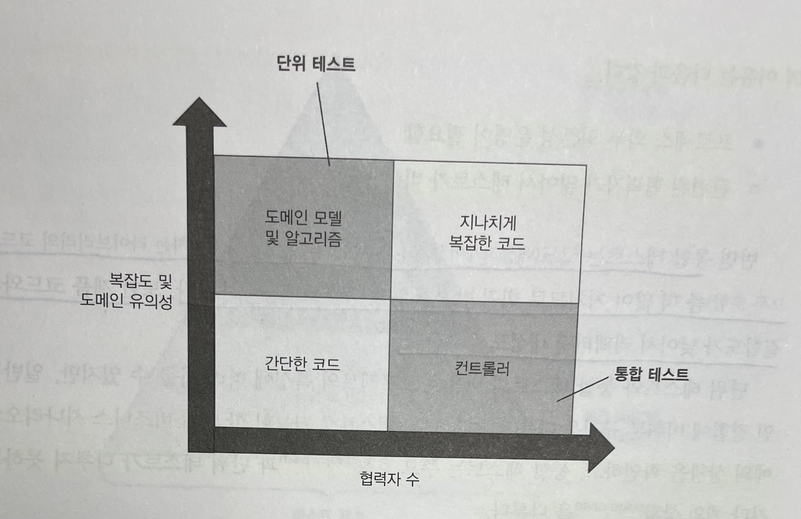
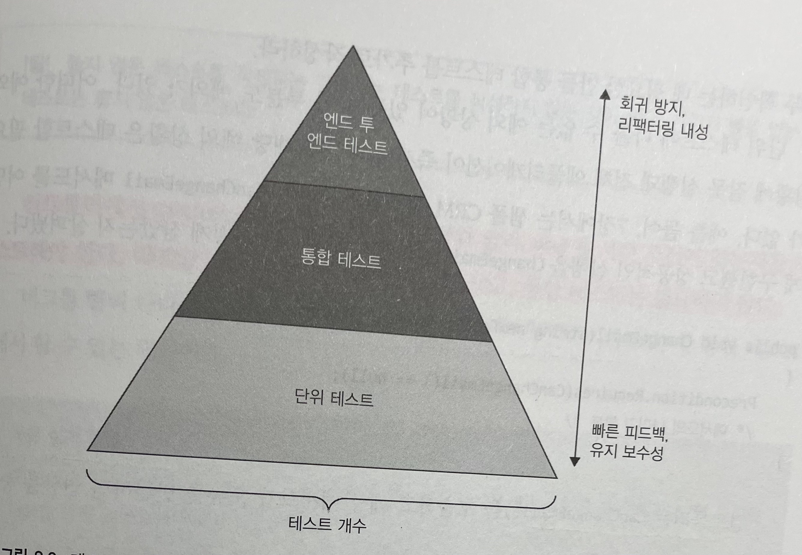
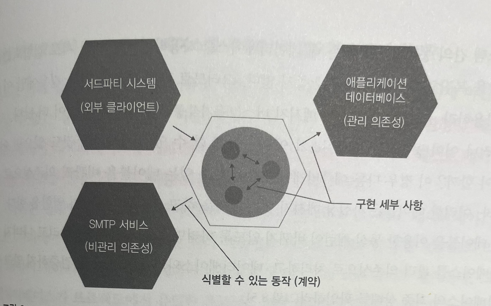
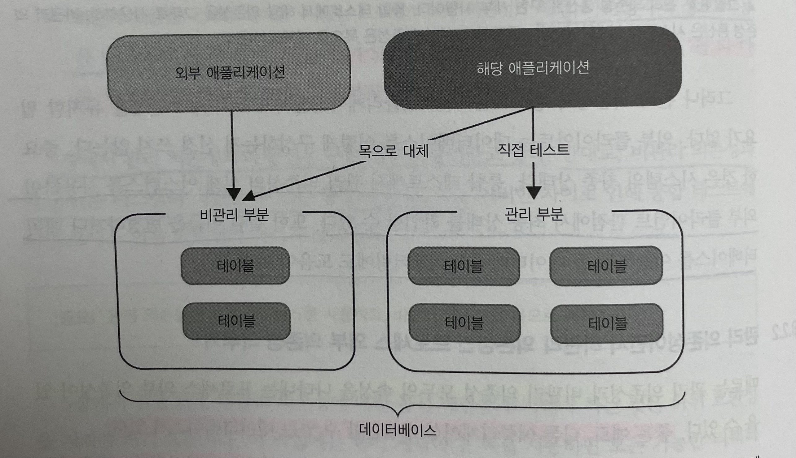
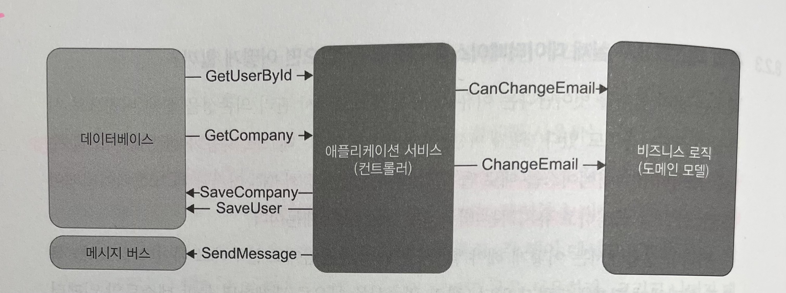
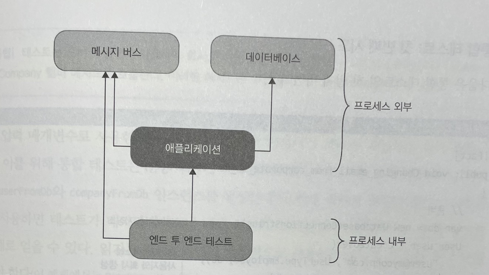
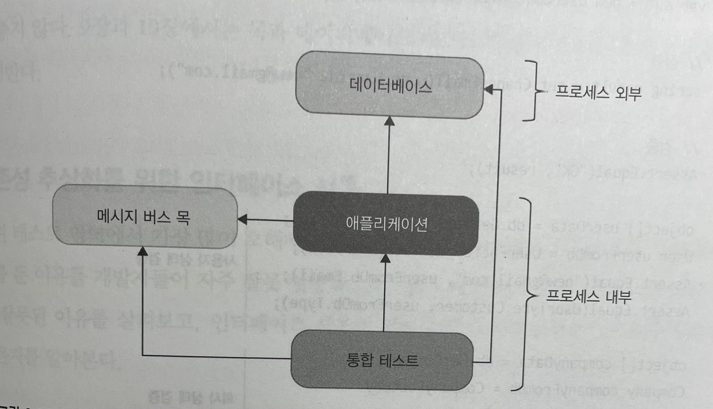

# Unit Testing : 생산성과 품질을 위한 단위 테스트 원칙과 패턴

이 내용은 [단위 테스트 생산성과 품질을 위한 단위 테스트 원칙과 패턴]을 읽으면서 정리한 내용을 포함하고 있습니다.

- 8장 통합 테스트를 하는 이유 : 8.1 ~ 8.4

목차는 다음과 같습니다.

- 8.1 통합 테스트는 무엇인가?
- 8.2 어떤 프로세스 외부 의존성을 직접 테스트해야 하는가?
- 8.3 통합 테스트 : 예제
- 8.4 의존성 추상화를 위한 인터페이스 사용

## 8장 통합 테스트를 하는 이유

단위 테스트에만 전적으로 의존하면 시스템이 전체적으로 잘 작동하는지 확신할 수 없다. 

도메인 모델 경계를 명시하고 애플리케이션의 계층 수를 줄이고 순환 의존성을 제거하는 등 코드베이스의 상태를 개선하는 데 도움이 되는 통합 테스트 모범 사례를 살펴본다.

### 8.1 통합 테스트는 무엇인가?

통합 테스트는 테스트 스위트에서 중요한 역할을 하며, 단위 테스트 개수와 통합 테스트 개수의 균형을 맞추는 것도 중요하다.

통합 테스트의 역할과 균형을 어떻게 지키는지 알아보고, 통합 테스트와 단위 테스트의 차이점도 알아보겠다.

#### 8.1.1 통합 테스트의 역할

단위 테스트의 세 가지 요구 사항은 다음과 같다.

- 단일 동작 단위를 검증하고,
- 빠르게 수행하고,
- 다른 테스트와 별도로 처리한다.

위 세 가지 요구 사항 중 하나라도 충족하지 못하는 테스트는 통합 테스트 범주에 속한다. 단위 테스트가 아닌 모든 테스트가 통합 테스트에 해당한다.

단위 테스트는 도메인 모델을 다루는 반면, 통합 테스트는 프로세스 외부 의존성과 도메인 모델을 연결하는 코드를 확인한다.



- 컨트롤러 사분면을 다루는 테스트가 단위 테스트일 수 있다.
  - 모든 프로세스 외부 의존성을 목으로 대체하면 테스트 간에 공유하는 의존성이 없어지므로 테스트 속도가 빨라지고 서로 격리됨

**모든 테스트는 도메인 모델과 컨트롤러 사분면에만 초점을 맞춰야 한다.**

> 컨트롤러 사분면
> 레이어드 아키텍처에서는 `SERVICE` 에 해당한다.

#### 8.1.2 다시 보는 테스트 피라미드

단위 테스트와 통합 테스트 간의 균형을 유지하는 것이 중요하다.

통합 테스트가 프로세스 의부 의존성에 직접 작동하는 경우의 단점은 다음과 같다.

| 장점 | 단점 |
| --- | --- |
| 회귀방지 우수</br>리팩터링 내성 우수 | 테스트 실행 속도가 느려짐</br>테스트 유지비 증가 |

단점의 테스트 유지비 증가의 이유는 다음과 같다.

- 프로세스 외부 의존성 운영이 필요함
- 관련된 협력자가 많아서 테스트가 비대해짐

**단위 테스트와 통합 테스트의 비율**

- 단위 테스트로 가능한 한 많이 비즈니스 시나리오의 예외 상황을 확인
- 통합 테스트는 주요 흐름(`happy path`)과 단위 테스트가 다루지 못하는 기타 예외 상황(`edge case`)을 처리

> 단위 테스트와 통합 테스트
> 대부분은 단위 테스트로 전환하면 유지비를 절감할 수 있다.
> 또한 중요한 통합 테스트는가 비즈니스 시나리오당 하나 또는 두 개 있으면 시스템 전체의 정확도를 보장할 수 있다.



#### 8.1.3 통합 테스트와 빠른 실패

통합 테스트에서 프로세스 외부 의존성과 상호 작용을 모두 확인하려면 가장 긴 주요 흐름을 선택해야 한다.

- 모든 상호 작용을 거치지 않는다면 외부 통신을 모두 확인하는 데 필요한 만큼 통합 테스트를 추가로 작성해야 한다.

어떠한 예외 상황에 잘못 실행돼 전체 애플리케이션이 즉시 실패하면 해당 예외 상황은 테스트할 필요가 없다. 버그를 빨리 나타나게 하는 것을 `빠른 실패 원칙` 이라고 하며 통합 테스트에서 할 수 있는 대안이다.

**빠른 실패 원칙**

- 예기치 않은 오류가 발생하자마자 현재 연산을 중단하는 것을 의미
- 버그를 빨리 발견하면 쉽게 해결할 수 있다.
- 빨리 실패하면 손상이 확산되는 것을 막을 수 있다.

### 8.2 어떤 프로세스 외부 의존성을 직접 테스트해야 하는가?

통합 테스트는 시스템이 프로세스 외부 의존성과 어떻게 통합하는지를 검증한다. 이러한 검증을 구현하는 방식은 두 가지가 있다.

- 실제 프로세스 외부 의존성을 사용
- 해당 의존성을 목으로 대체하는 것

두 가지 방식을 각각 언제 적용해야 하는지 알아본다.

#### 8.2.1 프로세스 외부 의존성의 두 가지 유형

모든 프로세스 외부 의존성은 두 가지 범주로 나뉜다.

- 관리 의존성
  - 전체를 제어할 수 있는 프로세스 외부 의존성
  - 애플리케이션을 통해서만 접근 가능하며 상호 작용은 외부에서 볼 수 없음
  - 예를 들어, 데이터베이스 등
- 비관리 의존성
  - 전체를 제어할 수 없는 프로세스 외부 의존성
  - 상호 작용을 외부에서 볼 수 있음
  - 예를 들어, SMTP 서버와 메시지 버스 등

> 관리 의존성은 실제 인스턴스를 사용하고, 비관리 의존성은 목으로 대체하라.



- 관리 의존성 통신은 구현 세부 사항으로 통합 테스트에서 해당 의존성을 그대로 사용한다
- 비관리 의존성 통신은 시스템의 식별할 수 있는 동작으로 해당 의존성은 목으로 대체한다.

#### 8.2.2 관리 의존성이면서 비관리 의존성인 프로세스 외부 의존성 다루기

관리 의존성과 비관리 의존성을 나타내는 프로세스 외부 의존성 : `다른 애플리케이션에서 접근할 수 있는 데이터베이스`

- A시스템은 데이터베이스를 사용
- B시스템이 같은 데이터베이스의 데이터를 요구
- B시스템과 쉽게 통합할 수 있도록 일부 테이블만 접근 권한을 공유
- 결과적으로 데이터베이스는 관리 의존성이면서 비관리 의존성

**시스템 간의 통합을 구현 시**

- 데이터베이스를 사용하면 시스템이 서로 결합되고 추가 개발을 복잡하게 만들기 때문에 좋지 않다. 
- API나 메시지 버스를 사용하는 것이 더 낫다.

**이미 공유 데이터베이스가 있다면?**

- 통신 패턴이 바뀌지 않도록 하려면 목을 사용
- 나머지 데이터베이스를 관리 의존성으로 처리
- 데이터베이스와의 상호 작용을 검증하지 말고 데이터베이스의 최종 상태를 확인



꼭 필요한 경우가 아니라면 시스템이 해당 테이블과 상호 작용하는 방식을 변경하지 말아야 한다.

#### 8.2.3 통합 테스트에서 실제 데이터베이스를 사용할 수 없으면 어떻게 할까?

관리 범위를 벗어난다는 이유로, 통합 테스트에서 관리 의존성을 실제 버전으로 사용할 수 없는 경우도 있다.

- 테스트 자동화 환경에 배포할 수 없는 레거시 데이터베이스
- IT 보안 정책 때문이거나 테스트 데이터베이스 인스턴스를 설정하고 유지하는 비용 고려

**이러한 상황에서 어떻게 해야 할까?**

관리 의존성을 목으로 대체하면 통합 테스트가 하는 일은 어떤 레포지터리 메소드를 호출하는지 검증하는 것뿐이다. 
데이터베이스를 그대로 테스트할 수 없으면 통합 테스트를 아예 작성하지 말고 도메인 모델의 단위 테스트에만 집중해야 한다.

### 8.3 통합 테스트 : 예제



- 사용자 이메일을 변경하는 유스케이스
- 컨트롤러(서비스)는 데이터베이스, 메시지 버스, 도메인 모델 간의 작업을 조정

다음 서비스의 현재 소스이다.

```java
public class UserService {

    private final UserRepository userRepository;
    private final CompanyRepository companyRepository;
    private final MessageBus messageBus;

    public UserService(final UserRepository userRepository, final CompanyRepository companyRepository, final MessageBus messageBus) {
        this.userRepository = userRepository;
        this.companyRepository = companyRepository;
        this.messageBus = messageBus;
    }

    public String changeEmail(final int userId, final String newEmail) {

        final User user = userRepository.findUserById(userId);
        final String error = user.canChangeEmail();
        if (Strings.isNotBlank(error)) {
            return error;
        }

        final Company company = companyRepository.findCompany();

        user.changeEmail(newEmail, company);

        companyRepository.saveCompany(company);
        userRepository.saveUser(user);
        for (EmailChangedEvent emailChangedEvent : user.getEmailChangedEvents()) {
            messageBus.sendEmailChangedMessage(emailChangedEvent.getUserId(), emailChangedEvent.getNewEmail());
        }

        return "OK";
    }
}
```

#### 8.3.1 어떤 시나리오를 테스트할까?

통합 테스트를 다루는 일반적인 지침은 다음과 같다. 

- 가장 긴 주요 흐름
  - 모든 프로세스 외부 의존성을 거치는 것
- 단위 테스트로는 수행할 수 없는 모든 예외 상황을 다루는 것

예제를 통한 작성해볼 수 있는 시나리오

- 가장 긴 주요 흐름은 기업 이메일에서 일반 이메일로 변경하는 시나리오
- 단위 테스트로는 수행할 수 없는 예외 상황은 이메일을 변경할 수 없는 시나리오

#### 8.3.2 데이터베이스와 메시지 버스 분류하기

통합 테스트를 작성하기 전 프로세스 외부 의존성을 두 가지 분류

- 직접 테스트할 대상
  - 애플리케이션 데이터베이스는 어떤 시스템도 접근할 수 없으므로 실제 인스턴스를 사용
- 목으로 대체할 대상
  - 메시지 버스는 비관리 의존성
  - 메시지 버스의 목적은 다른 시스템과의 통신을 가능하게 하는 것뿐

#### 8.3.3 엔드 투 엔드 테스트는 어떤가?

API로 시나리오를 엔드 투 엔드 테스트하면 배포해서 모두 작동하는 버전의 API로 테스트하게 되고, 이는 어떤 프로세스 외부 의존성도 목으로 대체하지 않는 것을 의미한다.
반면 통합 테스트는 동일한 프로세스 내에서 애플리케이션을 호스팅하고 비관리 의존성을 목으로 대체한다.



- 엔드 투 엔드 테스트는 외부 클라이언트를 모방
- 테스트 범위에 포함된 모든 프로세스 외부 의존성을 참조하는 배포된 버전의 애플리케이션을 테스트
- 관리 의존성을 직접 확인해서는 안 되고, 애플리케이션을 통해 간적접으로 확인



- 통합 테스트는 동일한 프로세스 내에서 애플리케이션을 호스팅
- 비관리 의존성을 목으로 대체하며 통합 테스트를 위한 프로세스 외부 의존성은 관리 의존성

#### 8.3.4 통합 테스트 : 첫 번째 시도

```java
@Test
void changing_email_from_corporate_to_non_corporate() {
    final var user = createUser("user@mycorp.com", UserType.EMPLOYEE);
    final var company = createCompany("mycorp.com", 1);
    
    final String result = userService.changeEmail(user.getUserId(), "new@gmail.com");

    assertThat("OK").isEqualTo(result);

    final User userData = userRepository.findUserById(user.getUserId());
    assertAll(
            () -> assertThat("new@gmail.com").isEqualTo(user.getEmail()),
            () -> assertThat(UserType.CUSTOMER).isEqualTo(user.getType())
    );

    final Company companyData = companyRepository.findCompany();
    assertThat(0).isEqualTo(companyData.getNumberOfEmployees());

    verify(messageBus, times(1)).sendEmailChangedMessage(user.getUserId(), user.getEmail());
}
```

- 입력 매개변수로 사용한 데이터와 별개로 데이터베이스 상태를 확인하는 것이 중요하다.
- 테스트가 데이터베이스에 대해 읽기와 쓰기 모두 수행하므로 회귀 방지를 최대로 얻을 수 있음
- 읽기는 컨트롤러 내부적으로 사용하는 동일한 코드를 써서 구현해야 한다.

### 8.4 의존성 추상화를 위한 인터페이스 사용

단위 테스트 영역에서 가장 많이 오해하는 주제 중 하나는 인터페이스 사용이다.

- 인터페이스를 둔 이유를 잘못 설명하고, 그 결과 남용하는 경향이 있다.

#### 8.4.1 인터페이스와 느슨한 결합

인터페이스를 사용하는 일반적인 이유

- 프로세스 외부 의존성을 추상화해 느슨한 결합을 달성
- 기존 코드를 변경하지 않고 새로운 기능을 추가해 공개 폐쇄 원칙을 지키기 때문 

두 가지 이유 모두 이해가 필요하다.

- 단일 구현을 위한 인터페이스는 추상화가 아니며, 해당 인터페이스를 구현하는 구체 클래스보다 결합도가 낮지 않다.
- 기본적인 원칙인 `YAGNI(You aren't gonna need it)`를 위반하기 때문이다. `YAGNI`는 현재 필요하지 않은 기능에 시간을 들이지 말라는 것이다. 

현재 필요하지 않는 기능에 시간을 들이지 말라는 두 가지 이유가 있다.

- 기회 비용
  - 현재 비즈니스 담당자들에게 필요하지 않은 기능에 시간을 보낸다면, 지금 당장 필요한 기능을 제치고 시간을 허비하는 것
  - 처음부터 실제 필요에 따라 기능을 구현하는 것이 더 유리
- 프로젝트 코드가 적을수록 좋다.
  - 요구 사항이 바로 있는 경우가 아닌데도 만일을 위해 코드를 작성하면 코드베이스의 소유 비용이 불필요하게 증가

#### 8.4.2 프로세스 외부 의존성에 인터페이스를 사용하는 이유는 무엇인가?

각 인터페이스에 구현이 하나만 있다고 가정할 때 프로세스 외부 의존성에 인터페이스를 사용하는 이유는 무엇일까? 목을 사용하기 위함이다.

**인터페이스 사용**

- 의존성을 목으로 처리할 필요가 없는 한, 프로세스 외부 의존성에 대한 인터페이스를 사용하면 안 된다.
- 비관리 의존성만 목으로 처리하므로, 비관리 의존성만 인터페이스를 사용한다.

#### 8.4.3 프로세스 내부 의존성을 위한 인터페이스 사용

프로세스 외부 의존성뿐만 아니라 프로세스 내부 의존성도 인터페이스 기반인 코드를 볼 수 있다.

프로세스 외부 의존성과 마찬가지로 도메인 클래스에 대해 단일 구현으로 인터페이스를 도입하는 이유는 목으로 처리하기 위한 것 뿐이다.

## 참조

- [OCP와 YAGNI](https://enterprisecraftsmanship.com/posts/ocp-vs-yagni)