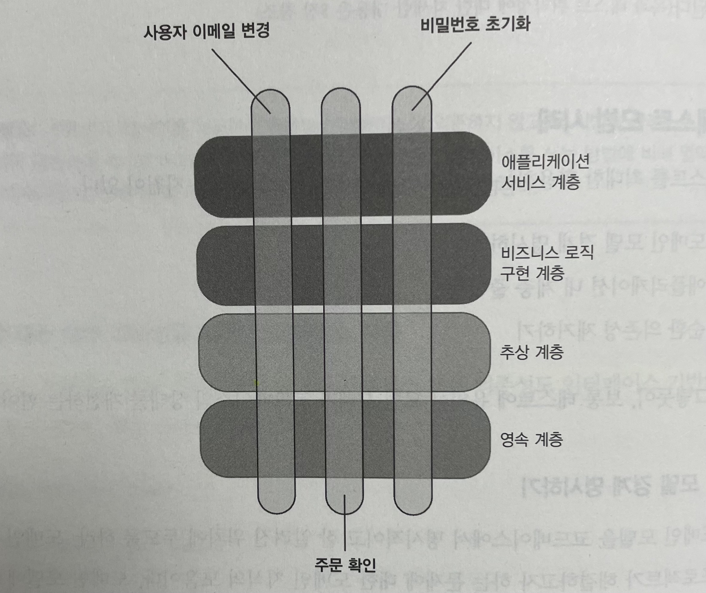

# Unit Testing : 생산성과 품질을 위한 단위 테스트 원칙과 패턴

이 내용은 [단위 테스트 생산성과 품질을 위한 단위 테스트 원칙과 패턴]을 읽으면서 정리한 내용을 포함하고 있습니다.

- 8장 통합 테스트를 하는 이유 : 8.5 ~ 8.7

목차는 다음과 같습니다.

- 8.5 통합 테스트 모범 사례
- 8.6 로깅 기능을 테스트하는 방법
- 8.7 결론

## 8장 통합 테스트를 하는 이유

### 8.5 통합 테스트 모범 사례

통합 테스트를 활용하는데 도움이 되는 몇 가지 내용은 다음과 같다.

- 도메인 모델 경계 명시하기
- 애플리케이션 내 계층 줄이기
- 순환 의존성 제거하기

테스트의 모범 사례는 코드베이스의 상태를 개선하는 것이다.

#### 8.5.1 도메인 모델 경계 명시하기

항상 도메인 모델을 코드베이스에 명시적이고 잘 알려진 위치에 두도록 해야지 테스트에 도움이 된다.

- 도메인 모델은 프로젝트가 해결하고자 하는 문제에 대한 도메인 지식의 모음
- 도메인 모델에 명시적 경계를 지정하면 코드의 해당 부분을 더 잘 보여주고 더 잘 설명

**단위 테스트와 통합 테스트**

- 단위 테스트 : 도메인 모델과 알고리즘 대상
- 통합 테스트 : 컨트롤러(또는 서비스)
- 도메인 클래스와 컨트롤러 사이의 명확한 경계로 차이점을 쉽게 구별할 수 있어야 한다.

#### 8.5.2 계층 수 줄이기

일반적인 애플리케이션의 모습



- 간접 계층을 추가해서 코드를 추상화하고 일반화

간접 계층은 코드를 추론하는 데 부정적인 영향을 미친다.

- 모든 조각을 하나의 그림으로 만드는 데 상당한 노력 필요
  - 개발 과정을 방해
- 간접 계층이 많은 코드 베이스는 (컨트롤러와 도메인 사이) 명확한 경계가 없는 편
  - 통합 테스트의 가치가 떨어짐
  - 특정 계층의 코드만 실행하고 하위 계층은 목으로 처리하는 경향

가능한 한 간접 계층을 적게 사용해야 한다.

- 백엔드 시스템에서는 도메인 모델, 애플리케이션 서비스 게층, 인프라 계층 세 가지만 활용하면 된다.


#### 8.5.3 순환 의존성 제거하기

**순환 의존성**

- 둘 이상의 클래스가 제대로 작동하고자 직간접적으로 서로 의존하는 것

**순환 의존성의 문제점**

- 코드를 읽고 이해하려고 할 때 알아야 할 것이 많아서 부담이 된다.
  - 해결책을 찾기 위한 객체 그래프 전체를 이해해야 한다.
- 테스트를 방해한다.
  - 클래스 그래프를 나눠서 동작 단위를 하나 분리하려면 인터페이스에 의존해 목으로 처리해야 하는 경우가 많다.

순환 의존성의 문제는 인터페이스 사용을 통해 발생될 수 있다.

- 컴파일에는 문제가 발생하지 않지만 런타임에 발생할 수 있는 케이스

가장 좋은 방법은 순환 의존성을 제거하는 것이다.

#### 8.5.4 테스트에서 다중 실행 구절 사용

엔드 투 엔드 테스트를 제외하고 테스트에서 두 개 이상의 준비 또는 실행 또는 검증 구절을 두는 것은 `코드 악취`에 해당

- 이는 테스트가 여러 가지 동작 단위를 확인해서 테스트의 유지 보수성을 저해한다는 신호
- 예를 들어 사용자 등록과 사용자 삭제 관련 유스케이스

### 8.6 로깅 기능을 테스트하는 방법

로깅 테스트의 의문점

- 로깅을 조금이라도 테스트해야 하는가?
- 만약 그렇다면 어떻게 테스트해야 하는가?
- 로깅이 얼마나 많으면 충분한가?
- 로거 인스턴스를 어떻게 전달할까?

#### 8.6.1 로깅을 테스트해야 하는가?

로깅은 횡단 기능으로, 코드베이스 어느 부분에서나 필요로 할 수 있다.
또한 애플리케이션의 동작에 중요한 정보를 생성한다.

그러나 로깅은 너무나 보편적이므로, 테스트 노력을 더 들일 가치가 있는지 분명하지 않다.
로깅이 애플리케이션의 식별할 수 있는 동작인가, 아니면 구현 세부 사항인가?

로깅은 개발자 편의 기능으로, 자유로이 수정할 수 있는 구현 세부 사항이므로 테스트가 필요하지 않다.

#### 8.6.2 로깅을 어떻게 테스트해야 하는가?

로깅은 프로세스 외부 의존성으로 다른 기능과 동일한 규칙이 적용 된다.
애플리케이션과 로그 저장소 간의 상호 작용을 검증하려면 목을 사용해야 한다.

진단 로깅을 도메인 클래스에서 사용하지 말라.

#### 8.6.3 로깅이 얼마나 많으면 충분한가?

진단 로깅을 과도하게 사용하지 말아야 한다.

- 과도한 로깅은 코드를 혼란스럽게 한다.
  - 도메인 모델에 해당
- 로그가 많을수록 관련 정보를 찾기 어려워진다.

가능하면 도메인 모델에서는 진단 로깅을 절대 사용하지 말고 서비스 클래스로 안전하게 옮겨서 사용한다.
무언가를 디버깅해야 할 때만 일시적으로 진단 로깅을 사용하고 디버깅이 끝나면 제거 한다.

#### 8.6.4 로거 인스턴스를 어떻게 전달하는가?

로그는 보통 정적 메서드 또는 어노테이션을 사용해서 선언한다.

`@Slf4j`는 다음과 같이 사용할 수 있다.

```java
@Slf4j
public class Company {

    private String domainName;
    private int numberOfEmployees;

    /* 비즈니스 로직 */
}
```

컴파일된 클래스를 확인해보면 다음과 같다.

```java
public class Company {
    private static final Logger log = LoggerFactory.getLogger(Company.class);
    private String domainName;
    private int numberOfEmployees;

    /* 비즈니스 로직 */
}
```

이렇게 도메인 모델에서 사용한다면 두 가지 문제점이 있다.

- 의존성이 숨어있고 변경하기가 어렵다.
- 테스트가 더 어려워진다.

로거를 명시적으로 주입하는 두 가지 방법이 있다.

- 메소드의 인자로 전달
- 생성자를 통해 생성

### 8.7 결론

식별할 수 있는 동작인지, 아니면 구현 세부 사항인지 여부에 대한 관점으로 프로세스 외부 의존성과의 통신을 살펴봐야 한다.
개발자가 아닌 사람이 로그를 볼 수 있으면 로깅 기능을 목으로 처리하고, 그렇지 않으면 테스트하지 말아야 한다.