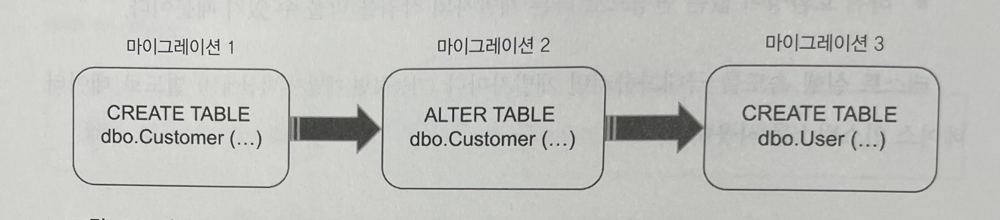
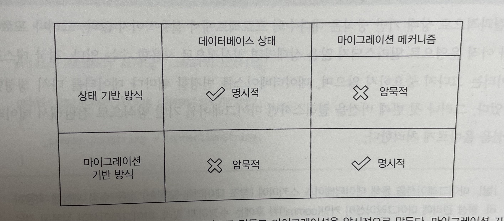

# Unit Testing : 생산성과 품질을 위한 단위 테스트 원칙과 패턴

이 내용은 [단위 테스트 생산성과 품질을 위한 단위 테스트 원칙과 패턴]을 읽으면서 정리한 내용을 포함하고 있습니다.

- 10장 데이터베이스 테스트 : 10.1 ~ 10.3

목차는 다음과 같습니다.

- 10.1 데이터베이스 테스트를 위한 전제 조건
- 10.2 목 처리에 대한 모범 사례
- 10.3 목 처리에 대한 모범 사례

## 10장 데이터베이스 테스트

통합 테스트라는 퍼즐의 마지막 조각은 프로세스 외부 관리 의존성이다.

- 가장 일반적인 예는 애플리케이션 데이터베이스

여기서는 다음 내용을 살펴본다.

- 데이터베이스 테스트를 시작하기 전에 거쳐야 할 준비 단계
- 데이터베이스 스키마를 관리
  - 상태 기반 데이터베이스 배포 방식
  - 마이그레이션 기반 데이터베이스 배포 방식의 차이점을 설명
- 트랜잭션 관리
- 남은 데이터 정리

### 10.1 데이터베이스 테스트를 위한 전제 조건

통합 테스트에서는 관리 의존성이 그대로 있어야 한다. 목을 사용하는 방법은 고려할 수 없으므로 비관리 의존성보다 작업하기가 더 힘들 수 있다.
통합 테스트에서 데이터베이스를 테스트하기 위한 전제 조건을 살펴본다.

- 데이터베이스를 형상 관리 시스템에 유지
- 개발자마다 별도의 데이터베이스 인스턴스 사용
- 데이터베이스 배포에 마이그레이션 기반 방식 적용

#### 10.1.1 데이터베이스를 형상 관리 시스템에 유지

데이터베이스를 테스트하는 방법의 첫 단계는 데이터베이스 스키마를 일반 코드로 취급하는 것이다. 일반 코드와 마찬가지로 데이터베이스 스키마는 Git과 같은 형상 관리 시스템에서 저장하는 것이 최선이다.

실제로 이를 지원하는 다양한 라이브러리들이 있는데 아래 `Flyway`가 대표적이다.

- [tecoble - Flyway](https://tecoble.techcourse.co.kr/post/2021-10-23-flyway/)
- [[10분 테코톡] 🐶 코기의 Flyway](https://www.youtube.com/watch?v=pxDlj5jA9z4&t=634s&ab_channel=%EC%9A%B0%EC%95%84%ED%95%9CTech)
- [flyway를 통해 DDL 형상관리를 하자](https://sabarada.tistory.com/193)
- [flywaydb document](https://flywaydb.org/documentation/)

#### 10.1.2 참조 데이터도 데이터베이스 스키마다

데이터베이스 스키마에 속하지만, 데이터베이스 스키마로 거의 여기지 않는 부분은 바로 참조 데이터이다.

- 참조 데이터는 애플리케이션이 제대로 작동하도록 미리 채워야 하는 데이터

예를 들어, 이전 장의 CRM 시스템을 예로 든다.

- 사용자 유형은 `Customer` 또는 `Employee` 일 수 있다.
- 모든 사용자 유형이 포함된 테이블을 만들고 User에서 해당 테이블로 외래 키 제약 조건을 두고 싶다고 가정하자.
- `UserType` 테이블의 내용이 참조 데이터에 해당
- 애플리케이션이 데이터베이스에 사용자를 저장하려면 `UserType` 테이블에 데이터가 있어야 한다.

참조 데이터는 애플리케이션의 필수 사항이므로, 테이블, 뷰 그리고 다른 데이터베이스 스키마와 함께 SQL INSERT 문 형태로 형상 관리 시스템에 저장해야 한다.

#### 10.1.3 모든 개발자를 위한 별도의 데이터베이스 인스턴스

실제 데이터베이스로 테스트하는 것은 충분히 어렵다. 특히, 다른 개발자들과 데이터베이스를 공유해야 되는 문제는 훨씬 어렵다.

- 서로 다른 개발자가 실행한 테스트는 서로 간섭될 수 있다.
- 하위 호환성이 없는 변경으로 다른 개발자의 작업을 막을 수 있다.

테스트 실행 속도를 극대화하려면 개발자마다 별도로 데이터베이스 인스턴스를 사용하면 된다.

#### 10.1.4 상태 기반 데이터베이스 배포와 마이그레이션 기반 데이터베이스 배포

**상태 기반 데이터베이스**

- 개발 내내 유지보수하는 모델 데이터베이스가 있고 운영 데이터베이스와 비교해 최신 상태로 유지
- 물리적인 모델 데이터베이스는 원천 데이터가 아니며, 해당 데이터베이스를 작성하는 데 사용할 수 있는 SQL 스크립트 존재
- 해당 스크립트는 형상 관리에 저장

**마이그레이션 기반 데이터베이스**



- 데이터베이스를 어떤 버전에서 다른 버전으로 전환하는 명시적인 마이그레이션을 의미
- 운영 데이터베이스와 개발 데이터베이스를 자동으로 동기화하기 위한 도구 사용보다는 스크립트를 직접 작성



첫 번째 버전 릴리스전까지 상태 기반 데이터베이스 방식을 사용하고, 그 후에는 마이그레이션 기반 방식으로 전환해서 데이터 모션을 올바르게 처리한다.

```
데이터 모션은 새로운 데이터베이스 스키마를 준수하도록 기존 데이터의 형태를 변경하는 과정이다.
```

### 10.2 데이터베이스 트랜잭션 관리

테스트에서는 운영 환경에 근접한 설정을 데이터베이스 통합을 검증하는 데 도움이 된다. 
여기서는 제품 코드에서 트랜잭션을 처리하는 방법과 통합 테스트에서 트랜잭션을 사용하는 방법을 알아본다.

#### 10.2.1 제품 코드에서 데이터베이스 트랜잭션 관리하기

잠재적인 모순을 피하려면 결정 유형을 두 가지로 나눠야 한다.

- 업데이트할 데이터
- 업데이트 유지 또는 롤백 여부

Database 클래스를 리포지터리와 트랜잭션으로 나눠서 이러한 책임을 구분할 수 있다.

- 리포지터리는 데이터베이스의 데이터에 대한 접근과 수정을 가능하게 하는 클래스
  - 샘플 프로젝트에는 user를 위한 리포지터리와 Company를 위한 리포지터리, 이렇게 두 개가 있게 된다.
- 트랜잭션은 데이터 업데이트를 완전히 커밋하거나 롤백하는 클래스
  - 데이터 수정의 원자성 확보를 위해 기본 데이터베이스 트랜잭션에 의존하는 사용자 정의 클래스

리포지터리와 트랜잭션을 도입하면 잠재적인 데이터 모순을 피할 수 있지만 더 좋은 방법이 있다. Transaction 클래스를 작업 단위로 업그레이드할 수 있다.

#### 10.2.2 통합 테스트에서 데이터베이스 트랜잭션 관리하기

테스트 구절 간에 데이터베이스 트랜잭션이나 작업 단위를 재사용하지 말아야 한다.

### 10.3 테스트 데이터 생명 주기

공유 데이터베이스를 사용하면 통합 테스트를 서로 분리할 수 없는 문제가 생긴다. 
이 문제를 해결하려면,

- 통합 테스트를 순차적으로 실행하라
- 테스트 실행 간에 남은 데이터를 제거하라

전체적으로 테스트는 데이터베이스 상태에 따라 달라지면 안 된다. 테스트는 데이터베이스 상태를 원하는 조건으로 만들어야 한다.

#### 10.3.1 병렬 테스트 실행과 순차적 테스트 실행

병렬 테스트 실행 시에는 고려해야 될 사항들이 많다.

- 모든 테스트 데이터가 고유한지 확인 -> 데이터베이스 제약 조건 위반하지 않는 지
- 남은 데이터를 정리하는 부분

통합 테스트의 실행 시간을 최소화해야 하는 경우가 아니라면 (병렬 테스트의 대한 고려보다) 순차적으로 통합 테스트를 실행하는 것이 더 실용적이다.

#### 10.3.2 테스트 실행 간 데이터 정리

테스트 실행 간에 남은 데이터를 정리하는 4가지 방법은 다음과 같다.

- 각 테스트 전에 데이터베이스 백업 복원하기
  - 다른 세 가지 방법보다 훨씬 느리다
- 테스트 종료 시점에 데이터 정리하기
  - 테스트 실행 속도는 빠름
  - 데이터 정리 단계를 건너뛰기 쉬움
    - 테스트 도중에 빌드 서버가 중단하거나 디버거에서 테스트 종료하는 경우
- 데이터베이스 트랜잭션에 각 테스트를 래핑하고 커밋하지 않기
  - 정리 단계를 건너뛰는 방식
  - 추가 트랜잭션으로 인한 운영 소스 수정이 필요
- 테스트 시작 시점에 데이터 정리하기
  - 제일 좋은 방법
  - 빠르게 작동하고 일관성이 없는 동작을 일으키지 않으며, 정리 단계를 실수로 건너뛰지 않음
  - 추가로 테스트 실행 후 UI 화면에서 데이터 확인시에도 좋음

모든 통합 테스트의 기초 클래스를 두고, 기초 클래스에 삭제 스크립트를 작성한다. 다음은 예제이다.

```java
@Profile("test")
@Service
public class DatabaseCleanup implements InitializingBean {
    @PersistenceContext
    private EntityManager entityManager;

    private List<String> tableNames;

    @Override
    public void afterPropertiesSet() {
        tableNames = entityManager.getMetamodel().getEntities().stream()
                .filter(entity -> entity.getJavaType().getAnnotation(Entity.class) != null)
                .map(entity -> entity.getName())
                .collect(Collectors.toList());
    }

    @Transactional
    public void execute() {
        entityManager.flush();
        entityManager.createNativeQuery("SET REFERENTIAL_INTEGRITY FALSE").executeUpdate();
        for (String tableName : tableNames) {
            entityManager.createNativeQuery("TRUNCATE TABLE " + tableName).executeUpdate();
            entityManager.createNativeQuery("ALTER TABLE " + tableName + " ALTER COLUMN ID RESTART WITH 1").executeUpdate();
        }
        entityManager.createNativeQuery("SET REFERENTIAL_INTEGRITY TRUE").executeUpdate();
    }
}
```

#### 10.3.3 인메모리 데이터베이스 피하기

통합 테스트를 서로 분리하는 또 다른 방법으로 데이터베이스를 H2, SQLite와 같은 인메모리 데이터베이스로 교체할 수도 있다.
인메모리 데이터베이스는 다음과 같은 장점이 있다.

- 테스트 데이터를 제거할 필요가 없음
- 작업 속도 향상
- 테스트가 실행될 때마다 인스턴스화 가능

이러한 장점에도 불구하고, 일반 데이터베이스와 기능적으로 일관성이 없기 때문에 사용하지 않는 것이 좋다.

- 운영 환경과 테스트 환경의 불일치 문제
- 이 차이로 인해 테스트에서 거짓 양성 또는 거짓 음성 발생
- 테스트를 통한 높은 보호 구준 기대 어려움
- 수동으로 회귀 테스트를 많이 수행해야 함