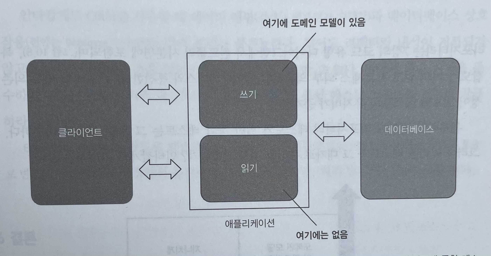
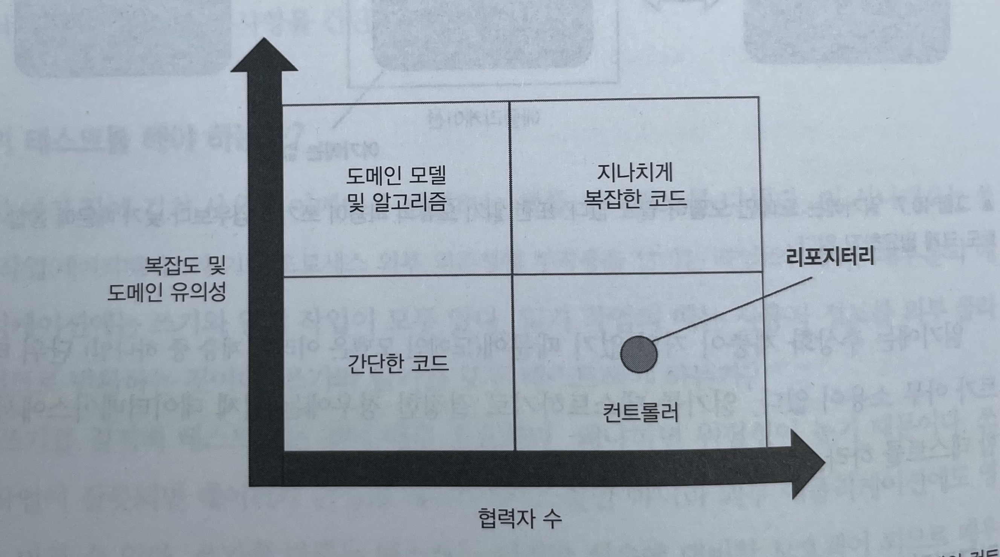

# Unit Testing : 생산성과 품질을 위한 단위 테스트 원칙과 패턴

이 내용은 [단위 테스트 생산성과 품질을 위한 단위 테스트 원칙과 패턴]을 읽으면서 정리한 내용을 포함하고 있습니다.

- 10장 데이터베이스 테스트 : 10.1 ~ 10.3

목차는 다음과 같습니다.

- 10.4 테스트 구절에서 코드 재사용하기
- 10.5 목 처리에 대한 모범 사례
- 10.6 결론

## 10장 데이터베이스 테스트

### 10.4 테스트 구절에서 코드 재사용하기

통합 테스트는 가능한 한 짧게 하되 서로 결합하거나 가독성에 영향을 주지 않는 것이 중요하다.

#### 10.4.1 준비 구절에서 코드 재사용하기

테스트 준비 구절 간에 코드를 재사용하기에 가장 좋은 방법은 비공개 팩토리 메소드를 도입하는 것이다.

```java
public class TestFactoryUser {

    public static User createUser(final String email, final UserType userType) {
        return new User(0, email, userType);
    }

    public static User createByEmployeeUser(final String email) {
        return new User(0, email, UserType.EMPLOYEE);
    }
}
```

- 메서드 인수에 대한 기본값을 정의
  - `직원` 상태의 대한 기본값을 정의

**단순하게 시작하는 방법**

- 기본적으로 팩토리 메소드를 동일한 클래스에 배치하라
- 코드 복제가 중요한 문제가 될 경우에만 별도의 헬퍼 클래스로 이동한다.
- 기초 클래스에 팩토리 메소드를 넣지 않는다.
- 기초 클래스는 데이터 정리와 같이 모든 테스트에서 실행해야 하는 코드를 위한 클래스로 남겨둬야 한다.

#### 10.4.2 실행 구절에서 코드 재사용하기

이 부분은 인수 테스트에서 실행 구절을 재사용할 수 있었다.

#### 10.4.3 검증 구절에서 코드 재사용하기

**가장 쉬운 방법**

- 헬퍼 메서드 사용

플루언트 인터페이스를 사용하면 검증문을 읽기가 훨씬 쉬워진다.

아래는 입력받은 email을 분리하는 기능을 테스트하는 것이다.

```java
@Test
void split_test() {

    String email = "test@yopmail.com";
    final String[] split = email.split("@");

    assertAll(
            () -> assertThat(split[0]).isEqualTo("test"),
            () -> assertThat(split[1]).isEqualTo("yopmail.com")
    );
}
```

#### 10.4.4 테스트가 데이터베이스 트랜잭션을 너무 많이 생성하는가?

데이터베이스 컨텍스트를 추가하면 테스트가 느려지기 때문에 어느 정도 문제가 되기는 하지만, 할 수 있는 것은 많지 않다.
가치 있는 테스트는 빠른 비드백과 유지 보수성 간의 절충을 의미한다.
유지 보수성 측면에서 상당히 많은 이점을 가져가기 때문에 

### 10.5 데이터베이스 테스트에 대한 일반적인 질문

#### 10.5.1 읽기 테스트를 해야 하는가?

쓰기를 철저히 테스트하는 것은 매우 중요하다.

- 위험성이 높기 때문
- 쓰기 작업이 잘못되면 데이터가 손상돼 데이터베이스뿐만 아니라 외부 애플리케이션에도 영향을 미칠 수 있음
- 쓰기를 다루는 테스트는 이러한 실수에 대비한 보호책이 되므로 매우 가치 있음

읽기는 이에 해당하지 않는다.

- 읽기 작업의 버그에는 해로운 문제가 없음
- 읽기 테스트 임계치는 쓰기 테스트 임계치보다 높아야 함
- 가장 복잡하거나 중요한 읽기 작업만 테스트하고, 나머지는 무시해야 한다.



- 읽기에는 도메인 모델이 없음
- 읽기를 테스트하기로 결정한 경우에는 실제 데이터베이스에서 통합 테스트를 하라

#### 10.5.2 리포지터리 테스트를 해야 하는가?

리포지터리는 데이터베이스 위에 유용한 추상화를 제공한다. 
리포지터리가 도메인 객체를 어떻게 데이터베이스에 매핑하는지를 테스트하는 것은 중요하지 않다.

- 리포지터리는 복잡하지 않으며 회귀 방지에 일반적인 통합 테스트가 주는 이점과 겹친다.

리포지터리는 직접 테스트하지 말고, 포괄적인 통합 테스트 스위트의 일부로 취급해야 한다.



- 리포지터리는 복잡도가 거의 없고 프로세스 외부 의존성과 통신하므로 코드 유형 다이터그램의 컨트롤러 사분면에 속함

### 10.6 결론

데이터베이스 테스트를 잘 만들면 버그로부터 훌륭히 보호할 수 있다.
이러한 테스트를 통해 데이터베이스를 리팩터링하거나 ORM을 전환하거나 데이터베이스 공급업체를 변경할 때 큰 도움이 된다.