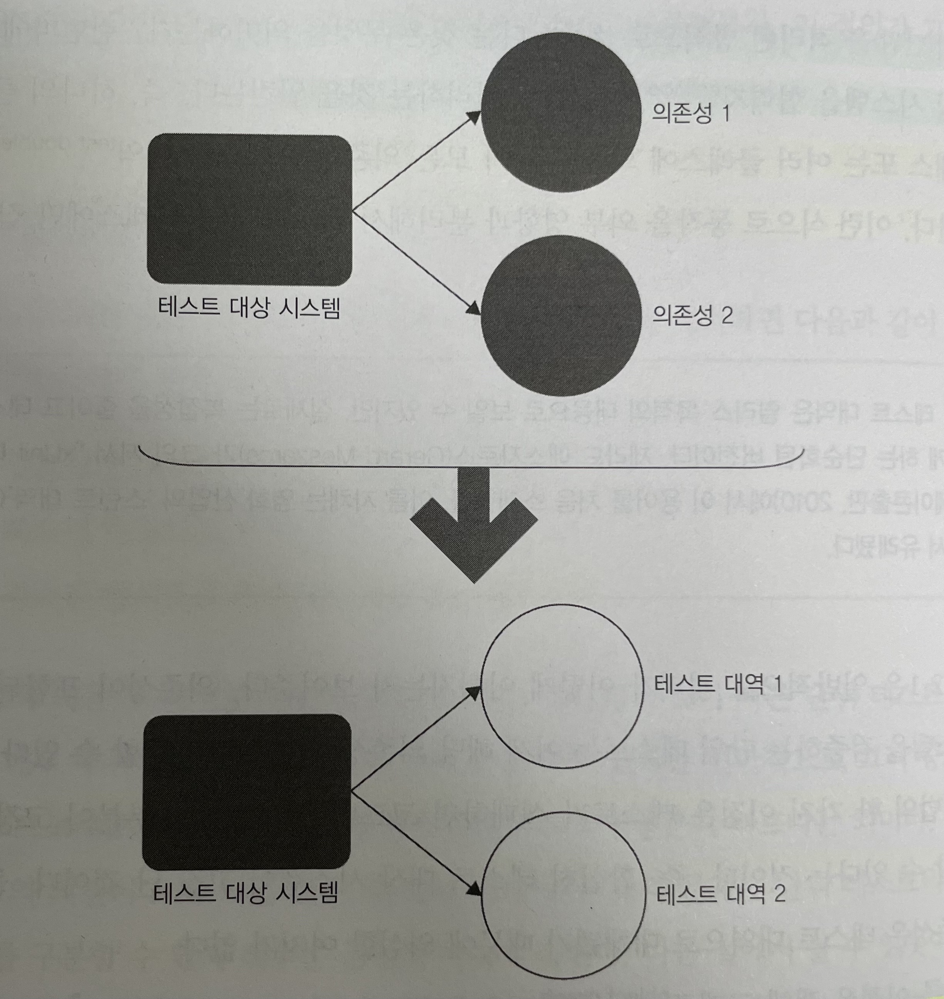
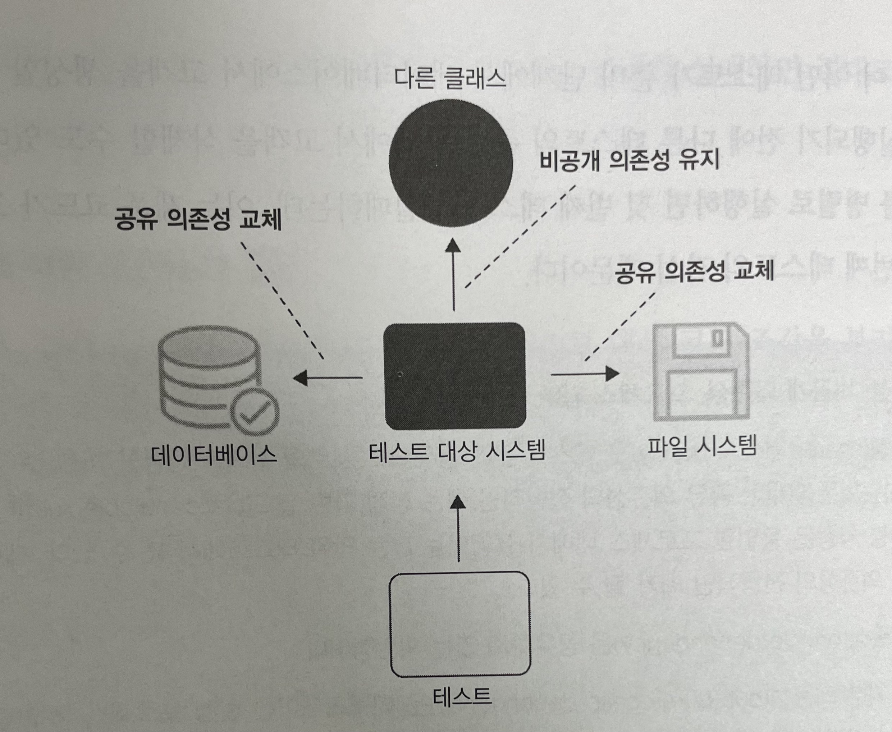
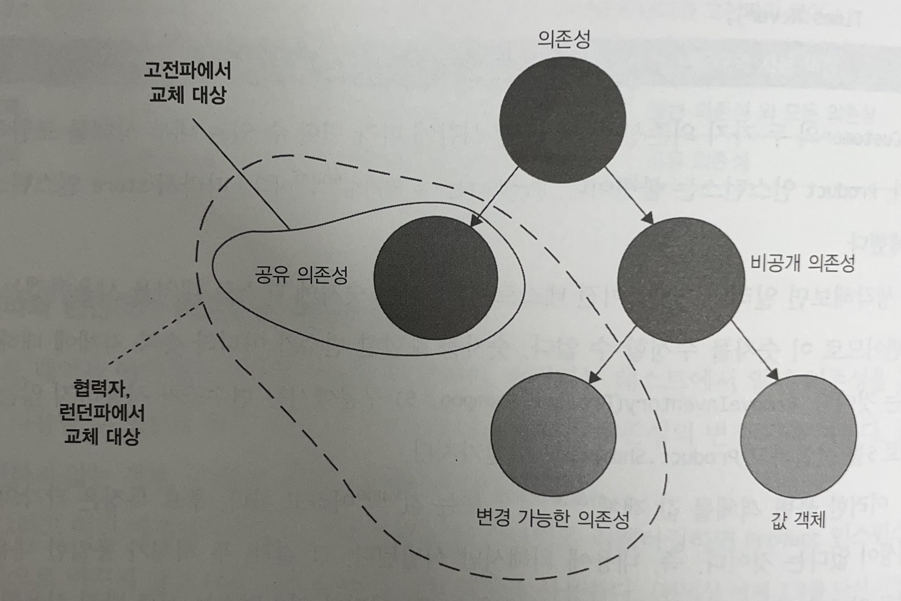
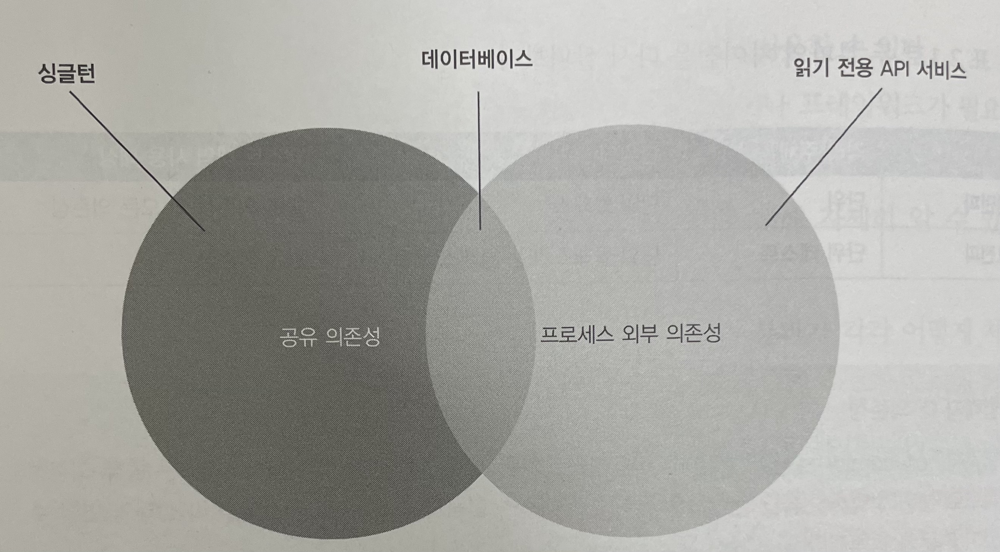
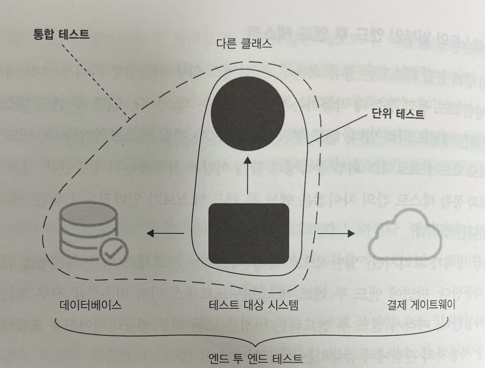

# [Unit Testing] 2장 단위 테스트란 무엇인가

이 내용은 [단위 테스트 생산성과 품질을 위한 단위 테스트 원칙과 패턴]을 읽으면서 정리한 내용을 포함하고 있습니다.

- 범위 : 2장 2.1 ~ 2.4

목차는 다음과 같습니다.

- 단위테스트의 정의
- 단위 테스트의 런던파와 고전파
- 의존성을 다루는법
- 고전파와 런던파의 비교
- 두 분파의 통합 테스트
- 정리
- 참고

## 단위테스트의 정의

단위테스트의 3가지 주요 속성

- 작은 코드 조각을 검증하고
- 빠르게 수행하며
- 격리된 방식으로 처리하는 자동화된 테스트

단위테스트 정의 중 세번째 `코드 조각을 격리된 방식으로 검증한다` 에 대해서 단위테스트의 고전파와 런던파로 분리한다.
그럼, 코드 조각을 격리된 방식으로 검증한다는 것은 무엇을 의미하는 것일까? 각 분파의 특성을 먼저 알아본 후 예제 소스도 같이 알아보자.

### 격리 문제에 대한 각 분파 접근 방법

단위테스트 정의 중 세번째 `코드 조각을 격리된 방식으로 검증한다` 는 속성으로 인하여 논란이 생기게 되었고 크게 2가지 파로 나뉘게 되었다.

#### 고전파의 접근

고전파에서 단위 테스트는 서로 격리해서 실행해야 한다. 

- 테스트를 어떤 순서로든 가장 적합한 방식으로 실행할 수 있으며 서로의 결과에 영향을 미치지 않는다. 
- 즉, 순서와 상관없이 각 단위 테스트는 동일한 결과를 보장한다.

격리의 목적은 무엇일까?

- 여러 클래스가 모두 메모리에 상주하고 공유 상태에 도달하지 않는 한, 여러 클래스를 한 번에 테스트해도 괜찮다는 뜻이다.
- 이를 통해 테스트가 서로 소통하고 실행 컨텍스트에 영향을 줄 수 있다. 
- 공유 의존성의 대표적인 예 : 데이터베이스, 파일 시스템 등

#### 런던파의 접근

런던파의 코드 조각을 격리된 방식으로 검증한다는 것은 무엇을 의미할까? 

- 테스트 대상 시스템을 협력자에게서 격리하는 것

즉 하나의 클래스가 다른 클래스 또는 여러 클래스에 의존하면 이 모든 의존성을 테스트 대역으로 대체해야 한다.

- 동작을 외부 영향과 분리해서 테스트 대상 클래스에만 집중할 수 있다.
- 테스트가 실패하면 코드베이스의 어느 부분이 고장 났는지 확실히 알 수 있다.
- 객체 그래프를 분할할 수 있다.



의존성을 가진 코드베이스를 테스트하는 것은 테스트 대역 없이는 어렵다. 

- 의존하는 클래스의 수가 너무 많으면 어려운 작업이 된다. 테스트 대역을 사용하면 클래스의 직접적인 의존성을 대체할 수 있고, 더 나아가 의존성의 의존성을 다룰 필요도 없다.
- 모든 클래스가 각각 직접적인 의존성을 갖고 있으며 또 그 의존성이 또 다른 의존성을 갖고 있는 식으로, 그래프가 상당히 복잡해진다는 단점이 있다.

객체 그래프가 상당히 복잡하다면 이러한 부분은 설계의 문제를 놓치게 할 수 있다. 해당 의존성을 갖는 것이 맞는지 집중해야 하지만 Mock의 사용으로 이 부분을 놓치게 만든다.

- 내용 참고 [@SpyBean @MockBean 의도적으로 사용하지 않기](https://jojoldu.tistory.com/320)

## 단위 테스트의 런던파와 고전파

고전파와 런던파로 나눠진 원인은 격리 특성에 있다는 것을 알게 되었다. 

- 런던파는 대상 시스템에서 협력자를 격리하는 것
- 고전파는 단위 테스트끼리 격리하는 것

종합해보면 세 가지 주요 주제에 대해 의견 차이가 있다.

- 격리 요구 사항
- 테스트 대상 코드 조각(단위)의 구성 요소
- 의존성 처리

이를 표로 나타내면 다음과 같다.

|        | 격리 주체      | 단위의 크기                | 테스트 대역 사용 대상     |
| ------ | -----------  | ---------------------- | ---------------------|
| 런던파   | 단위         | 단일 클래스                | 불변 의존성 외 모든 의존성 |
| 고전파   | 단위 테스트    | 단일 클래스 또는 클래스 세트   | 공유 의존성            |

각 분파별 테스트 대역 사용 대상은 다음과 같다.

- 런던파 : 불변 의존성 외 모든 의존성
- 고전파 : 공유 의존성

각 의존성의 대하여 알아보도록 하겠다.

### 공유 의존성, 비공개 의존성, 프로세스 외부 의존성

#### 공유 의존성

- 테스트 간에 공유되고 서로의 결과에 영향을 미칠 수 있는 수단을 제공
  - 첫번째 예, 정적 가변 필드 
    - 이러한 필드의 변경 사항은 동일한 프로세스 내에서 실행되는 모든 단위 테스트에서 볼 수 있다.
  - 두번째 예, 데이터베이스
- 테스트 대상 클래스 간이 아니라 단위테스트 간에 공유

#### 비공개 의존성

- 공유하지 않는 의존성이다.

#### 프로세스 외부 의존성

- 애플리케이션 실행 프로세스 외부에서 실행되는 의존성이며, 아직 메모리에 없는 데이터에 대한 프록시
- 공유 의존성에 해당하지만 모두 그런 것은 아니다.
- 예를 들어, 데이터베이스는 프로세스 외부이면서 공유 의존성
  - 각 테스트 실행 전에 도커 컨테이너로 데이터베이스를 시작하면 테스트가 더 이상 동일한 인스턴스로 작동하지 않기 때문에 프로세스 외부이면서 공유하지 않는 의존성
  - 데이터베이스 환경에서는 테스트가 데이터를 변경할 수 없으므로 결과에 서로 영향을 미칠 수 없다.

여기까지 단위테스트의 대한 두 가지 견해의 대한 특성을 알아보았고, 샘플 코드를 통해 좀 더 알아보도록 하겠다.

### 개발 환경

여기서는 상점 구매 도메인에 대한 고전파와 런던파의 단위 테스트 작성에 대해서 실습을 해보도록 하겠다.

#### 고전파 예시

고전파 테스트는 협력자를 대체하지 않고 실제 객체를 사용한다.

```java
@Test
void Purchase_succeeds_when_enough_inventory() {

    // 준비
    Store store = new Store();
    Product shampoo = Shampoo;
    store.addInventory(shampoo, 10);
    Customer customer = new Customer();

    // 실행
    boolean success = customer.purchase(store, shampoo, 5);

    // 검증
    assertAll(
        () -> assertThat(success).isTrue(),
        () -> assertThat(store.findInventory(shampoo)).isEqualTo(5)
    );
}

@Test
void Purchase_fails_when_not_enough_inventory() {

    // 준비
    Store store = new Store();
    store.addInventory(Product.Shampoo, 10);
    Customer customer = new Customer();

    // 실행
    boolean success = customer.purchase(store, Product.Shampoo, 15);

     // 검증
    assertAll(
        () -> assertThat(success).isFalse(),
        () -> assertThat(store.findInventory(Product.Shampoo)).isEqualTo(10)
    );
}
```

`준비` 부분은 의존성과 테스트 대상 시스템을 모두 준비하는 부분

- 테스트 대상 시스템(`SUT`) 과 하나의 협력자를 준비
  - 테스트 대상 시스템(`SUT`) : 고객(`Customer`)
  - 협력자 : 상점(`Store`)
- 협력자가 필요한 이유는 무엇인가?
  - 테스트 대상 메서드를 컴파일하려면 필요로 하기 때문이다.
  - 검증 단계에서 상품 제품 수량이 감소할 경우 사용되기 때문이다.

`실행` 단계는 `customer.purchase()` 이며 검증하고자 하는 동작을 수행

`검증` 단계는 동작이 예상 결과로 이어지는 확인

> 테스트 대상 시스템(`SUT`, System Under Test), 테스트 대상 메서드(`MUT`, Method Under Test)
> 테스트에서 호출한 SUT의 메서드로, MUT와 SUT는 흔히 동의어로 사용하지만 일반적으로 MUT는 메서드를 가리키는 데 반해 SUT는 클래스 전체를 가리킨다.

#### 격리 문제에 대한 고전파의 접근

- 단위 테스트는 서로 격리해서 실행해야 한다.
  - 각각의 테스트를 격리하는 것은 여러 클래스가 모두 메모리에 상주하고 공유 상태에 도달하지 않는 한, 여러 클래스를 한 번에 테스트해도 괜찮다는 뜻이다.
  - 이를 통해 테스트가 서로 소통하고 실행 컨텍스트에 영향을 줄 수 있다.
- 이렇게 하면 테스트를 어떤 순서로든 가장 적합한 방식으로 실행할 수 있어서 서로의 결과에 영향을 미치지 않는다.

단, 공유 의존성으로 인한 다음과 같은 격리 문제가 발생할 수 있다.

- 테스트의 준비 단계에서 필요한 데이터 설정을 위한 병렬 실행
- 테스트 실행 속도

##### 테스트의 준비 단계에서 필요한 데이터 설정을 위한 병렬 실행

싱글턴 의존성을 통해서 새 인스턴스를 만든다면 공유되지 않는 방법도 있다. 단 새로운 시스템 또는 데이터베이스를 만들 수는 없기 때문에, 테스트 간에 공유하면서 사용하거나 테스트 대역으로 대체되어야 한다.



- 단위 테스트를 서로 격리하는 것은 테스트 대상 클래스에서 공유 의존성만 격리하는 것을 의미한다.
- 비공개 의존성은 그대로 둘 수 있다.

##### 테스트 실행 속도

공유 의존성은 거의 항상 실행 프로세스 외부에 있는 데 반해, 비공개 의존성은 보통 그 경계를 넘지 않는다.

- 데이터베이스나 파일 시스템 등의 공유 의존성에 대한 호출은 비공개 의존성에 대한 호출보다 더 오래 걸린다.

이러한 호출을 포함하는 공유 의존성을 가진 테스트는 단위 테스트 영역에서 통합 테스트 영역으로 넘어간다.

#### 런던파 예시

고전파와 동일한 테스트에서 `Store` 인스턴스는 테스트 대역, 구체적으로 목으로 교체해본다.

```java
@Test
void Purchase_succeeds_when_enough_inventory() {

    // 준비
    Store storeMock = mock(Store.class);
    Customer customer = new Customer();
    when(storeMock.findInventory(any())).thenReturn(5);
    when(storeMock.saveInventory(any(), anyInt())).thenReturn(5);

    // 실행
    boolean success = customer.purchase(storeMock, Shampoo, 5);

    // 검증
    assertAll(
        () -> assertThat(success).isTrue()
    );
    verify(storeMock, never()).removeInventory(Shampoo, 5);
    
}

@Test
void Purchase_fails_when_not_enough_inventory() {

    // 준비
    Store storeMock = mock(Store.class);
    Customer customer = new Customer();
    when(storeMock.findInventory(any())).thenReturn(10);

    // 실행
    boolean success = customer.purchase(storeMock, Shampoo, 15);

    // 검증
    assertAll(
        () -> assertThat(success).isTrue()
    );
    verify(storeMock, never()).removeInventory(Shampoo, 5);
}
```

`준비` 부분은 의존성과 테스트 대상 시스템을 모두 준비하는 부분

- 실제 인스턴스 생성하지 않고 테스트 대역 사용 (여기서는 `Mock` 사용)
- 실제 객체의 상태를 수정하지 않고 어떻게 응답이 올지 `Mock` 에 직접 정의
- 실제 객체의 상태와 상관없이 테스트가 요구하는 방식으로 정의 가능

`실행` 단계는 `customer.purchase()` 이며 검증하고자 하는 동작을 수행

`검증` 단계는 동작이 예상 결과로 이어지는 확인

- 고객이 상점에서 호출을 올바르게 했는지 확인
- 고객이 상점으로 호출해야 하는 메서드뿐만 아니라 호출 횟수까지 검증 가능

## 의존성을 다루는법



- 의존성 계층. 
- 고전파에서는 공유 의존성을 테스트 대역으로 교체
- 런던파에서는 변경 가능한 한 비공개 의존성도 테스트 대역으로 교체

의존성은 공유되거나 비공개일 수 있다. 

- 비공개 의존성은 변경 가능하거나 불변일 수 있다. 
- 불변인 경우 값 객체라고 부른다. 
- 예를 들어 데이터베이스는 공유 의존성이며, 내부 상태는 모든 자동화된 테스트에서 공유한다.



- 공유이지만 프로세스 외부가 아닌 의존성의 예
  - 싱글턴, 클래스의 정적 필드
- 데이터베이스는 공유이면서 프로세스 외부에 존재
  - 주 프로세스 외부에 상주하며 변경이 가능
- 읽기 전용 API는 프로세스 외부에 있지만 공유되지 않음
  - 수정할 수 없고, 이로 인해 서로의 실행 흐름에 영향을 줄 수 없다.

테스트 속도를 높이기 위해서는 테스트 대역으로 교체가 필요하다.
그러나 프로세스 외부 의존성이 충분히 빠르고 연결이 안정적이라면 테스트에서 그대로 사용하는 것도 괜찮다.

### 협력자 대 의존성

- 협력자는 공유하거나 변경 가능한 의존성이다.
  - 데이터베이스는 공유 의존성이므로 데이터베이스 접근 권한을 제공하는 클래스는 협력자

`customer.purchase(store, Product.Shampoo, 15);`

- `store` 는 협력자이고, `Product.Shampoo`, `15` 는 아니다. 

## 고전파와 런던파의 비교

주요 차이는 단위 테스트의 정의에서 격리 문제를 어떻게 다루는지에 있다.

고전파의 주요 장점

- Mock의 대한 취약성이 없어서 고품질의 테스트 코드 작성이 가능하다.

런던파의 주요 장점

- 한 번에 한 클래스만 테스트하기
- 상호 연결된 클래스의 큰 그래프를 단위 테스트하기
- 버그 위치 정확히 찾아내기

여기서는 런던파의 장점을 알아보도록 한다.

### 한 번에 한 클래스만 테스트하기

테스트가 단일 동작 단위를 검증한다.

- 이보다 적은 목표를 삼는다면 사실 단위 테스트를 훼손하는 결과를 가져올 수 있다.
- 이 테스트가 무엇을 검증하는지 정확히 이해하기 어렵다.

응집도가 높은 이야기 예시

- `우리집 강아지를 부르면, 바로 나에게 온다.`
- `우리집 강아지를 부르면 먼저 왼쪽 앞다리를 움직이고, 이어서 오른쪽 앞다리를 움직이고, 머리를 돌리고, 꼬리를 흔들기 시작한다...`
- 첫번째 이야기가 응집도가 높다.
  - 실제 동작 대신 개별 클래스를 목표로 할 때 두번째 이야기처럼 테스트가 이렇게 보이기 시작한다.

### 상호 연결된 클래스의 큰 그래프를 단위 테스트하기

실제 협력자를 대신해 목을 사용하면 클래스를 쉽게 테스트할 수 있다.

#### 가장 큰 문제점

상호 연결된 클래스의 크고 복잡한 그래프를 테스트할 방법을 찾는 대신, 먼저 이러한 클래스 그래프를 갖지 않는 데 집중해야 한다.

- 클래스 그래프가 커진 것은 코드 설계 문제일 확률이 높다.
- 목을 사용한다면 이 문제를 감추기만 할 뿐, 원인을 해결하지 못한다.

### 버그 위치 정확히 찾아내기

런던 스타일 테스트가 있는 시스템에 버그가 생기면, 보통 SUT에 버그가 포함된 테스트만 실패한다.

- 해당 부분을 빠르게 찾고 확인할 수 있다.

### 고전파와 런던파 사이의 다른 차이점

런던 스타일 테스트 주도 개발 설계 방식

- 단위 테스트는 하향식 TDD로 이어지며, 전체 시스템에 대한 기대치를 결정하는 상위 레벨 테스트부터 시작

고전 스타일 테스트 주도 개바 설계 방식

- 단위 테스트는 상향식 TDD로 작성
- 도메인 모델을 시작으로 최종 사용자가 소프트웨어를 사용할 수 있을 때까지 계층을 그 위에 더 둔다.

## 두 분파의 통합 테스트

두 분파의 통합 테스트의 대한 견해를 알아보도록 하겠다.

### 런던파 통합 테스트

- 실제 협력자 객체를 사용하는 모든 테스트를 통합 테스트로 간주
- 고전 스타일로 작성된 대부분의 테스트는 통합 테스트로 생각할 수 있다.

### 고전파 통합 테스트

고전파에서 단위 테스트 특징은 다음과 같다.

- 단일 동작 단위를 검증하고
- 빠르게 수행하고
- 다른 테스트와 별도로 처리한다.

통합 테스트는 이러한 기준 중 하나를 충족하지 않는 테스트

- 공유 의존성에 접근하는 테스트는 다른 테스트와 분리해 실행할 수 없다.
- 프로세스 외부 의존성에 접근하면 테스트가 느려진다.
- 둘 이상의 동작 단위를 검증할 때의 테스트는 통합 테스트이다.
  - 비슷한 두 동작을 검증하는 하나의 테스트
  - 다른 팀이 개발한 모듈이 둘 이상 있을 때 테스트

### 통합 테스트의 일부인 엔드 투 엔드 테스트

통합 테스트는 공유 의존성, 프로세스 외부 의존성뿐 아니라 조직 내 다른 팀이 개발한 코드 등과 통합해 작동하는지도 검증하는 테스트이다.

엔드 투 엔드 테스트는 다음과 같다.

- 통합 테스트의 일부
- 테스트도 코드가 프로세스 외부 종속성과 함께 어떻게 작동하는지 검증하는 것
- 모든 외부 애플리케이션을 포함해 시스템을 최종 사용자의 관점에서 검증하는 것



- 엔드 투 엔드 테스트는 일반적으로 프로세스 외부 의존성을 모두 포함한다.

## 정리

- 단위 테스트는 단일 동작 단위를 검증하고 빠르게 수행하며 다른 테스트와 별도로 동작
- 고전파자와 런던파의 의견 차이는 단위의 대한 관점과 테스트 대상 시스템의 의존성 처리 방식
- 런던파 테스트의 가장 큰 문제는 테스트 대상 시스템의 세부 구현에 결합된 테스트 문제

## 참고

- [단위 테스트 : 생산성과 품질을 위한 단위 테스트 원칙과 패턴](http://www.yes24.com/Product/Goods/104084175)
- [@SpyBean @MockBean 의도적으로 사용하지 않기](https://jojoldu.tistory.com/320) 