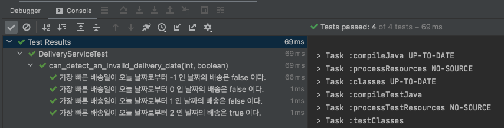
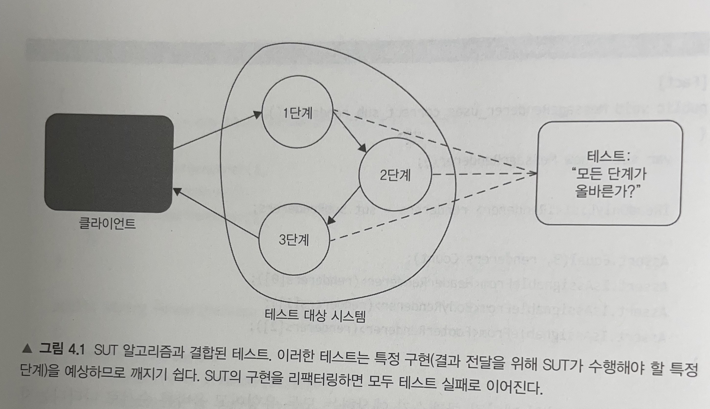
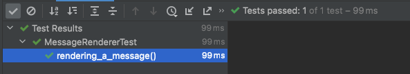
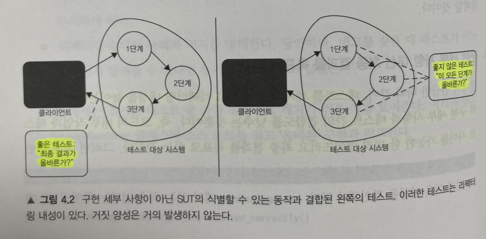
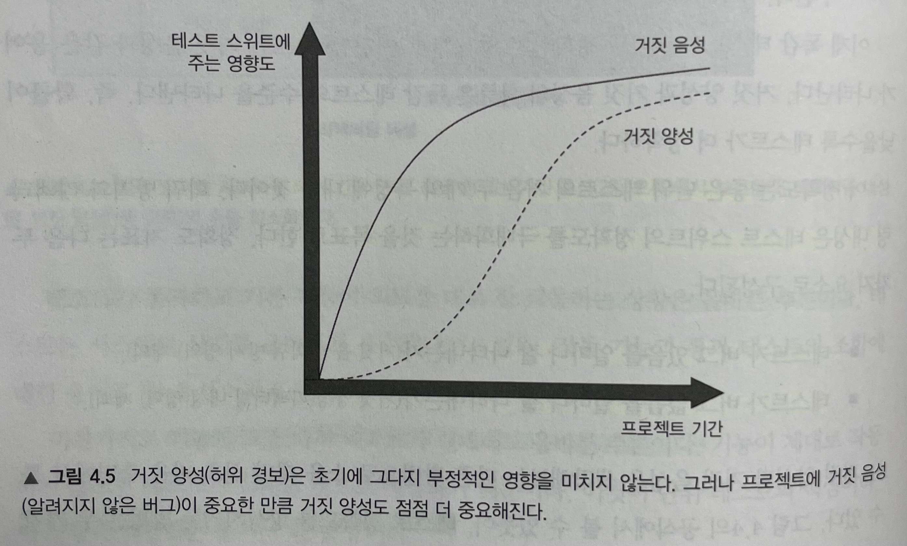

# Unit Testing : 생산성과 품질을 위한 단위 테스트 원칙과 패턴

이 내용은 [단위 테스트 생산성과 품질을 위한 단위 테스트 원칙과 패턴]을 읽으면서 정리한 내용을 포함하고 있습니다.

- 3장 단위 테스트 구조 : 3.5 
- 4장 좋은 단위 테스트의 4대 요소 : 4.1 ~ 4.3

목차는 다음과 같습니다.

- 단위 테스트를 구성하는 방법
- xUnit 테스트 프레임워크 살펴보기
- 단위 테스트 명명법
- 정리

책의 예제는 C#으로 되어 있어서 Java로 변경해서 진행합니다.

## 3장 단위 테스트 구조

### 3.5 매개변수화된 테스트 리팩터링하기

보통 테스트 하나로는 동작 단위를 완전하게 설명하기에 충분치 않다.

- 동작이 충분히 복잡하면, 이를 설명하는 테스트 수가 급격히 증가할 수 있으며 관리하기 어려워진다.

단위 테스트 프레임워크는 매개변수화된 테스트를 사용해 유사한 테스트를 묶을 수 있는 기능을 제공한다.

#### 실습해보기

가장 빠른 배송일이 오늘로부터 이틀 후가 되도록 작동하는 배송 기능이 있다고 가정해보자.
지난 배송일을 확인하는 테스트 외에 오늘 날짜, 내일 날짜 그리고 그 이후의 날짜까지 확인하는 테스트도 필요하다.

즉, 테스트가 3개는 필요한 상황이다.

`public void delivery_for_today_is_invalid()`
`public void delivery_for_tomorrow_is_invalid()`
`public void the_soonest_delivery_date_is_two_days_from_now()`

이로 인해 테스트 메서드가 나왔지만 테스트 하고자하는 것은 `배송날짜` 이다.

*Action*

- 좀 더 좋은 방법은 테스트 코드의 양을 줄이고자 이러한 테스트를 하나로 묶는 것이다.

```java
@ParameterizedTest(name = "가장 빠른 배송일이 오늘 날짜로부터 {0} 인 날짜의 배송 기능의 결과는 {1} 이다.")
@CsvSource(value = {"-1,false", "0,false", "1,false", "2,true"})
void can_detect_an_invalid_delivery_date(int daysFromNow, boolean expected) {
    DeliveryService sut = new DeliveryService();
    LocalDate deliveryDate = LocalDate.now().plusDays(daysFromNow);
    Delivery delivery = new Delivery(deliveryDate);

    boolean isValid = sut.isDeliveryValid(delivery);

    assertThat(isValid).isEqualTo(expected);
}
```

- `@ParameterizedTest`
  - 매개변수화된 테스트 메서드를 지원
  - 메서드는 비공개 또는 정적은 불가
- `@CsvSource` 
  - `,` 로 분리된 문자열을 테스트 메소드의 파라미터로 분리하여 실행
  - `,` 이외 custom 구분자 사용 가능하며 `delimiterString` 통해 사용
  - ` `는 empty, 비워두는 것은 null 처리
- 이외 `ValueSource`, `NullSource`, `EmptySource`, `NullAndEmptySource`, `EnumSource`, `MethodSource` 가 존재한다.

결과는 다음과 같습니다.



매개변수화된 테스트를 사용하면 테스트 코드의 양을 크게 줄일 수 있지만, 테스트 메서드가 나타내는 사실을 파악하기가 어려워져서 비용이 발생한다.

절충안으로 긍정적인 테스트 케이스는 고유한 테스트로 도출하고 가장 중요한 부분을 잘 설명하는 이름을 쓰면 좋다.
위에 배송날짜 테스트 케이스를 토대로 다음과 같이 나타낼 수 있다.

- 유효한 배송 날짜 테스트 케이스
- 유효하지 않은 배송 날짜를 구별하는 요소 테스트 케이스

```java
@ParameterizedTest(name = "가장 빠른 배송일이 오늘 날짜로부터 이틀 전의({0}) 배송은 불가능하다.")
@ValueSource(ints = {-1, 0, 1})
void detects_an_invalid_delivery_date(int daysFromNow) {
    DeliveryService sut = new DeliveryService();
    LocalDate deliveryDate = LocalDate.now().plusDays(daysFromNow);
    Delivery delivery = new Delivery(deliveryDate);

    boolean isValid = sut.isDeliveryValid(delivery);

    assertThat(isValid).isFalse();
}

@DisplayName("가장 빠른 배송일이 오늘 날짜로부터 이틀 후의 배송이 도착한다")
@Test
void the_soonest_delivery_date_is_tow_days_from_now() {
    DeliveryService sut = new DeliveryService();
    LocalDate deliveryDate = LocalDate.now().plusDays(2);
    Delivery delivery = new Delivery(deliveryDate);

    boolean isValid = sut.isDeliveryValid(delivery);

    assertThat(isValid).isTrue();
}
```

동작이 너무 복잡하면 매개변수화된 테스트를 조금도 사용하지 말아야 한다.

- 긍정적인 테스트 케이스와 부정적인 테스트 케이스 모두 각각 고유의 테스트 메서드로 나타내야 한다.

> 테스트 코드의 양과 그 코드의 가독성은 서로 상충된다.
경험상 입력 매개변수만으로 테스트 케이스를 판단할 수 있다면 긍정적인 테스트 케이스와 부정적인 테스트 케이스 모두 하나의 메서드로 두는 것이 좋다.

#### 3.5.1 매개변수화된 테스트를 위한 데이터 생성

실제 날짜를 구하는 메소드를 통해서 매개변수화된 테스트를 할 수 있다.

```java
@ParameterizedTest(name = "가장 빠른 배송일이 오늘 날짜로부터 {0} 인 날짜의 배송 기능의 결과는 {1} 이다.")
@MethodSource("providerLocalDate")
void can_detect_an_invalid_delivery_date2(LocalDate daysFromNow, boolean expected) {
    DeliveryService sut = new DeliveryService();
    Delivery delivery = new Delivery(daysFromNow);

    boolean isValid = sut.isDeliveryValid(delivery);

    assertThat(isValid).isEqualTo(expected);
}

static Stream<Arguments> providerLocalDate() {
    return Stream.of(
        arguments(LocalDate.now().plusDays(-1), false),
        arguments(LocalDate.now().plusDays(0), false),
        arguments(LocalDate.now().plusDays(1), false),
        arguments(LocalDate.now().plusDays(2), true)
    );
}
```

- 이 기능을 사용하면 컴파일러의 제한을 극복하고 매개변수화된 테스트에서 모든 유형의 매개변수를 사용할 수 있다.

### 3.6 검증문 라이브러리를 사용한 테스트 가독성 향상

테스트 가독성을 높이기 위한 방법을 하나 더 소개하면, 검증문 라이브러리를 사용하는 것을 들 수 있다.

검증문 라이브러리를 사용하는 주요 이점은 검증문을 재구성해 가독성을 높이는 방법이다.

이전 테스트 내용에서 검증문을 살펴보면 다음과 같다.

```java
void sum_of_two_numbers() {
    var sut = new Calculator();
    
    double result = sut.sum(10, 20);
    
    assertEquals(result, 30);
}
```

검증문만 자연스럽게 수정해보면 다음과 같다.

```java
void sum_of_two_numbers() {
    var sut = new Calculator();
    
    double result = sut.sum(10, 20);
    
    assertThat(result).isEquals(30);
}
```

- 해당 테스트 코드의 검증문은 쉬운 영어로 읽을 수 있다.
- 문장을 만들 때 `[주어] [행동] [목적어]` 패턴을 따른다.
  - 그래서 후자의 단위 테스트 코드가 잘 읽어진다.

## 4장 좋은 단위 테스트의 4대 요소

### 4.1 좋은 단위 테스트의 4대 요소 자세히 살펴보기

좋은 단위 테스트의 4가지 특성

- 회귀 방지
- 리팩터링 내성
- 빠른 피드백
- 유지 보수성

#### 4.1.1 첫 번째 요소 : 회귀 방지

**회귀란?**

- 소프트웨어 버그
- 코드를 수정한 후(일반적으로 새 기능을 출시한 후) 기능이 의도한 대로 작동하지 않는 경우
- 회귀의 최악의 상황은 개발할 기능이 많을수록, 새로운 릴리스에서 기능이 하나라도 고장 날 가능성이 높다는 점

**코드는 자산이 아니라 책임이다.**

- 코드베이스가 커질수록 잠재적인 버그에 더 많이 노출된다. 
- 회귀에 대해 효과적인 보호를 개발하는 것이 중요하다. 
- 이러한 보호가 없다면 프로젝트가 오랫동안 성장할 수 없으며 점점 더 많은 버그가 쌓일 것이다.

**회귀 방지 지표의 고려 사항은 다음과 같다.**

- 테스트 중에 실행되는 코드의 양
  - 일반적으로 실행되는 코드가 많을수록 테스트에서 회귀가 나타날 가능성이 높다.
- 코드 복잡도
  - 코드의 양뿐만 아니라 복잡도와 도메인 유의성도 중요하다. 
  - 복잡한 비즈니스 로직을 나타내는 코드가 보일러플레이트 코드보다 훨씬 더 중요하다.
- 코드의 도메인 유의성
  - 단순한 코드를 테스트하는 것은 가치가 거의 없다.

> 회귀 방지 지표를 극대화하려면 가능한 한 많은 코드를 실행하는 것을 목표로 해야 한다.

#### 4.1.2 두 번째 요소 : 리팩터링 내성

테스트를 `빨간색`으로 바꾸지 않고 기본 애플리케이션 코드를 리팩터링할 수 있는지에 대한 척도

> 리팩터링은 식별할 수 있는 동작을 수정하지 않고 기본 코드를 변경하는 것을 의미하며 비 기능적 특징을 개선하는 것으로 가독성을 높이고 복잡도를 낮추는 것

다음과 같은 상황을 가정한다.

- 새로운 기능을 개발했으며 모든 것이 잘 작동된다
- 기능이 제 역할을 하고 있으며, 모든 테스트가 통과하고 있다.
- 이제 코드를 정리하기로 결정하고 여기에 리팩터링을 조금 하고 나서 보니 모든 것이 전보다 훨씬 좋아 보인다. 
- 그런데 테스트가 실패하고 있다.

**이러한 상황은 `거짓 양성` 또는  `리팩터링 내성` 이라고 한다.**

- 허위 경보
- 실제로 기능이 의도한 대로 작동하지만 테스트는 실패는 나타내는 결과
- 일반적으로 코드를 리팩터링할 때, 즉 구현을 수정하지만 식별할 수 있는 동작은 유지할 때 발생
- 리팩터링 내성 지표에서 테스트 점수가 잘 나오려면 테스트에서 얼마나 거짓 양성이 적게 나오는지 살펴봐야 한다.

**왜 거짓 양성을 신경 쓰는가?**

- 전체 테스트 스위트에 치명적인 영향을 줄 수 있기 때문이다.
- 기본 기능이 고장 났을 때 테스트가 조기 경고를 제공한다.
  - 결함이 있는 코드가 운영 환경에 배포되기 전에 해결할 수 있다.
- 코드 변경이 회귀로 이어지지 않을 것이라고 확신하게 된다.
  - 이러한 확신이 없으면 리팩터링을 하는 데 주저하게 되고 코드베이스가 나빠질 가능성이 훨씬 높아진다.

> 단위 테스트의 목표는 프로젝트 성장을 지속 가능하게 하는 것이다. 
> - 테스트가 지속 가능한 성장을 하게 하는 메커니즘은 회귀 없이 주기적으로 리팩터링하고 새로운 기능을 추가할 수 있는 것이다.

**거짓 양성은 이 두 가지 이점을 모두 방해한다.**

- 테스트가 타당한 이유 없이 실패하면, 코드 문제에 대응하는 능력과 의지가 희석된다.
  - 시간이 흐르면서 실패에 익숙하게 되고 신경을 많이 쓰지 않게 된다.
  - 실패도 무시하기 시작해 기능이 고장 나도 운영 환경에 배포될 수 있다.
- 거짓 양성이 빈번하면 테스트 스위트에 대한 신뢰가 서서히 떨어지며, 더 이상 믿을 만한 안전망으로 인식하지 않는다.
  - 허위 경보로 인식이 나빠진다.
  - 신뢰가 부족해지면 리팩터링이 줄어든다.

> 올바른 대응은 테스트 스위트를 다시 살펴보고 안정성을 높이기 시작하는 것이다.

#### 4.1.3 무엇이 거짓 양성의 원인인가?

테스트와 테스트 대상 시스템의 구현 세부 사항이 많이 결합할수록 허위 경보가 더 많이 생긴다. 

거짓 양성이 생길 가능성을 줄이는 방법

- 해당 구현 세부 사항에서 테스트를 분리하는 것뿐이다.

테스트를 통해 SUT가 제공하는 최종 결과를 검증하는지 확인해야 한다. 테스트는 최종 사용자의 관점에서 SUT를 검증해야 하고 최종 사용자에게 의미 있는 결과만 확인해야 한다.

```java
@Getter
@Setter
@NoArgsConstructor
@AllArgsConstructor
public class Message {
    private String header;
    private String body;
    private String footer;
}
```

```java
public interface IRenderer {
    String render(final Message message);
}
```

```java
public class MessageRenderer implements IRenderer {

    private List<IRenderer> subRenderers;

    public MessageRenderer() {
        this.subRenderers = List.of(new HeaderRenderer(), new BodyRenderer(), new FooterRenderer());
    }

    @Override
    public String render(final Message message) {
        return subRenderers.stream()
                .map(sub -> sub.render(message))
                .collect(Collectors.joining());
    }

    public List<IRenderer> getSubRenderers() {
        return subRenderers;
    }
}
```

- MessageRenderer 클래스에 여러 하위 렌더링 클래스가 있고, 메시지의 일부에 대한 실제 작업을 위임한다.
- 결과를 HTML 문서로 결합한다.
- 하위 렌더링 클래스는 원본 문자열을 HTML 태그로 조정한다.

```java
public class BodyRenderer implements IRenderer {

    @Override
    public String render(final Message message) {
        return "<b>"+message.getBody()+"</b>";
    }
}

public class FooterRenderer implements IRenderer {

    @Override
    public String render(final Message message) {
        return "<i>"+message.getFooter()+"</i>";
    }
}

public class HeaderRenderer implements IRenderer {

    @Override
    public String render(final Message message) {
        return "<h1>"+message.getHeader()+"</h1>";
    }
}
```

- MessageRenderer를 어떻게 테스트할 수 있을까? 한 가지 가능한 방법은 이 클래스가 따르는 알고리즘을 분석하는 것이다.

```java
public void MessageRenderer_uses_correct_sub_renderers() {
    var sut = new MessageRenderer();

    IReadOnlyList<Irenderer> renderers = sut.subRenderers;

    asserAll(
        () -> assertThat
    );
}
```

- 이 테스트는 하위 렌더링 클래스가 예상하는 유형과 올바른 순서로 나타나는지 여부를 확인한다.
- MessageRenderer의 식별할 수 있는 동작을 실제로 확인하지 않는다.
- 만약 하위 렌더링 클래스의 위치를 조정하거나 그중 하나를 다른 것으로 변경한다면 어떻께 될까? 
- 버그로 이어지지는 않지만 테스트는 깨지게 된다.
- 이는 테스트가 SUT가 생성한 결과가 아니라 SUT의 구현 세부 사항과 결합했기 때문이다.



리팩터링 과정은 애플리케이션의 식별할 수 있는 동작에 영향을 주지 않으면서 구현을 변경하는 것이다. 그리고 변경할 때마다 빨간색으로 변하는 것은 바로 테스트가 구현 세부 사항에 관계돼 있기 때문이다.

SUT의 구현 세부 사항과 결합된 테스트의 단점

- 회귀 발생 시 조기 경고를 제공하지 않는다. 대부분 잘못된 것이므로 이러한 경고는 무시하게 된다.
- 리팩터링에 대한 능력과 의지를 방해한다. 버그를 찾을 때 테스트가 어느 방향인지 알려줄 수 없다면 누가 리팩터링하고 싶을까?

#### 4.1.4 구현 세부 사항 대신 최종 결과를 목표로 하기

테스트를 깨지지 않게 하고 리팩터링 내성을 높이는 방법은 SUT의 구현 세부 사항과 테스트 간의 결합도를 낮추는 것 뿐이다. 즉, 코드의 내부 작업과 테스트 사이를 가능한 한 멀리 떨어뜨리고 최종 결과를 목표로 하는 것이다.

```java
@Test           
void rendering_a_message() {
    var sut = new MessageRenderer();
    Message message = new Message("h", "b", "f");

    String html = sut.render(message);

    assertThat(html).isEqualTo("<h1>h</h1><b>b</b><i>f</i>");
}
```


- 이 테스트는 MessageRender 를 블랙박스로 취급하고 식별할 수 있는 동작에만 신경 쓴다.
- 결과적으로 테스트는 리팩터링 내성이 부쩍 늘었다.



이 테스트는 최종 사용자에게 의미 있는 유일한 결과, 즉 브라우저에 메시지가 표시되는 방식을 검증해 비즈니스 요구 사항에 들어맞는다.

> 좋지 않은 거짓 양성은 컴파일 오류를 내지 않는 것이다.

### 4.2 첫 번째 특성과 두 번째 특성 간의 본질적인 관계

- 첫 번째 특성 : 회귀 방지
- 두 번째 특성 : 리팩터링 내성

#### 4.2.1 테스트 정확도 극대화

|오류 유형 표|기능 - 작동|기능 - 고장|
|---|---|---|---|
|테스트 통과|올바른 추론(참 음성)|2종 오류(거짓 음성)|
|테스트 실패|1종 오류(거짓 양성)|올바른 추론(참 양성)|

##### 올바른 추론

- 테스트가 통과하고 기본 기능이 의도한 대로 잘 작동하는 상황
- 기능이 고장나서 테스트가 실패한 상황

##### 거짓 음성

- 기능이 고장났는데, 테스트에서 오류가 발생하지 않으면 문제
- 회귀 방지를 통해서 거짓 음성을 최소화할 수 있다.

##### 거짓 양성

- 기능은 올바르지만 테스트가 여전히 실패로 표시되는데 상황
- 허위 경보
- 리팩터링 내성을 통해서 거짓 양성을 최소화할 수 있다.

##### 이해도를 올려보자

테스트 스위트를 이해하기 좋은 한 가지 방법 : 독감 검사

- 독감 검사를 받는 사람이 독감에 걸렸을 때 : `긍정`
- 독감 검사를 받는 사람이 독감이 걸리지 않았을 때 : `부정`

독감 테스트가 얼마나 정확한지 평가할 때,

- 거짓 양성 또는 거짓 음성과 같은 용어가 나타난다.
- 거짓 양성과 거짓 음성의 확률은 독감 테스트의 수준을 나타낸다.
- 확률이 낮을수록 테스트가 더 정확하다.

**정확한 지표**

- 테스트가 버그 있음을 얼마나 잘 나타내는가?(거짓 음성(회귀 방지 영역) 제외)
- 테스트가 버그 없음을 얼마나 잘 나타내는가?(거짓 양성(리팩터링 내성 영역) 제외)

**테스트 정확도를 향상시키는 방법**

- 신호를 증가시키는 것
  - 회귀를 더 잘 찾아내는 테스트로 개선하는 것
- 분모, 즉 소음을 줄이는 것
  - 허위 경보를 발생시키지 않는 테스트로 개선하는 것

#### 4.2.2 거짓 양성과 거짓 음성의 중요성 : 역학 관계



**프로젝트 초기에는 거짓 양성이 중요하지 않다.**

- 초기에는 코드 정리가 필요없으며, 개발자의 기억 속에 생생하기 때문에 테스트에서 잘못된 경보가 발생하더라도 쉽게 리팩터링할 수 있다.
- 그러나 시간이 흐를수록 코드베이스는 점점 복잡해지고 체계적이지 않게 된다.

따라서 이러한 경향을 줄이려면 정기적으로 리팩터링을 해야 한다. 그렇지 않으면 새로운 기능에 드는 비용이 결국 엄청나게 커진다.

### 4.3 세 번째 요쇼와 네 번째 요소 : 빠른 피드백과 유지 보수성

##### 빠른 피드백

- 단위 테스트의 필수 속성
- 테스트 속도가 빠를수록 테스트 스위트에서 더 많은 테스트를 수행할 수 있고 더 자주 실행 가능
- 오래 걸리는 테스트는 자주 실행하지 못하기 때문에 잘못된 방향으로 가면서 시간을 더 많이 낭비하게 된다.

##### 유지 보수성

- 테스트가 얼마나 이해하기 어려운가?
  - 테스트의 크기과 관련 있음
  - 테스트는 코드 라인이 적을수록 더 읽기 쉽다.
  - 작은 테스트는 필요할 때 변경하는 것도 쉽다.
- 테스트가 얼마나 실행하기 어려운가?
  - 테스트가 프로세스 외부 종속성으로 작동하면, 데이터베이스 서버를 재부팅하고 네트워크 연결 문제를 해결하는 등 의존성을 상시 운영하는 데 시간이 필요하다.