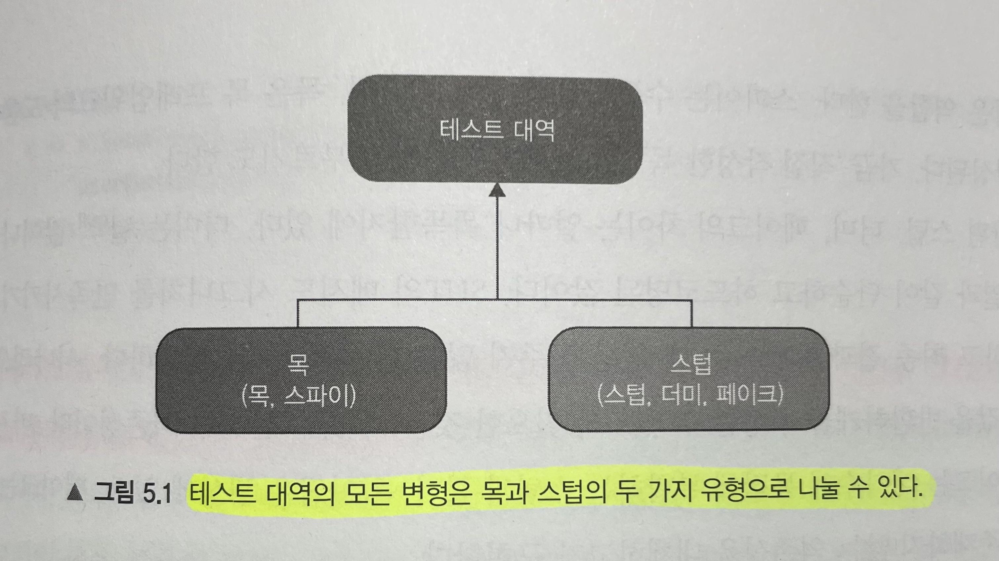
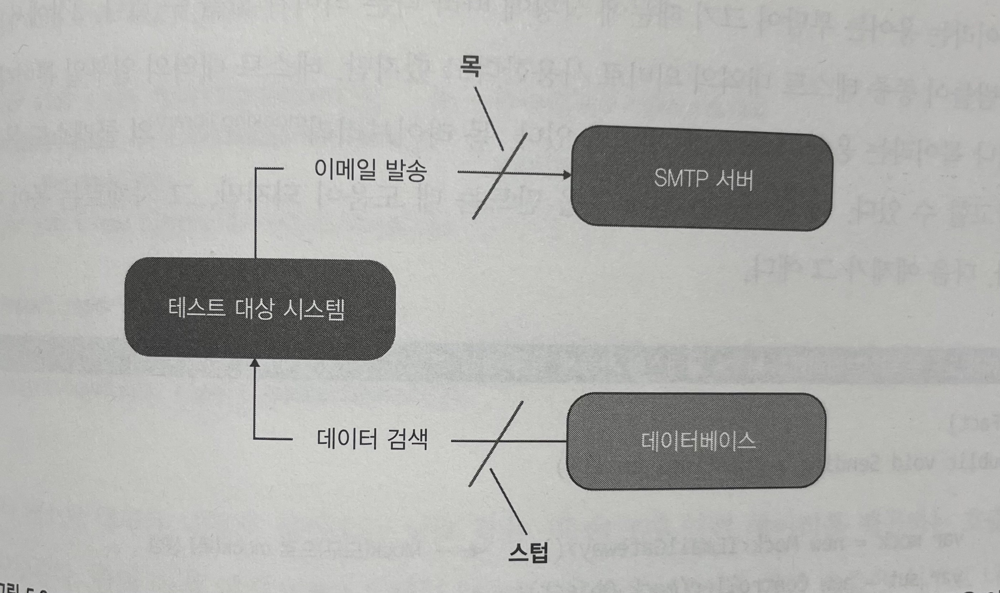
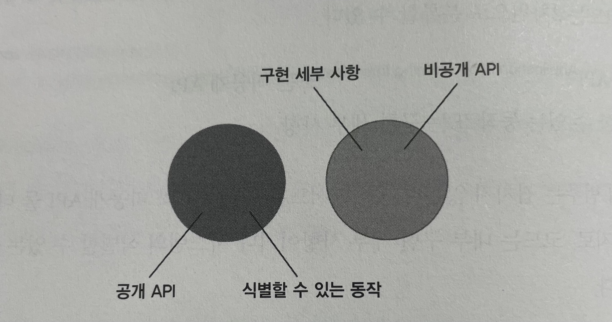
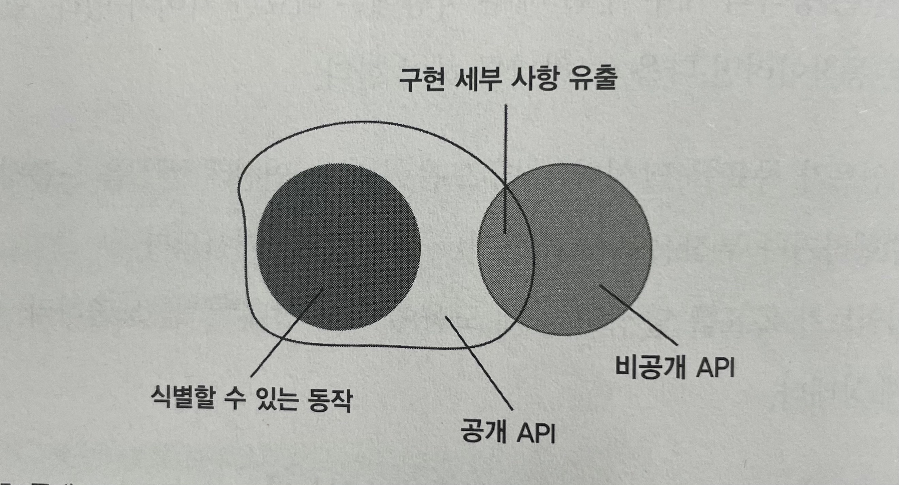
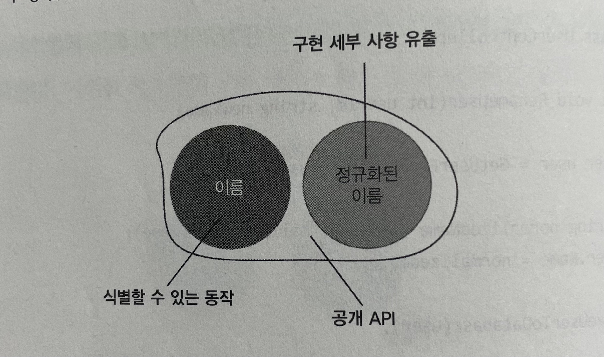

# Unit Testing : 생산성과 품질을 위한 단위 테스트 원칙과 패턴

이 내용은 [단위 테스트 생산성과 품질을 위한 단위 테스트 원칙과 패턴]을 읽으면서 정리한 내용을 포함하고 있습니다.

- 5장 목과 테스트 취약성 : 5.1 ~ 5.2

목차는 다음과 같습니다.

- 목과 스텁 구분
- 식별할 수 있는 동작과 구현 세부 사항

## 5장 목과 테스트 취약성

해당 장에서는 목으로 인해 취약한 테스트, 즉 리팩터링 내성이 부족한 테스트를 초래하는 것을 살펴본다. 그리고 목과 테스트 취약성 사이에는 연관 관계가 있는지를 알아보고, 리팩터링 내성 저하 없이 목을 사용하는 방법을 살펴본다.

### 5.1 목과 스텁 구분

목은 테스트 대상 시스템과 그 협력자 사이의 상호 작용을 검사할 수 있는 테스트 대역이라고 했다. 테스트 대역에 또 다른 유형이 있는데, 바로 스텁이다.

#### 5.1.1 테스트 대역 유형

**테스트 대역이란?**

- 모든 유형의 비운영용 가짜 의존성을 설명하는 포괄적인 용어
- 영화 산업의 스턴트 대역이라는 개념
- 테스트 대역의 주 용도는 테스트를 편리하게 하는 것
- 테스트 대상 시스템으로 실제 의존성 대신 전달되므로 설정이나 유지 보수가 어려울 수 있음

테스트 대역에는 다음과 같은 유형이 있다.

- 더미
- 스텁
- 스파이
- 목
- 페이크



- 테스트 대역의 모든 변형은 목과 스텁의 두 가지 유형으로 나눌 수 있다.

**목과 스텁의 차이점**

- 목은 외부로 나가는 상호 작용을 모방하고 검사
  - SUT가 상태를 변경하기 위한 의존성을 호출하는 것에 해당
  - 예를 들어, 이메일 발송은 SMTP 서버에 부작용을 초래하는 상호 작용, 즉 외부로 나가는 상호 작용
- 스텁은 내부로 들어오는 상호 작용을 모방 
  - SUT가 입력 데이터를 얻기 위한 의존성을 호출하는 것에 해당
  - 예를 들어, 데이터베이스에서 데이터를 검색하는 것은 내부로 들어오는 상호 작용



#### 5.1.2 도구로서의 목과 테스트 대역으로서의 목

목 라이브러리의 클래스도 목으로 참고할 수 있다.
아래 클래스는 실제 목을 만드는 데 도움이 되지만, 그 자체로는 목이 아니다.

```java
class GreetServiceTest {

    @Test
    void sending_a_greetings_email() {
        var iEmailGateway = mock(IEmailGateway.class);
        var sut = new GreetService(iEmailGateway);

        sut.greetUser("user@email.com");

        verify(iEmailGateway, times(1)).sendGreetingsEmail(anyString());
    }
}
```

- 테스트는 목 라이브러리에 있는 Mock 클래스를 사용
- 이 클래스는 테스트 대역(목)을 만들 수 있는 도구

**Mock 클래스**

- 도구로서의 목
  - 목과 스텁 대역 생성 가능
- 해당 클래스의 인스턴스인 mock은 테스트 대역으로서의 목

```java
class ReportServiceTest {

    @Test
    void creating_a_report() {
        var mock = mock(IDatabase.class);
        final ReportService sut = new ReportService(mock);

        when(mock.getNumberOfUsers()).thenReturn(10);

        Report report = sut.createReport();

        assertThat(report.numberOfUsers()).isEqualTo(10);
    }
}
```

- 해당 테스트 대역은 내부로 들어오는 상호 작용, 즉 SUT에 입력 데이터를 제공하는 호출을 모방

#### 5.1.3 스텁으로 상호 작용을 검증하지 말라

- 목은 SUT에 관련 의존성으로 나가는 상호 작용을 모방하고 검사
- 스텁은 내부로 들어오는 상호 작용만 모방하고 검사하지 않음

스텁은 SUT가 출력을 생성하도록 입력을 제공한다.

- 스텁과의 상호 작용을 검증하는 것은 취약한 테스트를 야기하는 일반적인 안티 패턴

거짓 양성을 피하고 리팩터링 내성을 향상시키는 방법은?

- 구현 세부 사항이 아니라 최종 결과를 검증하는 것!

```java
mock.verify(x -> x.sendGreetingsEmail("user@email.com"))
```

- 해당 결과는 도메인 전문가에게 의미가 있다.
  - 인사 메일을 보내는 것은 비즈니스 담당자가 시스템에 하길 원하는 것

다음은 깨지기 쉬운 테스트이다.

```java
@Test
void creating_a_report2() {
    var mock = mock(IDatabase.class);
    final ReportService sut = new ReportService(mock);

    when(mock.getNumberOfUsers()).thenReturn(10);

    Report report = sut.createReport();

    assertThat(report.numberOfUsers()).isEqualTo(10);
    verify(mock, times(1)).getNumberOfUsers();
}
```

- `과잉 명세` 
  - 최종 결과가 아닌 사항을 검증하는 것
  - 과잉 명세는 상호 작용을 검사할 때 가장 흔하게 발생
- 스텁과의 상호 작용을 확인하는 것은 쉽게 발견할 수 있는 결함
  - `verify(mock, times(1)).getNumberOfUsers();`

#### 5.1.4 목과 스텁 함께 쓰기

다음은 런던 스타일 단위 테스트를 설명하는 데 사용했던 2장의 테스트이다.

```java
@Test
void Purchase_succeeds_when_enough_inventory() {

    Store storeMock = mock(Store.class);
    Customer customer = new Customer();
    when(storeMock.findInventory(any())).thenReturn(5);
    when(storeMock.saveInventory(any(), anyInt())).thenReturn(5);

    boolean success = customer.purchase(storeMock, Shampoo, 5);

    assertAll(
        () -> assertThat(success).isTrue()
    );
    verify(storeMock, never()).removeInventory(Shampoo, 5);
}
```

- 해당 테스트는 두 가지 목적으로 storeMock을 사용
- 준비된 응답을 반환하고 SUT에서 수행한 메서드 호출을 검증하는데, 이는 두 가지의 서로 다른 메서드
  - 테스트는 `findInventory()` 에서 응답을 설정한 다음 `removeInventory()` 에 대한 호출을 검증
- 스텁과의 상호 작용을 검증하지 말라는 규칙은 여기서도 위배되지 않는다.

테스트 대역은 목이면서 스텁

- 여전히 목이라고 부르지 스텁이라고 부르지 않는다. 
- 이름을 하나 골라야 하기도 하고, 목이라는 사실이 스텁이라는 사실보다 더 중요하기 때문에 목이라고 한다.

#### 5.1.5 목과 스텁은 명령과 조회에 어떻게 관련돼 있는가?

목과 스텁의 개념은 명령 조회 분리(`CQS`) 원칙과 관련이 있다.

- `CQS` 원칙에 따르면 모든 메서드는 명령이거나 조회이여야 하며, 이 둘을 혼용해서는 안 된다.
- 명령은 부작용을 일으키고 어떤 값도 반환하지 않는 메서드
  - 부작용의 예로는 객체 상태 변경, 파일 시스템 내 파일 변경 등
- 조회는 그 반대로, 부작용이 없고 값을 반환

")

- 명령 조회 분리(`CQS`) 원칙에서 명령은 목에 해당하는 반면, 조회는 스텁과 일치한다.

### 5.2 식별할 수 있는 동작과 구현 세부 사항

테스트 취약성은 좋은 단위 테스트의 두 번째 특성인 리팩터링 내성에 해당

- 회귀 방지
- 리팩터링 내성
- 빠른 피드백
- 유지 보수성

테스트가 단위 테스트 영역에 있고 엔드 투 엔드 테스트 범주로 바뀌지 않는 한 리팩터링 내성을 최대한 활용하는 것이 좋다.
엔드 투 엔드 테스트 범주로 넘어가면, 리팩터링 내성이 가장 뛰어나도 일반적으로 유지 보수하기가 훨씬 까다롭다.

**테스트에 거짓 양성이 있는 주요 이유**

- 코드의 구현 세부 사항과 결합돼 있기 때문
- 이러한 강결합을 피하는 방법은 코드가 생성하는 최종 결과를 검증하고 구현 세부 사항과 테스트를 가능한 한 떨어뜨리는 것뿐
- 테스트는 `어떻게`가 아니라 `무엇`에 중점을 둬야 한다.

#### 5.2.1 식별할 수 있는 동작은 공개 API와 다르다

모든 제품 코드는 2차원 분류 가능

- 공개 API 또는 비공개 API
- 식별할 수 있는 동작 또는 구현 세부 사항

대부분의 프로그래밍 언어는 코드베이스의 공개 API와 비공개 API를 구별할 수 있는 간단한 메커니즘을 제공한다.

코드가 시스템의 식별할 수 있는 동작이려면 다음 중 하나를 해야 한다.

- 클라이언트가 목표를 달성하는 데 도움이 되는 연산을 노출하라. 
  - 연산은 계산을 수행하거나 부작용을 초래하거나 둘 다 하는 메서드다.
- 클라이언트가 목표를 달성하는 데 도움이 되는 상태를 노출하라. 
  - 상태는 시스템의 현재 상태다.

이상적으로 시스템의 공개 API는 식별할 수 있는 동작과 일치해야 하며, 모든 구현 세부 사항은 클라이언트 눈에 보이지 않아야 한다.



시스템의 공개 API가 식별할 수 있는 동작의 범위를 넘어 구현 세부 사항을 노출하기 시작한다.



#### 5.2.2 구현 세부 사항 유출 : 연산의 예

구현 세부 사항이 공개 API(public 메소드)로 유출되는 코드의 예는 다음과 같다.

```java
@Getter @Setter
public class User {

    public String name;

    public User(final String name) {
        this.name = name;
    }

    public String normalizeName(final String name) {
        final String result = name.trim();

        if (result.length() > 50) {
            return result.substring(0, 50);
        }
        return result;
    }

    public void updateName(final String name) {
        this.name = name;
    }
}

public class UserService {

    public void renameUser(final int userId, final String newName) {

        final User findUser = getUserFromDatabase(userId);
        final String normalizeName = findUser.normalizeName(newName);
        findUser.updateName(normalizeName);
    }
}
```

- 위 예제는 이름을 변경하는 기능이다.
- User 클래스의 public 메소드가 잘 설계되지 않은 이유는 무엇인가? 
  - `name` 필드의 속성이 모두 공개로 되어 있다.

클래스의 public 메소드를 잘 설계하려면 해당 멤버가 식별할 수 있는 동작이 되게 해야 한다.

- 클라이언트 목표를 달성하는 데 도움이 되는 작업을 노출하라.
- 클라이언트 목표를 달성하는 데 도움이 되는 상태를 노출하라.

사용자 이름 변경이라는 기능을 잘 나타낼 수 있도록 해당 기능만 노출하고 구현 세부 사항들은 캡슐화 해야 한다.



```java
@Getter @Setter
public class User {

    public String name;

    public User(final String name) {
        this.name = name;
    }

    public void updateName(final String name) {
        this.name = normalizeName(name);
    }

    private String normalizeName(final String name) {
        final String result = name.trim();

        if (result.length() > 50) {
            return result.substring(0, 50);
        }
        return result;
    }
}

public class UserService {

    public void renameUser(final int userId, final String newName) {

        final User findUser = getUserFromDatabase(userId);
        findUser.updateName(normalizeName);
    }
}
```

- 식별할 수 있는 동작인 `updateName` 가 공개되어 있고 구현 세부 사항인 `normalizeName` 비공개이다.
  


클래스가 구현 세부 사항을 유출하는지 판단하는 데 도움이 되는 유용한 규칙은 다음과 같다.

- 단일한 목표를 달성하고자 클래스에서 호출해야 하는 연산의 수가 1보다 크면 해당 클래스에서 구현 세부 사항을 유출할 가능성이 있다.
- 이상적으로는 단일 연산으로 개별 목표를 달성해야 한다.

#### 5.2.3 잘 설계된 API와 캡슐화

캡슐화는 다음과 같은 성격을 갖는다.

- 잘 설계된 API를 유지보수 한다.
- 불변성 위반의 모순을 방지하는 조치한다.
  - 불변성은 항상 참이어야 한다.

만일 불변성 위반으로 구현 세부 사항을 노출하게 된다는 것은 불변성 위반을 가져온다.

장기적으로 코드베이스 유지 보수에서는 캡슐화가 중요하다.

- 코드 복잡도는 소프트웨어 개발에서 가장 큰 어려움 중 하나이다.
  - 코드베이스가 점점 복잡해질수록 작업하기가 더 어려워지고, 개발 속도가 느려지고, 버그 수가 증하게 된다.
- 가장 좋은 방법은 캡슐화를 올바르게 유지해 코드베이스에서 잘못할 수 있는 옵션조차 제공하지 않도록 하는 것이다.
- 캡슐화는 궁극적으로 단위 테스트와 동일한 목표를 달성
- 즉, 소프트웨어 프로젝트의 지속적인 성장을 가능하게 하는 것

코드 캡슐화가 목표이지만, 구현 세부 사항을 숨기고 데이터와 기능을 결합하는 것이 해당 목표를 달성하기 위한 수단이다.

- 구현 세부 사항을 숨기면 클라이언트의 시야에서 클래스 내부를 가릴 수 있기 때문에 내부를 손상시킬 위험이 적다
- 데이터와 연산을 결합하면 해당 연산이 클래스의 불변성을 위반하지 않도록 할 수 있다.

#### 5.2.4 구현 세부 사항 유출 : 상태의 예

구현 세부 사항이 공개 API(public 메소드)로 유출되는 코드의 예는 다음과 같다.

```java
public class MessageRenderer implements IRenderer {

    public List<IRenderer> subRenderers;

    public MessageRenderer() {
        this.subRenderers = List.of(new HeaderRenderer(), new BodyRenderer(), new FooterRenderer());
    }

    @Override
    public String render(final Message message) {
        return subRenderers.stream()
                .map(sub -> sub.render(message))
                .collect(Collectors.joining());
    }

    public List<IRenderer> getSubRenderers() {
        return subRenderers;
    }
}
```

- `subRenderers` 변수가 공개이다.
  - 이 변수는 식별할 수 있는 동작이 아니다.
- 클라이언트에게 필요한 기능은 `render` 뿐이다.
  - `subRenderers` 구현 세부 사항이다.

좋은 단위 테스트와 잘 설계된 API 사이에는 본질적인 관계가 있다.

- 모든 구현 세부 사항을 비공개로 하면 테스트가 식별할 수 있는 동작을 검증하는 것 외에는 다른 선택지가 없으며, 이로 인해 리팩터링 내성도 자동으로 좋아진다.

잘 설계된 API의 정의에서 비롯된 또 다른 지침으로 연산과 상태를 최소한으로 노출해야 한다. 클라이언트가 목표를 달성하는 데 직접적으로 도움이 되는 코드만 공개해야 하며, 다른 모든 것은 구현 세부 사항이므로 비공개 API 뒤에 숨겨야 한다.

## 정리

- 목은 외부로 나가는 상호 작용을 모방하고 검사
- 스텁은 내부로 들어오는 상호 작용을 모방
  - 스텁과의 상호 작용을 검증하면 취약한 테스트로 이어지는데, 최종 결과와 일치하지 않는 중간 단계의 구현 세부 사항의 해당한다.
- 명령 조회 분리(CQS) 원칙에 따르면, 모든 메서드가 명령 또는 조회 중 하나여야 하지만 둘 다는 안 된다.
  - 명령을 대체하는 테스트 대역은 목이다.
  - 조회를 대체하는 테스트 대역은 스텁이다.
- 모든 제품 코드는 공개 API인지 비공개 API인지와 식별할 수 있는 동작인 구현 세부사항인지라는 두 가지 차원으로 분류할 수 있다. 
