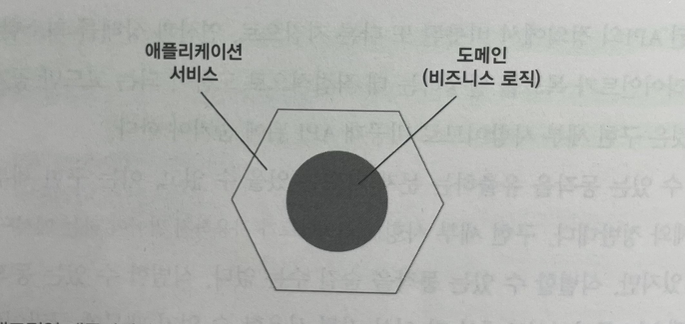
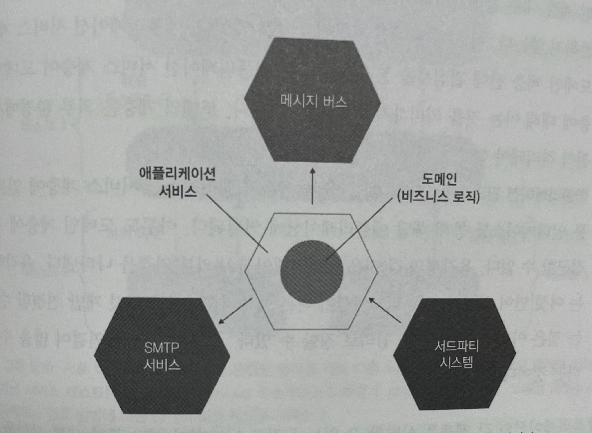
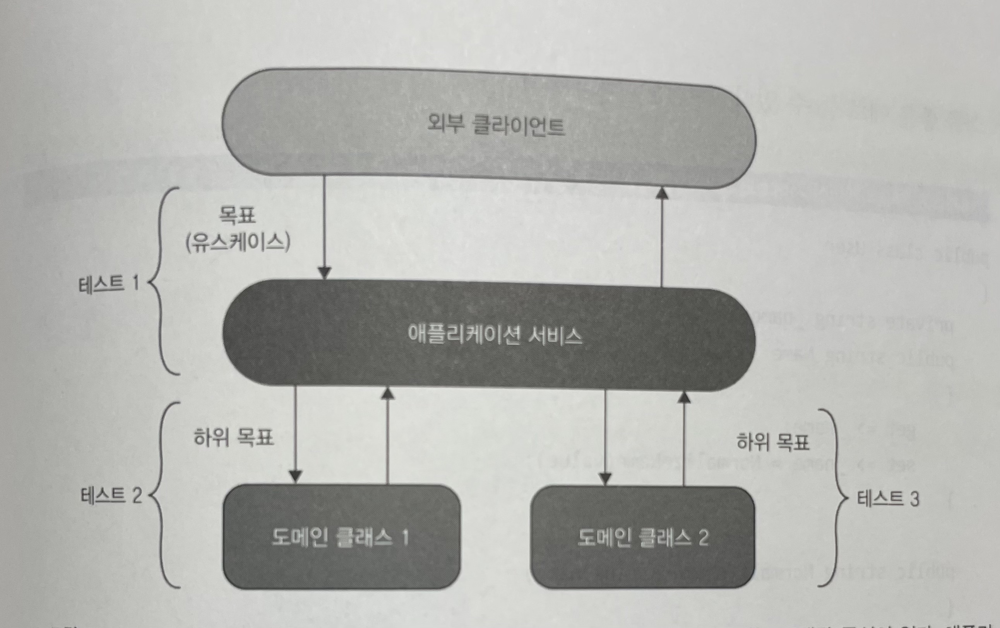
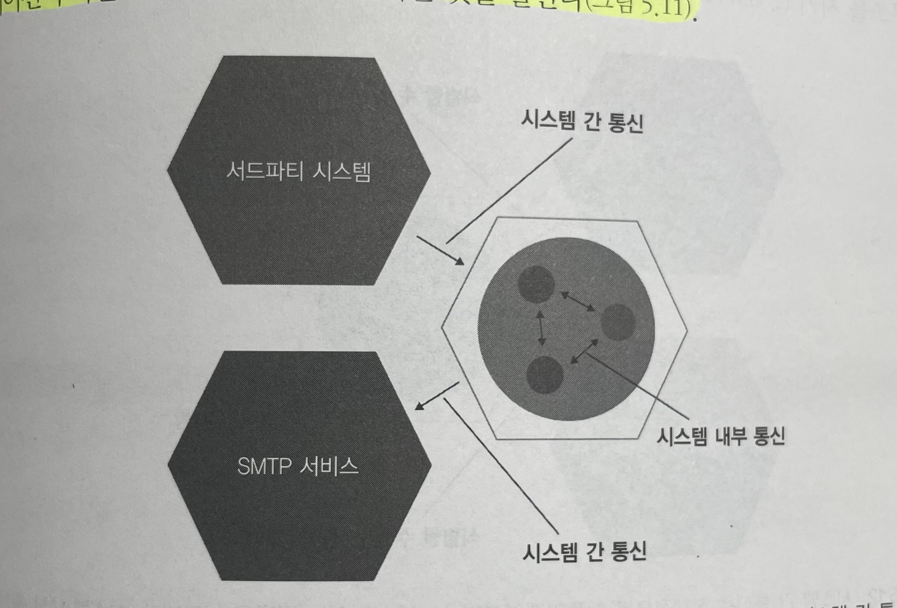
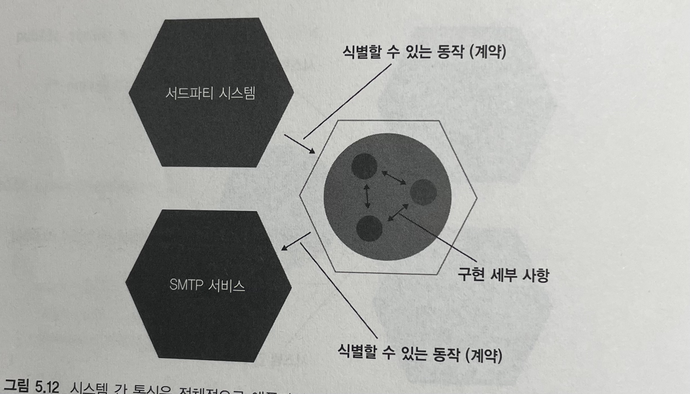
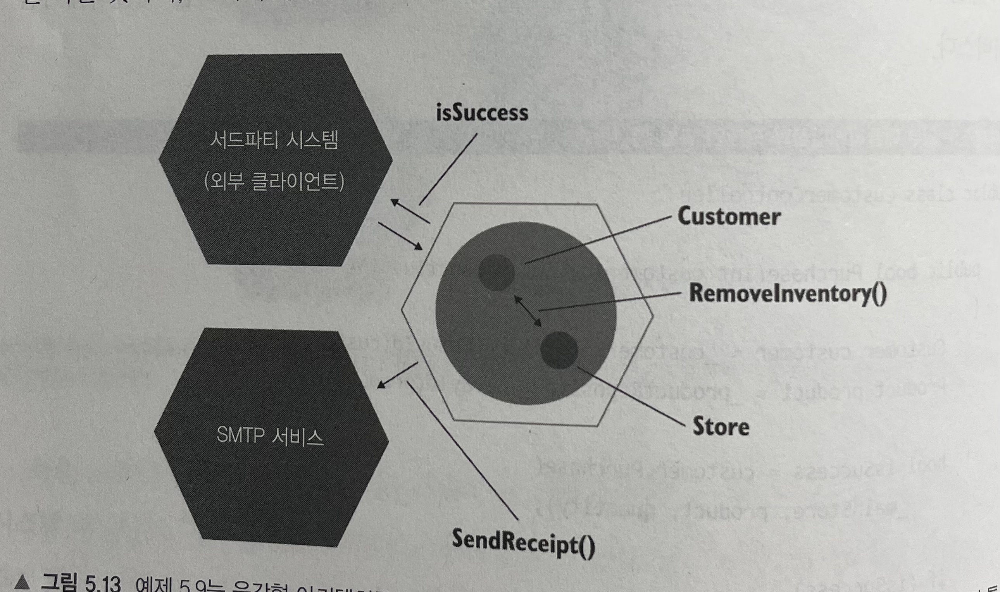

# Unit Testing : 생산성과 품질을 위한 단위 테스트 원칙과 패턴

이 내용은 [단위 테스트 생산성과 품질을 위한 단위 테스트 원칙과 패턴]을 읽으면서 정리한 내용을 포함하고 있습니다.

- 5장 목과 테스트 취약성 : 5.3 ~ 5.4

목차는 다음과 같습니다.

- 목과 테스트 취약성 간의 관계
- 단위 테스트의 고전파와 런던파 재고
  
## 5장 목과 테스트 취약성

### 5.3 목과 테스트 취약성 간의 관계

육각형 아키텍처, 내부 통신과 외부 통신의 차이점 그리고 목과 테스트 취약성 간의 관계를 알아본다.

#### 5.3.1 육각형 아키텍처 정의



- 대표적인 애플리케이션은 도메인과 애플리케이션 서비스 계층으로 구성
- 도메인 계층
  - 애플리케이션의 중심부
  - 애플리케이션의 필수 기능으로 비즈니스 로직 포함
  - 도메인 계층과 해당 비즈니스 로직은 조직의 경쟁력을 향상
- 애플리케이션 계층
  - 도메인 계층 위에 있으며 외부 환경과의 통신을 조정
  - 도메인 클래스와 프로세스 외부 의존성 간의 작업을 조정
  - 다음 예와 같다.
    - 데이터베이스를 조회하고 해당 데이터로 도메인 클래스 인스턴스 구체화
    - 해당 인스턴스에 연산 호출
    - 결과를 데이터베이스에 다시 저장



- 육각형 아키텍처는 상호 작용하는 애플리케이션의 집합

##### 육각형 아키텍처의 목적

애플리케이션 서비스 계층과 도메인 계층의 조합은 육각형을 형성하며, 이 육각형은 애플리케이션을 나타낸다.

- 도메인 게층과 애플리케이션 서비스 계층 간의 관심사 분리
  - 비즈니스 로직은 애플리케이션의 가장 중요한 부분
  - 도메인 계층은 해당 비즈니스 로직에 대해서만 책임을 져야 하며, 다른 모든 책임에서는 제외
  - 애플리케이션 서비스에는 어떤 비즈니스 로직도 존재하면 안됨
- 애플리케이션 내부 통신
  - 육각형 아키텍처는 애플리케이션 서비스 계층에서 도메인 계층으로 흐르는 단방향 의존성 흐름을 규정
  - 도메인 계층 내부 클래스는 도메인 계층 내부 클래스끼리 서로 의존하고 애플리케이션 서비스 계층의 클래스에 의존하지 않음
  - 도메인 계층은 외부 환경에서 완전히 격리
- 애플리케이션 간의 통신
  - 외부 애플리케이션은 애플리케이션 서비스 계층에 있는 공통 인터페이스를 통해 해당 애플리케이션에 연결
  - 도메인 계층에 직접 접근 불가

##### 식별할 수 있는 동작

애플리케이션의 각 계층은 식별할 수 있는 동작을 나타내며 해당 구현 세부 사항을 포함하고 있다. 잘 설계된 API의 원칙에는 프랙탈 특성이 있는데, 이는 전체 계층만큼 크게도, 단일 클래스만큼 작게도 똑같이 적용되는 것이다.

> 프랙탈이란? 일부 작은 조각이 전체와 비슷한 기하학적 형태
> 이 책에서는 달성하는 목표는 같지만 서로 다른 수준에서 동작을 검증하는 의미로 사용



- 서로 다른 계층의 테스트는 동일한 동작을 서로 다른 수준으로 검증하는 프랙탈 특성
- 애플리케이션 서비스 테스트는 전반적으로 비즈니스 유스케이스가 어떻게 실행되는지 확인

어떤 테스트든 비즈니스 요구 사항으로 거슬러 올라갈 수 있어야 한다.

- 각 테스트는 도메인 전문가에게 의미 있는 이야기를 전달해야 한다.
- 그렇지 않으면 테스트가 구현 세부 사항과 결합돼 있으므로 불안정하다.

식별할 수 있는 동작은 바깥 계층에서 안쪽으로 흐른다.

- 외부 클라이언트에게 중요한 목표는 개별 도메인 클래스에서 달성한 하위 목표로 변환
- 도메인 계층에서 식별할 수 있는 동작은 각각 구체적인 비즈니스 유스케이스와 연관성
- 이 연관성을 가장 안쪽 계층에서 애플리케이션 서비스 계층 바깥쪽으로, 그리고 외부 클라이언트의 요구 사항까지 재귀적으로 추적 가능

```java
@Getter @Setter
public class User {

    public String name;

    public User(final String name) {
        this.name = name;
    }

    public String normalizeName(final String name) {
        final String result = name.trim();

        if (result.length() > 50) {
            return result.substring(0, 50);
        }
        return result;
    }

    public void updateName(final String name) {
        this.name = name;
    }
}

public class UserService {

    public void renameUser(final int userId, final String newName) {

        final User findUser = getUserFromDatabase(userId);
        final String normalizeName = findUser.normalizeName(newName);
        findUser.updateName(normalizeName);
    }
}
```

- 외부 클라이언트가 사용자 이름을 정규화하는 것과 같은 특정 목표가 없고 전적으로 애플리케이션의 제약에 의해 모든 이름을 정규화한다고 가정하면, User 클래스의 normalizeName 메서드는 클라이언트의 요구 사항으로 추적할 수 없다.
- 따라서 구현 세부 사항이므로 비공개로 해야 한다.
- 테스트에서도 이 메소드를 직접 확인하면 안 된다. 클래스의 식별할 수 있는 동작으로서만 검증해야 한다.

#### 5.3.2 시스템 내부 통신과 시스템 간 통신

일반적인 애플리케이션은 두 가지 통신이 있다.

- 시스템 내부 통신
  - 시스템 내부 통신은 애플리케이션 내 클래스 간의 통신
- 시스템 간 통신 
  - 시스템 간 통신은 애플리케이션이 다른 애플리케이션과 통신



애플리케이션 내부의 클래스 간 협력과 달리 시스템 외부 환경과 통신하는 방식은 전체적으로 해당 시스템의 식별할 수 있는 동작을 나타낸다. 이는 애플리케이션에 항상 있어야 하는 계약이다.



- 시스템 간 통신은 전체적으로 애플리케이션의 식별할 수 있는 동작을 나타낸다.
- 시스템 내부 통신은 구현 세부 사항

#### 5.3.3 시스템 내부 통신과 시스템 간 통신의 예

시스템 내부 통신과 시스템 간 통신의 차이점을 설명하고자 지난 예제를 들어 설명해본다. 다음은 비즈니스 유스케이스이다.

- 고객이 상점에서 제품을 구매하려고 한다.
- 매장 내 제품 수량이 충분하면
  - 재고가 상점에서 줄어든다.
  - 고객에게 이메일로 영수증을 발송한다.
  - 확인 내역을 반환한다.

먼저 `CustomerService` 의 역할은 도메인 클래스(Customer, Product, Store)와 외부 애플리케이션 간의 작업을 조정하는 애플리케이션 서비스이다.

```java
public class CustomerService {
    
    private final CustomerRepository customerRepository;
    private final ProductRepository productRepository;
    private final IEmailGateway iEmailGateway;

    public CustomerService(final CustomerRepository customerRepository, final ProductRepository productRepository, final IEmailGateway iEmailGateway) {
        this.customerRepository = customerRepository;
        this.productRepository = productRepository;
        this.iEmailGateway = iEmailGateway;
    }

    public boolean purchase(final int customerId, final int productId, final int quantity) {

        final Customer customer = customerRepository.findById(customerId);
        final Product product = productRepository.findById(productId);

        final boolean isSuccess = customer.purchase(mainStore(), product, quantity);

        if (isSuccess) {
            iEmailGateway.sendReceipt(customer.getEmail(), product.getName(), quantity);
        }
        return isSuccess;
    }
}
```

- purchase 메소드에서 고객은 상점에 재고가 충분한지 확인하고, 충분하면 제품 수량을 감소
- 구매라는 동작은 시스템 내부 통신과 시스템 간 통신이 모두 있는 비즈니스 유스케이스
- 시스템 간 통신은 CustomerService 애플리케이션 서비스와 두 개의 외부 시스템인 서드파티 애플리케이션과 이메일 게이트웨이 간의 통신
- 시스템 내부 통신은 Customer와 Store 도메인 클래스 간의 통신

해당 시스템의 목표는 구매를 하는 것이며, 고객이 성공적인 결과로서 이메일로 확인 내역을 받는 것을 기대한다.



```java
@Test
void successful_purchase() {

    final CustomerRepository customerMock = mock(CustomerRepository.class);
    final ProductRepository productMock = mock(ProductRepository.class);
    final IEmailGateway emailMock = mock(IEmailGateway.class);
    final CustomerService sut = new CustomerService(customerMock, productMock, emailMock);

    boolean isSuccess = sut.purchase(1, 2, 5);

    assertThat(isSuccess).isTrue();
    verify(emailMock, times(1)).sendReceipt("customer@email.com", "Shampoo", 5);
}
```

- 취약한 테스트로 이어지지 않는 목 사용
- isSueccess 플래그는 외부 클라이언트에서도 확인할 수 있으며, 검증도 필요
- 해당 플래그는 목이 필요 없고, 간단한 값 비교만으로 충분

```java
@Test
void purchase_succeeds_when_enough_inventory() {

    final Store storeMock = mock(Store.class);
    doNothing().when(storeMock).hasEnoughInventory(Product.Shampoo, 5);
    final Customer customer = new Customer();

    boolean success = customer.purchase(storeMock, Product.Shampoo, 5);

    assertThat(success).isTrue();
    verify(storeMock, times(1)).removeInventory(any(), anyInt());
}
```

- 취약한 테스트로 이어지는 목 사용
- CustomerService와 SMTP 서비스 간의 통신과 달리, Customer 클래스에서 Store 클래스로의 메서드 호출은 애플리케이션 경계를 넘지 않음
- 클라이언트 입장에서 최종 결과가 아닌 중간 단계를 검증하는 것에 해당

### 5.4 단위 테스트의 고전파와 런던파 재고

|     | 격리 주체 | 단위의 크기 | 테스트 대역 사용 대상 |
| --- | --- | --- | --- |
| 런던파 | 단위 | 단일 클래스 | 불변 의존성 외 모든 의존성 |
| 고전ㅍ | 단위 테스트 | 단일 클래스 또는 클래스 세트 | 공유 의존성

**런던파**

- 불변 의존성을 제외한 모든 의존성에 목 사용을 권장하여 시스템 내 통신과 시스템 간 통신을 구분하지 않는다.
- 그 결과 테스트는 애플리케이션과 외부 시스템 간의 통신을 확인하는 것처럼 클래스 간 통신도 확인한다.
- 목을 무분별하게 사용하면 구현 세부 사항에 결합될 수 있고 리팩터링 내성이 없을 수 있다.

**고전파**

- 테스트 간에 공유하는 의존성만 교체하자고 하므로 이 문제에 훨씬 유리
- 시스템 간 통신에 대한 처리에 이상적이지 않음
- 고전파도 목 사용할 수 있음

#### 5.4.1 모든 프로세스 외부 의존성을 목으로 해야 하는 것은 아니다

의존성 유형은 다음과 같다.

- 공유 의존성
  - 테스트 간에 공유하는 의존성
- 프로세스 외부 의존성
  - 프로그램의 실행 프로세스 외에 다른 프로세스를 점유하는 의존성
- 비공개 의존성
  - 공유하지 않는 모든 의존성

고전파에서는 공유 의존성을 피할 것을 권고한다.

- 테스트가 실행 컨텍스트를 서로 방해하고, 결국 병렬 처리를 할 수 없기 때문
- 테스트 격리

> 테스트 격리란?
> 테스트를 병렬적, 순차적 또는 임의의 순서로 실행할 수 있는 것

(그림 178)

- 프로세스 외부 의존성과 통신은 외부에서 관찰할 수 없으면 구현 세부 사항이다.
- 리팩터링 후에 그대로 유지할 필요가 없으므로 목으로 검증해서는 안 된다.

#### 5.4.2 목을 사용한 동작 검증

목은 대부분의 경우 동작을 검증할 수 없다.

- 목표를 달성하고자 각 개별 클래스가 이웃 클래스와 소통하는 방식은 식별할 수 있는 동작과는 아무런 관계가 없다.

클래스 간의 통신을 검증하는 것은 서로 통과하는 신호를 측정해 행동을 유추하는 것과 유사하다.

- 중요한 것은 클라이언트 목표로 거슬러 올라갈 수 있는 동작이다.