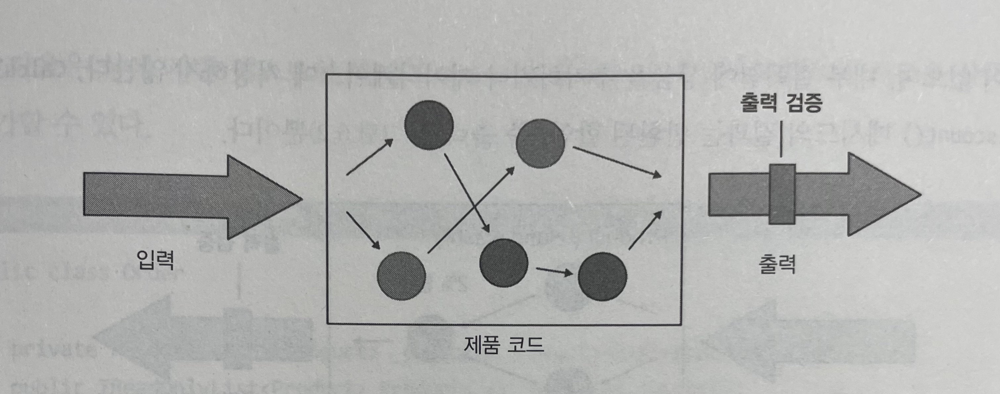
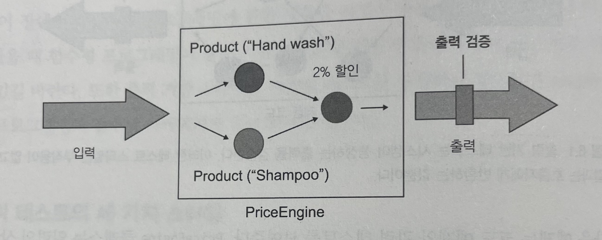
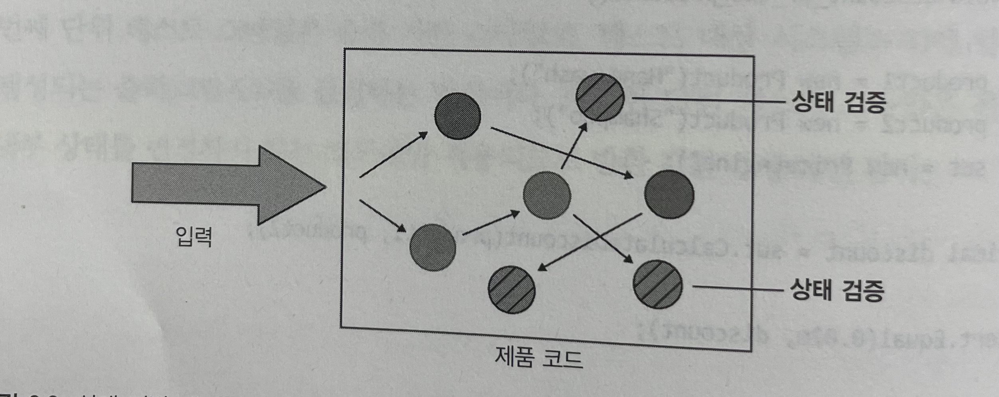
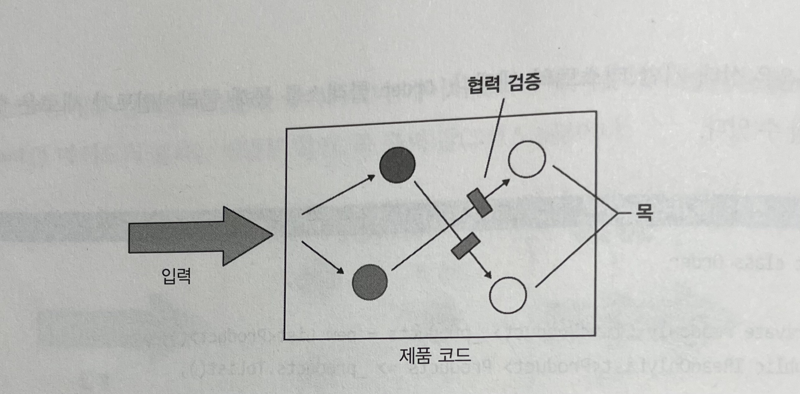
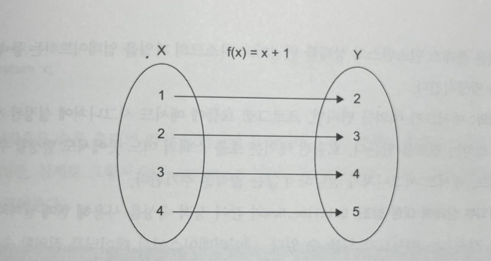
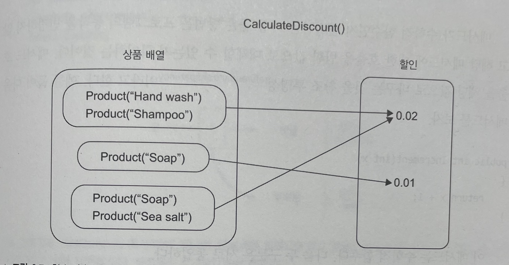
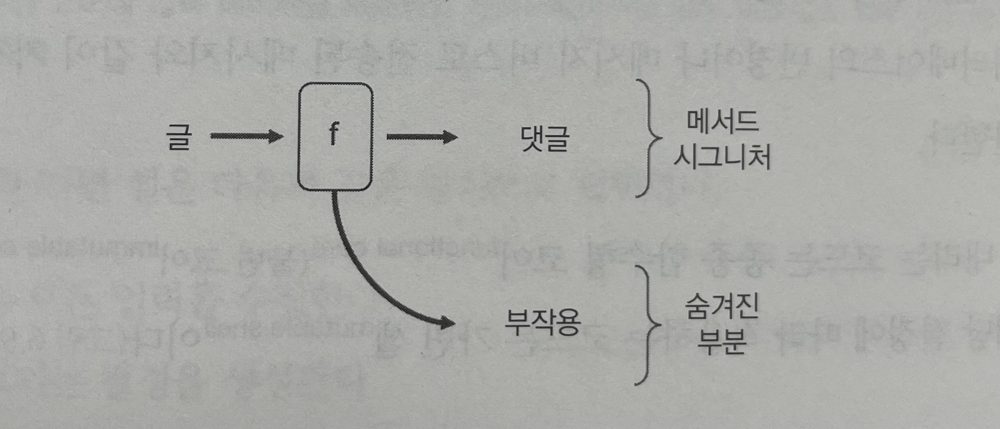
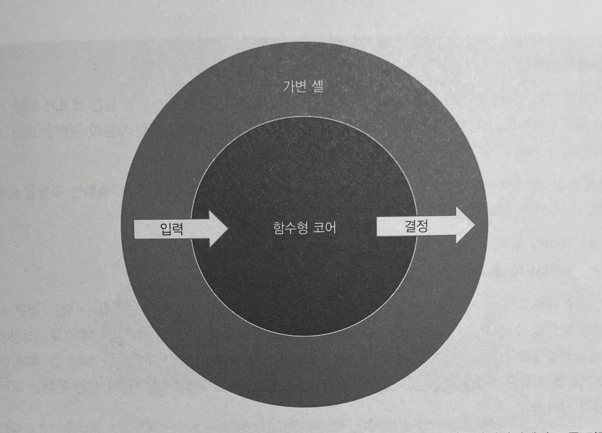

# Unit Testing : 생산성과 품질을 위한 단위 테스트 원칙과 패턴

이 내용은 [단위 테스트 생산성과 품질을 위한 단위 테스트 원칙과 패턴]을 읽으면서 정리한 내용을 포함하고 있습니다.

- 6장 단위 테스트 스타일 : 6.1 ~ 6.3

목차는 다음과 같습니다.

- 목과 테스트 취약성 간의 관계
- 단위 테스트의 고전파와 런던파 재고

## 6장 단위 테스트 스타일

- 출력 기반
  - 테스트가 가장 품질이 좋음
- 상태 기반
  - 두 번째로 좋은 선택
- 통신 기반
  - 간헐적으로만 사용

### 6.1 단위 테스트의 세 가지 스타일

- 출력 기반 테스트(output-based testing)
- 상태 기반 테스트(state-based testing)
- 통신 기반 테스트(communication-based testing)

하나의 테스트에서 하나 또는 둘, 심지어 세 가지 스타일 모두를 함께 사용할 수 있다. 

#### 6.1.1 출력 기반 테스트 정의

출력 기반 테스트는 전역 상태나 내부 상태를 번경하지 않는 코드에만 적용되므로 반환 값만 검증하면 된다.



- 출력 기반 테스트는 시스템이 생성하는 출력을 검증
- 해당 테스트 스타일은 부작용이 없다.

다음 코드는 예시이며, `PriceEngine` 클래스는 일련의 상품을 받아 할인을 계산한다.

```java
public class PriceEngine {

    public double calculateDiscount(final Product...products) {

        double discount = products.length * 0.01;
        return Math.min(discount, 0.2);
    }
}

class PriceEngineTest {

    @Test
    void discount_of_two_products() {

        var product1 = new Product("Hand wash");
        var product2 = new Product("Shampoo");
        var sut = new PriceEngine();

        double discount = sut.calculateDiscount(product1, product2);

        assertThat(discount).isEqualTo(0.2);
    }
}
```



- `PriceEngine` 을 입출력 표기법으로 표현
- `CalculateDiscount` 메서드는 상품 배열을 받아 할인을 계산

출력 기반 단위 테스트 스타일은 `함수형` 이라고도 한다.

- 부작용 없는 코드 선호를 강조하는 프로그래밍 방식

#### 6.1.2 상태 기반 스타일 정의

상태 기반 스타일은 작업이 완료된 후 시스템 상태를 확인하는 것이다.



- 상태 기반 테스트는 작업이 완료된 후 시스템의 최종 상태를 검증한다.

다음은 코드 예시이며, `Order` 클래스를 통해 클라이언트가 새로운 상품을 추가할 수 있다.

```java
public class Order {

    private List<Product> products = new ArrayList<>();

    public void addProduct(final Product product) {
        products.add(product);
    }

    public List<Product> getProducts() {
        return Collections.unmodifiableList(products);
    }
}

class OrderTest {

    @Test
    void adding_a_product_to_an_order() {

        var product = new Product("Hand wash");
        var sut = new Order();

        sut.addProduct(product);

        assertAll(
                () -> assertThat(sut.getProducts().size()).isEqualTo(1),
                () -> assertThat(sut.getProducts().get(0)).isEqualTo(product)
        );
    }
}
```

#### 6.1.3 통신 기반 스타일 정의

통신 기반 테스트는 목을 사용해 테스트 대상 시스템과 협력자 간의 통신을 검증한다.



- 통신 기반 테스트는 SUT의 협력자를 목으로 대체하고 SUT가 협력자를 올바르게 호출하는지 검증

다음 코드는 예제이다.

```java
class GreetingServiceTest {

    @Test
    void sending_a_greetings_email() {
        var iEmailGateway = mock(IEmailGateway.class);
        var sut = new GreetingService(iEmailGateway);

        sut.greetUser("user@email.com");

        verify(iEmailGateway, times(1)).sendGreetingsEmail(anyString());
    }
}
```

> **스타일과 단위 테스트 분파**
> 단위 테스트의 고전파는 통신 기반 스타일보다 상태 기반 스타일을 선호한다.
> 런던파는 이와 반대로 선택한다. 두 분파는 출력 기반 테스트를 사용한다.

### 6.2 단위 테스트 스타일 비교

좋은 단위 테스트의 4대 요소와 비교하여 알아보자. 좋은 단위 테스트의 4가지 요소는 다음과 같다.

- 회귀 방지
- 리팩터링 내성
- 빠른 피드백
- 유지 보수성

#### 6.2.1 회귀 방지와 피드백 속도 지표로 스타일 비교하기

회귀 방지 지표의 세 가지 특성

- 테스트 중에 실행되는 코드의 양
- 코드 복잡도
- 도메인 유의성

테스트 스타일과 테스트 피드백 속도 사이에는 상관관계가 거의 없다. 테스트가 프로세스 외부 의존성과 떨어져 단위 테스트 영역에 있는 한, 모든 스타일은 테스트 실행 속도가 거의 동일하다.

#### 6.2.2 리팩터링 내성 지표로 스타일 비교하기

리팩터링 내성은 리팩터링 중에 발생하는 거짓 양성 수에 대한 척도다. 결국 거짓 양성은 식별할 수 있는 동작이 아니라 코드의 구현 세부 사항에 결합된 테스트의 결과다.

##### 출력 기반 테스트

- 테스트가 테스트 대상 메서드에만 결합되므로 거짓 양성 방지가 가장 우수
- 테스트가 구현 세부 사항에 결합하는 경우는 테스트 대상 메서드가 구현 세부 사항일때만

##### 상태 기반 테스트

- 일반적으로 거짓 양성이 되기 쉬움
- 테스트 대상 메서드 외에도 클래스 상태와 함께 작동
- 테스트와 제품 코드 간의 결합도가 클수록 유출되는 구현 세부 사항에 테스트가 얽매일 가능성이 올라감

##### 통신 기반 테스트

- 허위 경보에 가장 취약
- 테스트 대역으로 상호 작용을 확인하는 테스트는 대부분 깨지기 쉬움
  - 스텁과 상호 작용하는 경우
- 애플리케이션 경계를 넘는 상호 작용을 확인하고 해당 상호 작용의 부작용이 외부 환경에 보이는 경우에만 목이 괜찮음

#### 6.2.3 유지 보수성 지표로 스타일 비교하기

유지 보수성은 단위 테스트의 유지비를 측정하며 다음 두 가지 특성으로 정의

- 테스트를 이해하기 얼마나 어려운가?(테스트 크기에 대한 함수)
- 테스트를 실행하기 얼마나 어려운가?(테스트에 직접적으로 관련 있는 프로세스 외부 의존성 개수에 대한 함수)

##### 출력 기반 테스트

- 가장 유지 보수하기 용이
- 거의 항상 짧고 간결하므로 유지 보수가 쉬움
- 전역 상태나 내부 상태를 변경할 리 없으므로, 프로세스 외부 의존성을 다루지 않음

##### 상태 기반 테스트

- 출력 기반 테스트보다 유지 보수가 쉽지 않음
- 상태 검증은 종종 출력 검증보다 더 많은 공간을 차지하기 때문

다음 테스트는 글에 댓글을 추가한 후 댓글 목록에 댓글이 나타나는지 확인한다.

```java
@Test
void adding_a_comment_to_an_article() {

    final var sut = new Article();
    final var text = "Comment text";
    final var author = "John Doe";
    final var now = LocalDate.of(2023, 4, 1);

    sut.addComment(text, author, now);

    assertAll(
            () -> assertThat(sut.getComments()).hasSize(1),
            () -> assertThat(sut.getComments().get(0).getText()).isEqualTo(text),
            () -> assertThat(sut.getComments().get(0).getAuthor()).isEqualTo(author),
            () -> assertThat(sut.getComments().get(0).getNow()).isEqualTo(now)
    );
}
```

- 많은 공간을 차지하는 상태 검증
- 상태 기반 테스트는 종종 훨씬 많은 데이터를 확인해야 하므로 크기가 대폭 커질 수 있다.

아래는 헬퍼 메서드를 통해 상태 기반 테스트가 커질 수 있는 것을 완화한 것이다.

```java
@Test
void adding_a_comment_to_an_article2() {

    final var sut = new Article();
    final var text = "Comment text";
    final var author = "John Doe";
    final var now = LocalDate.of(2023, 4, 1);

    sut.addComment(text, author, now);

    sut.shouldContainNumberOfComments(1).withComment(text, author, now);
}
```

상태 기반 테스트를 단축하는 또 다른 방법으로, 검증 대상 클래스의 동등 멤버를 정의할 수 있다.

```java
@Test
void adding_a_comment_to_an_article3() {

    final var sut = new Article();
    final var comment = new Comment(
        "Comment text",
        "John Doe",
        LocalDate.of(2023, 4, 1));

    sut.addComment(comment.getText(), comment.getAuthor(), comment.getNow());

    assertThat(sut.getComments()).containsExactly(comment);
}
```

- 클래스가 값에 해당하고 값 객체로 변환할 수 있을때만 효과적
  - 그렇지 않으면 코드 오염으로 이어짐

상태 기반 테스트는 출력 기반 테스트보다 공간을 더 많이 차지하므로 유지 보수성이 떨어진다.

##### 통신 기반 테스트

- 유지 보수성 지표에서 출력 기반 테스트와 상태 기반 테스트보다 점수가 낮다.
- 테스트 대역과 상호 작용 검증을 설정해야 하며, 이는 공간을 많이 차지한다.

#### 6.2.4 스타일 비교하기 : 결론

|     | 출력 기반 | 상태 기반 | 통신 기반 |
| --- | --- | --- | --- |
| 리팩터링 내성을 지키기 위해 필요한 노력 | 낮음 | 중간 | 중간 |
| 유지비 | 낮음 | 중간 | 높음 |

항상 다른 것보다 출력 기반 테스트를 선호해야 한다.

- 구현 세부 사항과 결합되지 않음
- 리팩터링 내성을 적절히 유지하고자 주의를 많이 기울일 필요가 없음
- 테스트는 간결하고 프로세스 외부 의존성이 없기 때문에 유지 보수도 쉬움

### 6.3 함수형 아키텍처 이해

함수형 프로그래밍과 함수형 아키텍처가 무엇인지 알아보고, 함수형 아키텍처와 육각형 아키텍처가 어떤 관련이 있는지 살펴본다.

- 참고 : https://fsharpforfunandprofit.com

#### 6.3.1 함수형 프로그래밍이란?

출력 기반 단위 테스트 스타일은 함수형이라고 하며, 함수형 프로그래밍은 수학적 함수를 사용한 프로그래밍이다.

수학적 함수의 특징은 다음과 같다.

- 수학적 함수는 숨은 입출력이 없는 함수
- 수학적 함수의 모든 입출력은 메서드 이름, 인수, 반환 타입으로 구성된 메서드 시그니처에 명시
- 수학적 함수는 호출 횟수에 상관없이 주어진 입력에 대해 동일한 출력을 생성



- 수학에서 함수의 대표적인 예로 `f(x) = x + 1` 이 있다.
- 집합 X의 값 입력 수 x에 대해 함수는 집합 Y의 해당하는 수 y를 찾는다.



- 함수 `f(x) = x + 1` 과 동일한 표기법으로 표현한 `CalculateDiscount()` 메서드
- 상품의 각 입력 배열에 대해 해당 할인을 출력으로 찾는다.

입출력을 명시한 수학적 함수는 이에 따르는 테스트가 짧고 간결하며 이해하고 유지 보수하기 쉬우므로 테스트하기가 매우 쉽다.

숨은 입출력은 코드를 테스트하기 힘들게 한다. 

- 부작용
  - 메서드 시그니처에 표시되지 않은 출력
  - 연산은 클래스 인스턴스의 상태를 변경하고 디스크의 파일을 업데이트하는 등 부작용을 발생
- 예외
  - 메서드가 예외를 던지면, 프로그램 흐름에 메서드 시그니처에 설정된 계약을 우회하는 경로 생성 
  - 호출된 예외는 호출 스택의 어느 곳에서도 발생할 수 있으므로, 메서드 시그니처가 전달하지 않는 출력을 추가
- 내외부 상태에 대한 참조
  - DateTime.Now와 같이 정적 속성을 사용해 현재 날짜와 시간을 가져오는 메서드가 있을 수 있다. 
  - 데이터베이스에서 데이터를 질의할 수 있고, 비공개 변경 가능 필드를 참조할 수도 있다. 
  - 이 모두 메서드 시그니처에 없는 실행 흐름에 대한 입력

##### 메서드가 수학적 함수인지 판별하는 가장 좋은 방법

- 프로그램의 동작을 변경하지 않고
- 해당 메서드에 대한 호출을 반환 값으로 대체할 수 있는지 확인하는 것

**참조 투명성**

- 메서드 호출을 해당 값으로 바꾸는 것

예를 들어,

```java
public int incerment(final int x) {
    return x + 1;
}
```

- 이 메서드는 수학적 함수

다음 두 구문을 서로 동일하다.

```java
int y = increment(4);
int y = 5
```

반면에 다음 메서드는 수학적 함수가 아니다.

```java
int x = 0;
public int increment() {
    x++;
    return x;
}
```

- 반환 값이 메서드의 출력을 모두 나타내지 않으므로 반환 값으로 대체할 수 없다.
- 숨은 출력은 필드 x의 변경이다.

부작용은 숨은 출력의 가장 일반적인 유형이다.
다음 예제는 예시이다.

```java
public Comment addComment(final String text, final String author, final LocalDate now) {
    final Comment comment = new Comment(text, author, now);
    comments.add(comment);
    return comment;
}
```



- `addComment` 메서드는 글을 입력으로 하고 댓글을 출력으로 한다.
- 둘다 메서드 시그니쳐에 표현되어 있다.
- 부작용은 추가적인 숨은 출력

#### 6.3.2 함수형 아키텍처란?

함수형 프로그래밍의 목표는 부작용을 완전히 제거하는 것이 아니라 비즈니스 로직을 처리하는 코드와 부작용을 처리하는 코드를 분리하는 것이다.

다음 두 가지 유형을 구분해서 비즈니스 로직과 부작용을 분리할 수 있다.

- 결정을 내리는 코드 
  - 이 코드는 부작용이 필요 없기 때문에 수학적 함수를 사용해 작성
  - 함수형 코어(불변 코어)
- 해당 결정에 따라 적용하는 코드
  - 이 코드는 수학적 함수에 의해 이뤄진 모든 결정을 데이터베이스의 변경이나 메시지 버스로 전송된 메시지와 같이 가시적인 부분으로 변환



함수형 코어와 가변 셸은 다음과 같은 방식으로 협력한다.

- 가변 셸은 모든 입력을 수집
- 함수형 코어는 결정을 생성
- 셸은 결정을 부작용으로 변환

#### 6.3.3 함수형 아키텍처와 육각형 아키텍처 비교


함수형 아키텍처와 육각형 아키텍처의 비슷한 점

- 관심라 분리
  - 도메인 계층과 애플리케이션 서비스 계층을 구별
- 의존성 간의 단방향 흐름
  - 도메인 계층 내 클래스는 서로에게만 의존

부작용에 대한 처리는 다르다.

- 함수형 아키텍처는 모든 부작용을 불변 코어에서 비즈니스 연산 가장자리로 밀어낸다. 가변 셸이 처리한다.
- 육각형 아키텍처는 모든 수정 사항은 도메인 계층 내에 있어야 하며, 계층의 경계를 넘어서는 안 된다.