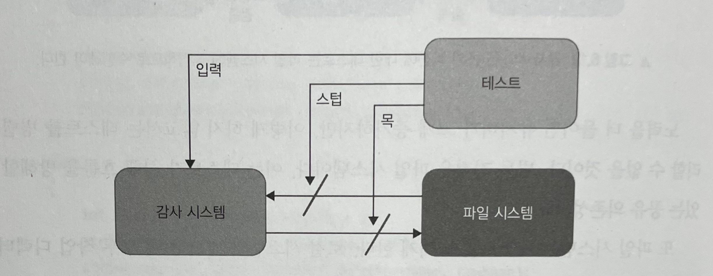
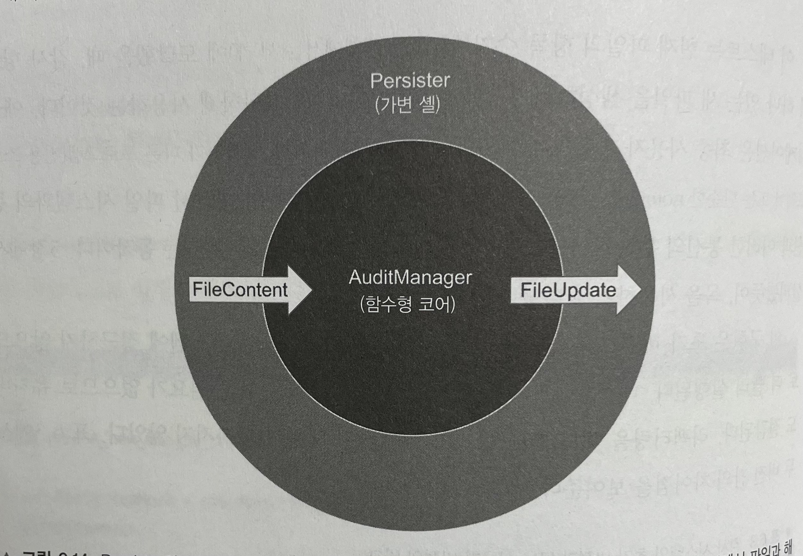
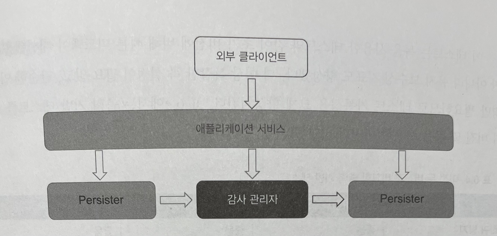
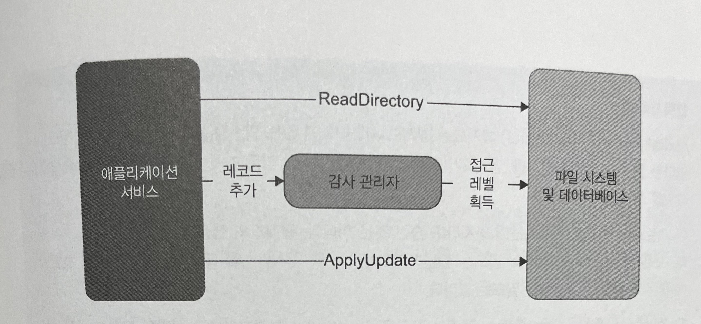

# Unit Testing : 생산성과 품질을 위한 단위 테스트 원칙과 패턴

이 내용은 [단위 테스트 생산성과 품질을 위한 단위 테스트 원칙과 패턴]을 읽으면서 정리한 내용을 포함하고 있습니다.

- 6장 단위 테스트 스타일 : 6.4 ~ 6.5

목차는 다음과 같습니다.

- 함수형 아키텍처와 출력 기반 테스트로의 전환
- 함수형 아키텍처의 단점 이해하기

## 6장 단위 테스트 스타일

### 6.4 함수형 아키텍처와 출력 기반 테스트로의 전환

해당 내용은 샘플 애플리케이션을 함수형 아키텍처로 리팩터링한다. 

- 프로세스 외부 의존성에서 목으로 변경
- 목에서 함수형 아키텍처로 변경

이러한 전환을 통해서 테스트 코드가 상태 및 통신 기반 테스트에서 출력 기반 테스트로 스타일로 리팩터링한다.

#### 6.4.1 감사 시스템 소개

샘플 프로젝트는 조직의 모든 방문자를 추적하는 검사 시스템이다.

```text
audit_01.txt
Peter; 2019-04-06T16:30:00
Jane;  2019-04-06T16:40:00
Jack;  2019-04-06T17:00:00
```

```text
audit_02.txt
Mary;  2019-04-06T17:30:00
방문자 이름; 방문 시간
```

- 감사 시스템은 방문자에 대한 정보를 특정 형식의 텍스트 파일로 저장한다. 파일당 최대 항목 수에 도달하면 시스템은 새 파일을 작성한다.

해당 시스템은 공유 의존성을 파일 시스템과 밀접하게 연결되어 있기 때문에 이를 테스트하기가 어렵다. 
테스트 전에 파일을 올바른 위치에 배치하고, 테스트가 끝나면 해당 파일을 읽고 내용을 확인한 후 삭제해야 한다.

초기 감사 시스템의 단위 테스트 4대 요소 평가는 다음과 같다.

|   | 초기 버전 |
|---|---|
|회귀방지|좋음|
|리팩터링 내성|좋음|
|빠른 피드백|나쁨|
|유지 보수성|나쁨|

파일 시스템에 직접 작동하는 테스트는 단위 테스트의 정의에 맞지 않는다.
단위 테스트는 빠르게 수행해야 하고 다른 테스트와 별도로 처리해야 하는데, 해당 테스트는 그렇지 못하기 때문에 통합 테스트 범주에 속한다.

#### 6.4.2 테스트를 파일 시스템에서 분리하기 위한 목 사용

테스트가 밀접하게 결합된 문제는 일반적으로 파일 시스템을 목으로 처리해 해결한다.



- 테스트는 파일 시스템을 목으로 처리해 감사 시스템이 파일에 수행하는 쓰기를 캡쳐할 수 있다.

다음 예제는 목을 활용한 예제이다.
jdk 14 버전 이후부터 제공되는 데이터 타입인 `record` 클래스를 활용하였다.

```java
public record AuditManagers(int maxEntriesPerFile, String directoryName, IFileSystem iFileSystem) {

    public void addRecord(final String visitorName, final LocalDateTime timeOfVisit) {

        final String[] filePaths = iFileSystem.listFiles(directoryName);
        Arrays.sort(filePaths, Comparator.naturalOrder());
        final String newRecord = visitorName + ";" + timeOfVisit;

        if (filePaths.length == 0) {
            final File file = new File(directoryName + "/" + "audit_1.txt");
            iFileSystem.writeAllText(file.getAbsolutePath(), newRecord);
            return;
        }

        final int currentFileIndex = filePaths.length;
        final String currentFilePath = Arrays.stream(filePaths)
                .sorted(Comparator.reverseOrder())
                .findFirst().get();

        final List<String> lines = iFileSystem.readAllLines(currentFilePath);

        if (lines.size() < maxEntriesPerFile) {
            lines.add(newRecord);
            final String newContent = String.join("\r\n", lines);
            iFileSystem.writeAllText(currentFilePath, newContent);
        } else {
            final int newIndex = currentFileIndex + 1;
            final String newName = "audit_" + newIndex + ".txt";
            final File newFile = new File(directoryName + "/" + newName);
            iFileSystem.writeAllText(newFile.getAbsolutePath(), newRecord);
        }
    }
}
```

다음 `IFileSystem` 은 파일 시스템 작업을 캡슐화한 새로운 사용자 정의 인터페이스이다.

```java
public interface IFileSystem {

    String[] listFiles(final String directoryName);
    void writeAllText(final String filePath, final String content);
    List<String> readAllLines(final String filePath);
}
```

이제 `AuditManagers`가 파일 시스템에서 분리되므로, 공유 의존성이 사라지고 테스트를 서로 독립적으로 실행할 수 있다.

```java
class AuditManagersTest {

    @Test
    void a_new_file_is_created_when_the_current_file_overflows() throws IOException {

        var fileSystemMock = mock(IFileSystem.class);
        final String[] strings = {"/audits/audit_1.txt", "/audits/audit_2.txt"};
        given(fileSystemMock.listFiles("/audits")).willReturn(new String[]{"/audits/audit_1.txt", "/audits/audit_2.txt"});

        given(fileSystemMock.readAllLines("/audits/audit_2.txt")).willReturn(List.of(
                "Peter; 2019-04-06T16:30:00",
                "Jane;  2019-04-06T16:40:00",
                "Jack;  2019-04-06T17:00:00"
        ));

        final var sut = new AuditManagers(3, "/audits", fileSystemMock);

        sut.addRecord("Alice", LocalDateTime.parse("2019-04-06T18:00:05"));

        verify(fileSystemMock, times(1)).writeAllText("/audits/audit_3.txt", "Alice;2019-04-06T18:00:05");
    }
}
```

- 테스트는 더 이상 파일 시스템에 접근하지 않으므로 더 빨리 실행된다.
- 테스트를 만족시키려고 파일 시스템을 다룰 필요가 없으므로 유지비도 절감된다.
- 리팩터링을 해도 회귀 방지와 리팩터링 내성이 나빠지지 않았다.

초기버전과 단위 테스트 4대 요소를 비교해보면 다음과 같다.

|   | 초기 버전 | 목 사용 |
|---|---|---|
|회귀방지|좋음|좋음|
|리팩터링 내성|좋음|좋음|
|빠른 피드백|나쁨|좋음|
|유지 보수성|나쁨|중간|

#### 6.4.3 함수형 아키텍처로 리팩터링하기



- Persister와 AuditManager는 함수형 아키텍처를 형성한다.
- Persister는 작업 디렉토리에서 파일과 해당 내용을 수집해 AuditManager에 준 다음, 반환 값을 파일 시스템의 변경 사항으로 변환한다.

다음은 기존 AuditManagers는 리팩토링한 후이다.

```java
public record AuditManagers(int maxEntriesPerFile) {

    public FileUpdate addRecord(final FileContent[] files, final String visitorName, final LocalDateTime timeOfVisit) {

        final List<FileContent> filePaths = Arrays.stream(files)
                .sorted()
                .collect(Collectors.toList());

        final String newRecord = visitorName + ";" + timeOfVisit;

        if (filePaths.isEmpty()) {
            return new FileUpdate("audit_1.txt", newRecord);
        }

        final int currentFileIndex = filePaths.size();
        final FileContent currentFile = filePaths.stream()
                .sorted()
                .findFirst()
                .get();
        final List<String> lines = Arrays.asList(currentFile.getLines());

        if (lines.size() < maxEntriesPerFile) {
            lines.add(newRecord);
            final String newContent = String.join("\r\n", lines);
            return new FileUpdate(currentFile.getFileName(), newContent);
        } else {
            final int newIndex = currentFileIndex + 1;
            final String newName = "audit_" + newIndex + ".txt";
            return new FileUpdate(newName, newRecord);
        }
    }
}
```

- 함수형 코어 역할을 진행
- AuditManagers는 이제 작업 디렉토리 경로 대신 FileContent 배열을 받는다.
- 이 클래스는 결정을 내리기 위해 파일 시스템에 대해 알아야 할 모든 것을 포함한다.

```java
public class Persister {

    public FileContent[] readDirectory(final String directoryName) {
        /** 비즈니스 로직 **/
    }

    public void applyUpdate(String directoryName, FileUpdate update) {
        /** 비즈니스 로직 **/
    }
}
```

- 가변 셸 역할을 진행
- `AuditManagers` 에서 받은 업데이트 명령을 작업 디렉토리에 다시 수행하기만 하면 된다.

```java
class ApplicationServiceTest {

    @Test
    void a_new_file_is_created_when_the_current_file_overflows() {

        final var sut = new AuditManagers(3);
        final var fileContent = new FileContent("audit_1.txt", new String[0]);
        final var fileContent2 = new FileContent("audit_2.txt", new String[]{
                "Peter; 2019-04-06T16:30:00",
                "Jane;  2019-04-06T16:40:00",
                "Jack;  2019-04-06T17:00:00"
        });
        final var files = new FileContent[]{fileContent, fileContent2};

        final FileUpdate update = sut.addRecord(files, "Alice", LocalDateTime.parse("2019-04-06T18:00:00"));

        assertAll(
                () -> assertThat("audit_3.txt").isEqualTo(update.getFileName()),
                () -> assertThat("Alice;2019-04-06T18:00:00").isEqualTo(update.getNewContent())
        );
    }
}
```

- 함수형 코어와 가변 셸을 붙이면서 애플리케이션 서비스가 외부 클라이언트를 위한 시스템의 진입점을 제공
- 이러한 진입점을 통해 시스템의 동작을 쉽게 확인 가능



- `ApplicationService`는 함수형 코어(`AuditManager`)와 가변 셸(`Persister`)을 붙이고, 외부 클라이언트를 위한 진입점을 제공
- 육각형 아키텍처 분류법에서 `ApplicationService`와 `Persister`는 애플리케이션 서비스 계층에 해당하고, `AuditManager`는 도메인 모델에 속함

```java
class ApplicationServiceTest {

    @Test
    void a_new_file_is_created_when_the_current_file_overflows() {

        final var sut = new AuditManagers(3);
        final var fileContent = new FileContent("audit_1.txt", new String[0]);
        final var fileContent2 = new FileContent("audit_2.txt", new String[]{
                "Peter; 2019-04-06T16:30:00",
                "Jane;  2019-04-06T16:40:00",
                "Jack;  2019-04-06T17:00:00"
        });
        final var files = new FileContent[]{fileContent, fileContent2};

        final FileUpdate update = sut.addRecord(files, "Alice", LocalDateTime.parse("2019-04-06T18:00:00"));

        assertAll(
                () -> assertThat("audit_3.txt").isEqualTo(update.getFileName()),
                () -> assertThat("Alice;2019-04-06T18:00:00").isEqualTo(update.getNewContent())
        );
    }
}
```

- 목을 사용한 테스트와 같이 초기 버전에 비해 빠른 피드백이 개선되었고 유지보수 지표 개선
- 목 설정없이, 단순한 입출력만 필요하여 테스트 가독성을 크게 향상

이전 두 버전과 비교한 출력 기반 테스트 결과이다.

|   | 초기 버전 | 목 사용 | 출력 기반 |
|---|---|---|---|
|회귀방지|좋음|좋음|좋음|
|리팩터링 내성|좋음|좋음|좋음|
|빠른 피드백|나쁨|좋음|좋음|
|유지 보수성|나쁨|중간|좋음|

`함수형 코어가 생성한 명령은 항상 값이거나 값 집합이다.`

#### 6.4.4 예상되는 추가 개발

추가 요구사항의 대하여 함수형 아키텍처 개발을 통해 오류 처리가 더욱 간단해지고 명확해질 수 있다.

### 6.5 함수형 아키텍처의 단점 이해하기

함수형 아키텍터과 관련된 비용과 장단점을 살펴본다.

#### 6.5.1 함수형 아키텍처 적용 가능성



- 데이터베이스에 대한 의존성으로 인해 감사 관리자에 숨은 입력이 생겼다.
- 이러한 클래스는 더 이상 순수 함수가 아니며, 전체 애플리케이션은 더 이상 함수형 아키텍처를 따르지 않는다.

**두 가지 해결책**

1. 애플리케이션 서비스 전면에서 디렉토리 내용과 더불어 방문자 접근 레벨을 수집
2. `AuditManagers`에서는 `isAccessLevelCheckRequired()`와 같은 새로운 메소드를 둬야 한다. 애플리케이션 서비스에서 `addRecord()` 전에 이 메소드를 호출하고, true를 반환하면 서비스는 데이터베이스에서 접근 레벨을 가져온 후 `addRecord()`에 전달한다.

**두 방법 장/단점**

- 첫번째 방법
  - 성능 저하 발생 가능
    - 접근 레벨이 필요 없는 경우에도 무조건 데이터베이스 질의
  - 비즈니스 로직과 외부 시스템의 통신을 완전히 분리
- 두번째 방법
  - 성능 향상을 위해 분리
  - 데이터베이스를 호출할지에 대한 결정은 `AuditManagers`가 아니라 애플리케이션 서비스로 넘어감

#### 협력자와 값

`AuditManagers`의 `addRecord()` 메소드는 시그니처에 없는 의존성(`maxEntriesPerFile`) 
감시 관리자는 이 필드를 참조해 기존 감사 파일에 추가하거나 새 감사 파일을 생성할지 결정

클래스의 생성자 시그니처에 있을 수 있다.
`maxEntriesPerFile` 필드는 불변이므로 클래스를 인스턴스할 때와 `addRecord()`를 호출할 때 모두 동일하다. 즉 해당 필드는 값이다.

`IDatabase` 의존성은 `maxEntriesPerFile`과 같은 값이 아니라 협력자이므로 상황이 다르다. 협력자는 다음 중 하나에 해당하는 의존성이다.

- 가변(상태 수정 가능)
- 아직 메모리에 있지 않은 데이터에 대한 프록시(공유 의존성)

#### 6.5.2 성능 단점

함수형 아키텍처와 전통전인 아키텍처 사이의 선택은 성능과 코드 유지 보수성 사이의 절충이며, 함수형 아키텍처는 유지 보수성 향상을 위해 성능을 희생한다.

#### 6.5.3 코드베이스 크기 증가

모든 코드베이스를 함수형 아키텍처로 전환할 수는 없으며, 다음 내용을 고려해야 한다.

- 시스템의 복잡도와 중요성을 고려하여
- 함수형 아키텍처를 전략적으로 적용한다.

코드베이스가 단순하거나 그렇게 중요하지 않으면, 함수형 아키텍처에 필요한 초기 투자는 별 효과가 없다.