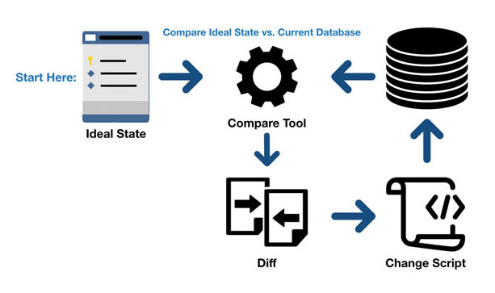
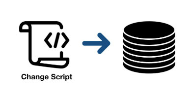

# Chapter 10. 데이터베이스 테스트

**10장에서 다루는 내용**

- 데이터베이스 테스트를 위한 전제 조건
- 데이터베이스 테스트 모범 사례
- 테스트 데이터 생명 주기
- 테스트 내 데이터베이스 트랜잭션 관리

## 10.1 데이터베이스 테스트를 위한 전제 조건

- 형상 관리 시스템에 데이터베이스 유지
- 모든 개발자를 위한 별도의 데이터베이스 인스턴스 사용
- 데이터베이스 배포에 마이그레이션 기반 방식 적용

### 10.1.1 데이터베이스를 형상 관리 시스템에 유지

- 데이터베이스 스키마를 일반 코드로 취급(Git으로 형상 관리)
- 개발자 전용 모델 데이터베이스를 수정하고 운영 배포시 운영 데이터베이스와 모델 데이터베이스를 비교하고 업데이트 하는 것은 좋지 못한 방식
    - 이유1. 변경 내역 부재: 데이터베이스 스키마를 과거의 특정 시점으로 되돌릴 수 없음. 이는 우영 환경에서 버그를 재현할 때 중요
    - 이유2. 복수의 원천 정보: 모델 데이터베이스는 개발 상태에 대한 원천 정보를 둘러싸고 경합하게 됨. 이렇게 기준을 두 가지(Git과 모델 데이터베이스)로 두면 부담이 가중
- 데이터베이스 스키마를 형상 관리 시스템에 두면
    - 원천 정보가 하나로 유지
    - 데이터베이스 변경 추적

### 10.1.2 참조 데이터도 데이터베이스 스키마다

- 스키마 → 테이블, 뷰, 인덱스, 저장 프로시저 그리고 데이터가 어떻게 구성되는지에 대한 청사진을 형성하는 나머지 모든 것
- 스키마는 SQL 스크립트 형태로 표현되어 개발 중 언제든 스크립트로 완전한 기능을 갖춘 최신 데이터베이스를 만들 수 있어야 함
- 또한, **참조 데이터**(애플리케이션이 제대로 작동하도록 미리 채워야 하는 데이터) 역시 **스키마에 속한다**고 생각해야한다.
- 참조 데이터와 일반 데이터 구별
    - 애플리케이션이 데이터를 수정할 수 있으면 일반 데이터, 그렇지 않으면 참조 데이터
- 참조 데이터도 SQL INSERT 문으로 형상 관리 시스템에 저장해야 함

### 10.1.3 모든 개발자를 위한 별도의 데이터베이스 인스턴스

- 실제 데이터베이스로 테스트 하는 것은 어려움
    - 이유 1. 서로 다른 개발자가 실행한 테스트는 서로 간섭
    - 이유 2. 하위 호환성이 없는 변경으로 다른 개발자의 작업을 막을 수 있기 때문
- 그렇기에 개발자마다 별도로 데이터베이스 인스턴스를 사용

### 10.1.4 상태 기반 데이터베이스 배포와 마이그레이션 기반 데이터베이스 배포

- 상태 기반 방식
    
    
    
    - 개발 내내 유지보수하는 모델 데이터베이스가 있음
    - 배포 중 비교 도구가 스크립트를 생성해서 운영 데이터베이스를 모델 데이터베이스와 비교해 최신 상태로 유지
    - 상태 기반 방식을 사용하면 물리적인 모델 데이터베이스는 원천 데이터가 아니며, 데이터베이스를 작성하는 데 사용할 수 있는 SQL 스크립트가 존재
    - 스크립트는 형상 관리에 저장
- 마이그레이션 기반 방식
    
    
    
    - 데이터베이스를 어떤 버전에서 다른 버전으로 전환하는 명시적인 마이그레이션을 뜻함
    - 개발자는 한 데이터베이스 상태에서 다른 데이터베이스 상태(S1, S2 .. Sn)로 마이그레이션(M1, M2 .. Mn)을 작성하는 데 집중

**상태 기반 방식보다 마이그레이션 기반 방식을 선호하라**

- 상태 기반 방식
    - 상태를 형상 관리에 저장함으로써 상태를 명시하고 비교 도구가 마이그레이션을 암묵적으로 제어
    - 병합 충돌 처리에 수월
- 마이그레이션 기반 방식
    - 마이그레이션을 명시적으로 하지만 상태를 암묵적으로 둠
    - 마이그레이션 기반 방식은 데이터 모션(새로운 데이터베이스 스키마를 준수하도록 기존 데이터의 형태를 변경하는 과정) 문제를 해결하는데 도움을 줌
- 대개 병합 충돌 완화보다 데이터 모션이 훨씬 더 중요하기에 마이그레이션 기반 방식이 도움이 됨

## 10.2 데이터베이스 트랜잭션 관리

### 10.2.1 제품 코드에서 데이터베이스 트랜잭션 관리하기

**데이터베이스 트랜잭션에서 데이터베이스 연결 분리하기**

- 모순을 피하기 위해 결정 유형을 업데이트할 데이터와 업데이트 유지 또는 롤백 여부 로 나눔
- 데이터베이스를 repository와 트랜잭션으로 나눠 책임을 구분

**작업 단위로 트랜잭션 업그레이드하기**

- 일반 트랜잭션과 비교하여 작업 단위가 갖는 가장 큰 장점은 업데이트 지연
- 작업 단위는 비즈니스 연산 종료 시점에 모든 업데이트를 실행하므로 데이터베이스 트랜잭션의 기간을 단축하고 데이터 혼잡을 줄임

**비관계형 데이터베이스에서의 데이터 모순**

- NoSql을 사용할 경우 원자적 업데이트는 단일 도큐먼트 내에서만 보장되고 여러 문서에 영향을 주는 경우 모순이 생기기 쉬움
- 이를 다른 각도에서 접근하는데 한 번에 둘 이상의 도큐먼트를 수정하는 비즈니스 연산이 없도록 도큐먼트를 설계해야 함.
- 비슷하게 도메인 주도 설계에서 비즈니스 연산당 둘 이상의 집계를 수정하면 안된다는 지침이 있음

### 10.2.2 통합 테스트에서 데이터베이스 트랜잭션 관리하기

- 테스트 구절 간에 데이터베이스 트랜잭션이나 작업 단위를 재사용하지 말아야 함
- 동작 모순에 빠지지 않기 위해 통합 테스트를 가능한 한 운영 환경에서와 비슷하게 구축해야함

## 10.3 테스트 데이터 생명 주기

**공유 데이터베이스 사용 시 통합 테스트를 서로 분리할 수 없는 문제 해결 방법**

- 통합 테스트를 순차적으로 실행
- 테스트 실행 간에 남은 데이터를 제거

### 10.3.1 병렬 테스트 실행과 순차적 테스트 실행

- 통합 테스트를 병렬로 실행하려면 상당한 노력이 요구됨
- 비활성화 하는 것이 권장되지만 컨테이너를 사용해 격리 환경에서 병렬로 처리할 수 있음
- 하지만 이 또한 유지 보수 부담이 너무 커지기에 왠만해선 순차적으로 실행

### 10.3.2 테스트 실행 간 데이터 정리

- 각 테스트 전에 데이터베이스 백업 복원
    - 굉장히 느리기에 좋지 않음
- 테스트 종료 시점에 데이터 정리
    - 빠르지만 정리 단계를 건너뛰기 쉬움
- 데이터베이스 트랜잭션에 각 테스트를 래핑하고 커밋하지 않기
    - 롤백으로 위의 2가지 문제점을 해결하지만, 추가 트랜잭션으로 인해 운영 환경과 달라질 수 있는 문제 야기
- 테스트 시작 시점에 데이터 정리하기
    - 빠르게 작동하고 일관성이 없는 동작을 일으키지 않으며 정리 단계를 실수로 건너뛰지 않음

### 10.3.3 인메모리 데이터베이스 피하기

- 인메모리 데이터베이스의 장점
    - 테스트 데이터를 제거할 필요가 없음
    - 작업 속도 향상
    - 테스트가 실행될 때마다 인스턴스화 가능
- 이러한 장점에도 불구하고, 인메모리 db는 일반 데이터베이스와 기능적 일관성이 없기에 운영 환경과 테스트 환경의 불일치 문제를 야기
- 운영과 같은 데이터베이스(버전은 다르더라도 공급자라도 같은)를 사용하는 것이 좋다

## 10.4 테스트 구절에서 코드 재사용하기

- 통합 테스트가 너무 커지면 유지 보수 지표가 낮아짐
- 짧게 하기 위해 비즈니스와 관련이 없는 기술적인 부분을 비공개 메서드나 헬퍼 클래스로 추출

### 10.4.1 준비 구절에서 코드 재사용하기

- private factory method를 도입하여 준비 단계 코드를 줄일 수 있다(예: 사용자 정보 생성)
- 팩토리 메서드를 배치할 위치 후보 → 테스트와 같은 클래스, 기초 클래스인  IntegrationTests, 별도의 헬퍼 클래스
- 기본적으로 테스트와 같은 클래스에 배치하고 코드 복제가 중요한 문제가 될 경우에만 별도의 헬퍼 클래스로 이동
- 기초 클래스에는 모든 테스트를 위한 코드만 배치하기에 팩토리 메서드를 넣기 부적절

### 10.4.2 실행 구절에서 코드 재사용하기

- Function 등 데코레이터 메서드를 사용해 실행 구절을 줄일 수 있다

### 10.4.3 검증 구절에서 코드 재사용하기

- 플루언트 인터페이스를 도입하여 코드를 줄인다

## 10.5 데이터베이스 테스트에 대한 일반적인 질문

### 10.5.1 읽기 테스트를 해야 하는가?

- 쓰기 작업의 위험성은 높기에 철저히 테스트하는 것이 매우 중요하지만 읽기 작업은 보통 해로운 문제가 없다
- 그렇기에 복잡하거나 중요한 읽기 작업만 테스트 하고 나머지는 무시한다
- 읽기에는 추상화 계층이 거의 없기 때문에 단위 테스트보단 실제 데이터베이스에서 통합 테스트를 하는 것만이 필요하다

### 10.5.2 리포지터리 테스트를 해야 하는가?

- 리포지터리는 직접 테스트하지 말고 포괄적인 통합 테스트 스위트로 취급하라. 리포지터리 테스트는 회귀 방지에 대한 이득이 너무 적은 데 반해 유지비가 너무 높다.