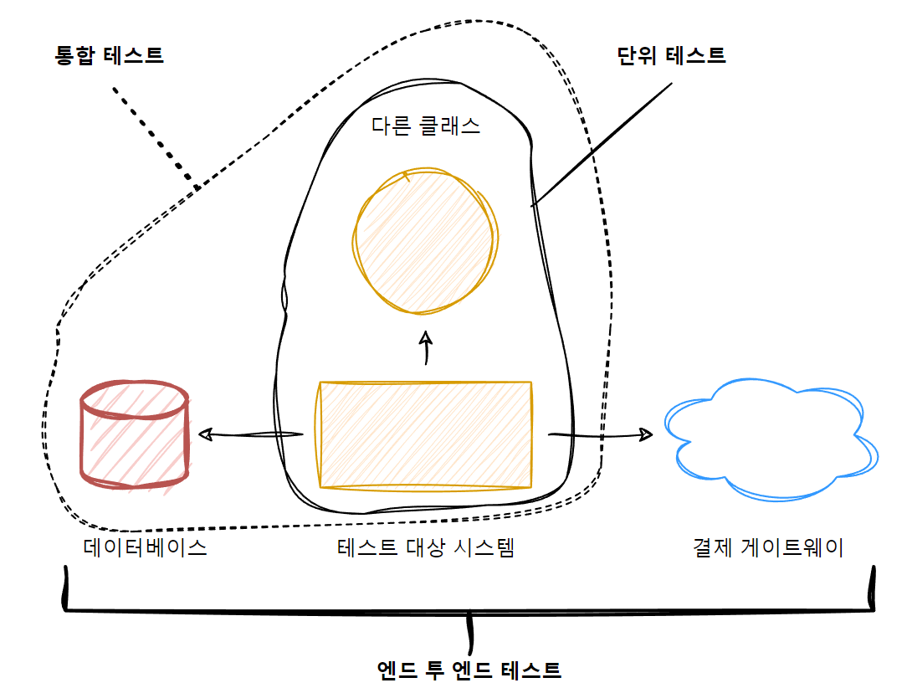

# Chapter2. 단위 테스트란 무엇인가

# [Unit Testing] 2장 단위 테스트란 무엇인가

## 2.1 단위 테스트의 정의

단위 테스트의 정의에는 다양한 뉘앙스가 있기에 해석의 차이가 생겼고, ‘classical school’과 ‘London school’ 두 가지 견해로 나뉘었다. 

단위 테스트에 많은 정의가 있지만 가장 중요한 세 가지 속성이 있다.

- 작은 코드조각 검증
- 빠르게 수행
- 격리된 방식으로 처리하는 자동화된 테스트

여기서 세 번째 속성에서 해석의 차이가 발생한다.

### 2.1.1 격리 문제에 대한 런던파의 접근

- 접근법
    - 하나의 클래스가 다른 클래스 또는 여러 클래스에 의존하면 이 모든 의존성을 테스트 대역으로 대체. 동작을 외부 영향과 분리해서 테스트 대상 클래스에만 집중
- 장점
    - 테스트가 실패하면 코드베이스의 어느 부분이 고장 났는지 확실히 알 수 있음
    - Object graph(같은 문제를 해결하는 클래스의 통신망)를 분할할 수 있음
        - 테스트 대역을 사용하면 객체 그래프를 다시 만들지 않아도 되기에 직접적인 의존성을 대체할 수 있고, 더 나아가 의존성의 의존성을 다룰 필요가 없음 → 단위 테스트에서 준비를 크게 줄일 수 있다
    - 제품 코드의 각 클래스에 대해 일대일로 매칭되는 테스트 클래스가 하나씩 있는 단순한 구조를 얻을 수 있다
- 예제. 고객이 온라인 상점에서 제품을 구매하는 케이스
    - 테스트 대상 시스템(System Under Test): Customer, 협력자(Collaborator): Store

```java
/* 고전적인 스타일 */ 
public void Purchase_succeeds_when_enough_inventory(){
  // 준비
	var store = new Store();
	store.AddInventory(Product.Shampoo, 10);
	var customer = new Customer();

	// 실행
	bool success = customer.Purchase(store, Product.Shampoo, 5);

	// 검증
	Assert.True(success);
	Assert.Equal(5, store.GetInventory(Product.Shampoo));
}

/* 런던 스타일 */ 
public void Purchase_succeeds_when_enough_inventory(){
  // 준비
	var storeMock = new Mock<IStore>();
	storeMock
		.Setup(x -> x.HasEnoughtInventory(Product.Shampoo, 5))
		.Returns(true);
	var customer = new Customer();

	// 실행
	bool success = customer.Purchase(storeMock.Object, Product.Shampoo, 5);

	// 검증
	Assert.True(success);
	storeMock.Verify(
		x-> x.RemoveInventory(Product.Shampoo, 5),
		Times.Once);
}
```

- 고전에서는 상점 상태를 검증하였고, 런던에서는 Customer와 Store 간의 상호 작용을 검사하였음

### 2.1.2 격리 문제에 대한 고전파의 접근

- 접근법
    - 코드를 격리하는 것이 아닌 단위 테스트를 격리해서 실행하는 것
    - 테스트가 서로의 결과에 영향을 미치지 않으며 공유 상태(데이터베이스, 파일 시스템 등)에 도달하지 않는 한, 여러 클래스를 한 번에 테스트해도 괜찮다는 의미
    - 공유 의존성은 보통 실행 프로세스 외부에 있기에 호출에 오랜 시간이 걸리므로 대체되어야 한다(단위 테스트의 두 번째 속성인 빨리 실행하는 것을 충족하기 위해)

## 2.2 단위 테스트의 런던파와 고전파

|  | 격리 주체 | 단위의 크기 |  테스트 대역 사용 대상 |
| --- | --- | --- | --- |
| 런던파 | 단위 | 단일 클래스 | 불변 의존성 외 모든 의존성 |
| 고전파 | 단위 테스트 | 단일 클래스 또는 클래스 세트 | 공유 의존성 |

### 2.2.1 공유 의존성과 외부 의존성의 관계

- 공유 의존성: 싱글턴
- 외부 의존성: read only API 서비스
- 공유+외부 의존성: 데이터베이스

읽기 전용 API의 경우 휘발성이고 애플리케이션의 경계를 벗어나지만, 테스트가 반환하는 데이터에 영향을 미칠 수 없기에 공유가 아니다. 이러한 API를 항상 테스트 범주에 포함시켜야하는 것은 아니지만(속도를 위해 교체), 충분히 빠르고 연결이 안정적이면 테스트에서 그대로 사용하는 것도 괜찮다

## 2.3 고전파와 런던파의 비교

Unit Testing 서적에서는 고전파가 고품질의 테스트를 만들고 프로젝트의 지속 가능한 성장을 달성하는데 더 적합하다 판단. 

**런던파에서 내세우는 이점과 그에 대한 반박에 대해 요약**

### 2.3.1 한 번에 한 클래스만 테스트하기

테스트는 코드의 단위로 검증해서는 안되고 오히려 동작의 단위, 즉 문제 영역에 의미가 있는 것, 이상적으로는 비즈니스 담당자가 유용하다고 인식할 수 있는 것을 검증해야 함

동작이 아닌 코드 조각으로 검증한다면 무엇을 검증하는지 이해하기가 더 어려워 질 수 있다.

### 2.3.2 상호 연결된 클래스의 큰 그래프를 단위 테스트하기

목을 사용하면 클래스를 쉽게 테스트할 수 있고 의존성 그래프가 복잡한 문제도 해결할 수 있다. 그에 따라 작업량을 크게 줄일 수 있지만, 이 추리 과정은 잘못된 문제에 초점을 맞춘다. 

근본적으로 상호 연결된 클래스의 크고 복잡한 그래프를 테스트할 방법을 찾는 대신, 이러한 구조를 갖지 않는데 집중해야한다.(복잡한 클래스 그래프는 대게 코드 설계가 잘못된 것이다 → 좋은 부정지표의 예)

목을 사용하는 것은 이러한 문제를 감추는 것일 뿐 해결하는 것이 아니다

### 2.3.3 버그 위치 정확히 찾아내기

런던 스타일의 경우 버그가 포함된 테스트만 실패하기에 위치를 정확히 찾아낼 수 있지만 고전적 스타일에는 문제 원인 찾기가 어려워 질 수 있다

맞는 말이지만 테스트를 정기적으로 실행하면(이상적으로는 소스 코드가 변경될 때마다) 버그의 원인을 쉽게 알아낼 수 있다. 마지막으로 한 수정이 무엇인지 알 수 있기 때문이다. (@내 생각. 공동 개발자 모두가 협력해야 이룰 수 있다 생각됨.)

## 2.4 두 분파의 통합 테스트

런던파는 목이 아닌 실제 협력자 객체를 사용하는 모든 테스트를 통합 테스트로 간주함. 고전파에서는 단위 테스트의 성질

- 단일 동작 단위를 검증하고,
- 빠르게 수행하고,
- 다른 테스트와 별도로 처리한다

중 하나를 충족하지 않는 것을 통합 테스트로 간주한다.

### 2.4.1 통합 테스트의 일부인 엔드 투 엔드 테스트

