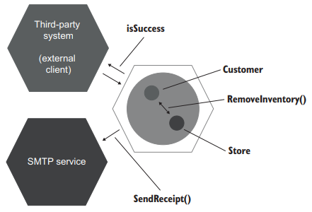

# Chapter 5. 목과 테스트 취약성

- 5장에서 다루는 내용
    - 목과 스텁 구분
    - 식별할 수 있는 동작과 구현 세부 사항 정의
    - 목과 테스트 취약성 간의 관계 이해
    - 리팩터링 내성 저하 없이 목 사용하기

## 5.1 목과 스텁 구분

### 5.1.1 테스트 대역 유형 

- 테스트 대역
  - 모든 유형의 비운영용 가짜 의존성을 설명하는 포괄적 용어 

- 테스트 대역은 목(목, 스파이), 스텁(스텁, 더미, 페이크) 두 가지 유형으로 나눌 수 있다
- 두 유형의 차이점
  - 목은 외부로 나가는 상호 작용을 모방하고 검사하는데 도움을 줌. 이러한 상호 작용은 SUT가 상태를 변경하기 위한 의존성을 호출하는 것에 해당
  - 스텁은 내부로 들어오는 상호 작용을 모방하는데 도움을 줌. 이러한 상호작용은 SUTㄱ 입력 데이터를 얻기 위한 의존성을 호출하는 것에 해당


### 5.1.2 도구로서의 목과 테스트 대역으로서의 목

- 도구로서의 목(Mock)과 테스트 대역으로서의 목(mock)을 구분 짓자
- 도구로서의 목을 사용해 목과 스텁 모두 만들 수 있다

### 5.1.3 스텁으로 상호 작용을 검증하지 말라

- 스텁은 SUT가 생성하는 최종 결과가 아닌 최종 결과를 산출하기 위한 수단
- 스텁과의 상호 작용을 검증하는 것은 취약한 테스트를 야기하는 일반적인 안티 패턴이다.

### 5.1.4 목과 스텁 함께 쓰기

- 스텁은 검증하지 말아야 하지만 스텁 내에서 호출된 다른 메소드가 실행되었는지 verify 하는 것은 괜찮다

### 5.1.5 목과 스텁은 명령과 조회에 어떻게 관련이 있는가?

- 목과 스텁의 개념은 명령 조회 분리 원칙(Command Query Separation)과 관련이 있다
- CQS원칙
  - 모든 메서드는 명령이거나 조회여야 하며, 이 둘은 혼용해서는 안 된다.
- 명령은 사이드 이펙트를 일으키고 반환 값이 없고(void) 조회는 반대로 사이드 이펙트를 일으키지 않고 값을 반환한다.
- 명령을 대체하는 테스트 대역-> 목, 조회를 대체하는 테스트 대역 -> 스텁

## 5.2 식별할 수 있는 동작과 구현 세부사항

- 4장에서 테스트에 거짓 양성이 있는 주요 이뉴는 코드의 구현 세부사항과 결합돼 있기 떄문
- 이를 피하기 위해 코드가 생성하는 최종 결과(식별할 수 있는 동작)를 검증하고 구현 세부사항과 테스트를 가능한 한 떨어뜨림.

### 5.2.1 식별할 수 있는 동작은 공개 API와 다르다

- 모든 제품 코드는 다음처럼 분류
  - 공개 API와 비공개 API
  - 식별할 수 있는 동작과 구현 세부사항
- 식별할 수 있는 동작이란
  - 클라이언트가 목표를 달성하는 데 도움이 되는 연산을 노출하라. 연산은 계산을 수행하거나 사이드 이펙트를 초래하거나 둘 다 하는 메서드이다
  - 클라이언트가 목표를 달성하는 데 도움이 되는 상태를 노출하라. 상태는 시스템의 현재 상태다
- 이상적으로 시스템의 공개 API는 식별할 수 있는 동작과 일치해야하며 모든 구현 세부 사항은 클라이언트 눈에 보이지 않아야 함

### 5.2.2 구현 세부 사항 유출: 연산의 예

- 구현 세부 사항을 유출하는 User 클래스

```java
public class User{
    public String name;
    
    public String getName(){
        return name;
    }
    
    public void setName(String name){
        this.name = name;
    }
    
    public String normalizeName(String name){
        String result = name;
        
        if(result.length() > 50)
            return result.subString(0, 50);
        
        return result;
    }
}
```

- API 잘 설계된 User 클래스

```java
public class User{
    public String name;
    
    public String getName(){
        return name;
    }
    
    public void setName(String name){
        this.name = normalizeName(name);
    }
    
    private String normalizeName(String name){
        String result = name;
        
        if(result.length() > 50)
            return result.subString(0, 50);
        
        return result;
    }
}
```

### 5.2.3 잘 설계된 API와 캡슐화

- 코드 복잡도에 대응하기 위하여 캡슐화가 중요

### 5.2.4 구현 세부 사항 유출: 상태의 예

|        | 식별할 수 있는 동작 | 구현 세부 사항 |
| ------ | ------------------- | -------------- |
| 공개   | 좋음                | 나쁨           |
| 비공개 | 해당 없음           | 좋음           |

## 5.3 목과 테스트 취약성 간의 관계

- 본 챕터에서 육각형 아키텍처, 내부 통신과 외부 통신의 차이점 그리고 목과 테스트 취약성 간의 관계를 살펴본다

### 5.3.1 육각형 아키텍처 정의

- 애플리케이션은 도메인과 애플리케이션 서비스라는 두 계층으로 구성된다
- 도메인 계층은 애플리케이션의 필수 기능으로 비즈니스 로직이 포함돼 있다
- 애플리케이션 서비스 계층은 도메인 계층 위에 있으며 외부 환경과의 통신을 조정한다
- 육각형 아키텍처의 세 가지 중요 지침
    - 도메인 계층과 애플리케이션 서비스 계층 간의 관심사 분리
        - 애플리케이션 서비스에는 어떠한 비즈니스 로직이 있으면 안되며 반대로 도메인 계층에는 외부 애플리케이션과 통신하거나 데이터베이스를 접근해선 안된다
    - 애플리케이션 내부 통신
        - 애플리케이션 서비스 계층에서 도메인 계층으로 흐르는 단방향 의존성 흐름을 규정
        - 도메인 계층 클래스는 도메인 계층끼리만 의존하고 애플리케이션 서비스 계층의 클래스에 의존하지 않는다
    - 애플리케이션 간의 통신
        - 외부 애플리케이션은 애플리케이션 서비스 계층에 있는 공통 인터페이스를 통해 연결됨
        - 도메인 계층에 직접 접근할 수 없다

### 5.3.2 시스템 내부 통신과 시스템 간 통신

- 시스템 내부 통신은 애플리케이션 내 클래스 간의 통신이며 시스템 간 통신ㅇ느 애플리케이션이 다른 애플리케이션과 통신하는 것을 뜻함
- 시스템 내부 통신은 구현 세부 사항에 해당. 이러한 협력은 클라이언트의 목표와 직접적인 관계가 없기에 협력과 결합하면 테스트가 취약해진다
- 목을 사용하면 시스템과 외부 애플리케이션 간의 통신 패턴을 확인할 때 좋으며 반대로 시스템 내 클래스 간의 통신을 검증하는 데 사용하면 테스트가 구현 세부 사항과 결합되어 리팩터링 내성 지표가 낮아진다.

### 5.3.3 시스템 내부 통신과 시스템 간 통신의 예

- 2장의 Customer와 Store 예제를 통해 적절한 목의 사용과 부적절한 목 사용법을 보여줌



- 취약한 테스트로 이어지지 않는 목 사용

```java
public void Successfule_purchase(){
  var mock = new Mock<IEmailGateway>();
  var sut = new CustomerController(mock.Object);

  bool isSuccess = sut.purcahse(customerId, productId, quantity);

  Assert.True(isSuccess);
  mock.Verify(
    x -> x.SendReceipt("customer@email.com", "shampoo", 5),
    Times.Once);
}
```

- 취약한 테스트로 이어지는 목 사용

```java
public void Purchase_succeeds_when_enough_inventory(){
  var storeMock = new Mock<IStore>();
  storeMock.Setup(x -> x.HasEnoughInventory(Product.Shampoo, 5))
  .Returns(true);
  var customer = new Customer();

  bool success = customer.Purchase(sotreMock.Object, Prduct.Shampoo, 5);
  
  Assert.True(success);
  storeMock.Verify(
    x -> x.RemoveInventory(Product.Shampoo, 5),
    Times.Once);
}
```

## 5.4 단위 테스트의 고전파와 런던파 재고

- 런던파와 같이 모든 의존성에 목 사용을 권장하며 시스템 내 통신과 시스템 간 통신을 구분하지 않고 사용하게 되면 리팩터링 내성이 없게 된다
- 하지만 고전파도 런던파만큼은 아니지만 목 사용을 지나치게 장려한다

### 5.4.1 모든 프로세스 외부 의존성을 목으로 해야 하는 것은 아니다

- 프로세스 외부 의존성이 애플리케이션을 통해서만 접근할 수 있으면, 이러한 의존성과의 통신은 시스템에서 식별할 수 있는 동작이 아니다.
- 애플리케이션에서만 사용되는 데이터베이스의 경우 어떤 외부 시스템도 이 데이터베이스에 접근할 수 없기에 이를 목으로 대체하면 깨지기 쉬운 테스트로 이어질 수 있다

### 5.4.2 목을 사용한 동작 검증

- 종종 목이 동작을 검증한다고 하지만 대개 그렇지 않음
- 목표를 달성하고자 각 개별 클래스가 이웃 클래스와 소통하는 방식은 식별할 수 있는 동작과는 아무런 관계가 없다
